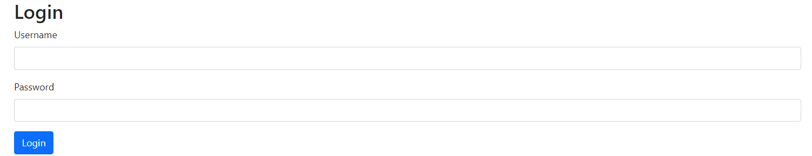
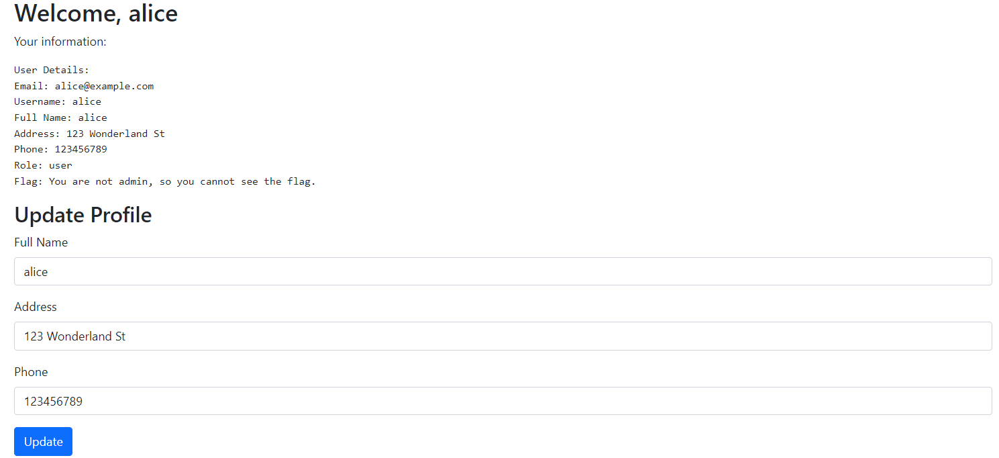
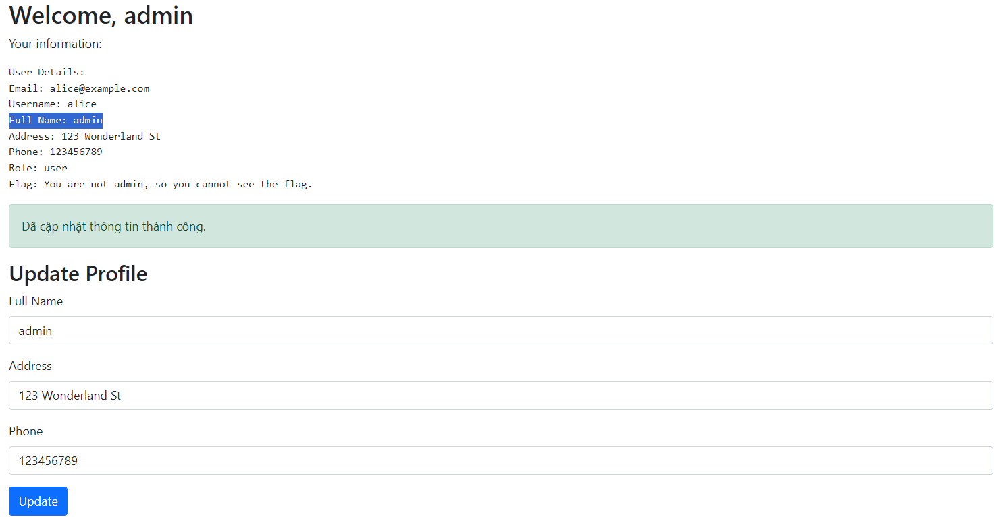
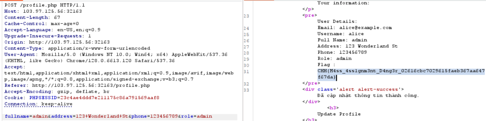

# Authorization - Mass Assignment

**Tên challenge:** Mass Assignment Profile

**Link challenge:** [Here](https://battle.cookiearena.org/challenges/web/mass-assignment-profile)

**Tác giả challenge:** MEME

**Mục tiêu challenge:** Sử dụng tài khoản `alice` và mật khẩu `alice` để truy cập vào hệ thống quản lý hồ sơ. Mỗi tài khoản chứa các thông tin cơ bản như email, username, email, điện thoại, địa chỉ. Mỗi người chỉ được phép thay đổi các thông tin cơ bản này.

Trên máy chủ có file Flag nằm ở `/flag.txt` và có nội dung `CHH{XXX}`. File này chỉ được hiển thị với người dùng có vai trò admin

Mục tiêu của bạn? Tìm cách để xem được nội dung này

**Tác giả Writeup:** Shino

---

# Bài giải

**B1:** Đầu tiên, giao diện Website chỉ có 1 chức năng Login như sau:

**B2:** Ta thử đăng nhập với `username` và `password` là `alice` như Challenge đã cung cấp.

**B3:** Ta thử thay đổi fullname thành `admin` rồi Update:

Ta vẫn chưa lấy được `Flag` do `Role` của ta vẫn là user.

**B4:** Do ta biết đây là Challenge liên quan đến lỗ hổng [Mass Assignment](https://en.wikipedia.org/wiki/Mass_assignment_vulnerability), cho nên ta sẽ thử bắt lại gói tin `POST` vừa Update và thêm parameter `role=admin`.

=> Vậy là ta đã thành công đọc được `Flag`.