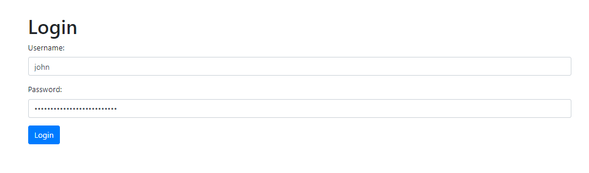
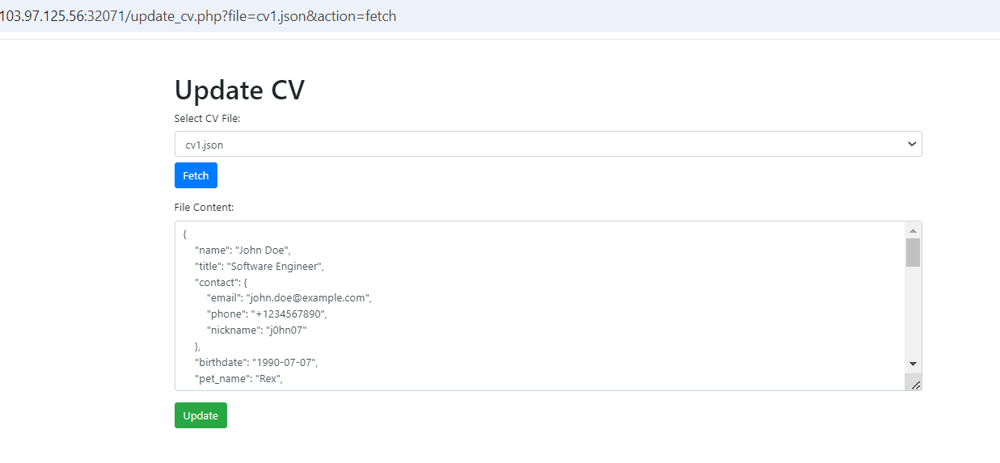
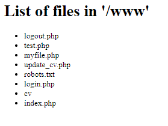
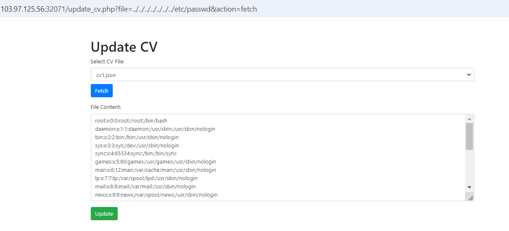
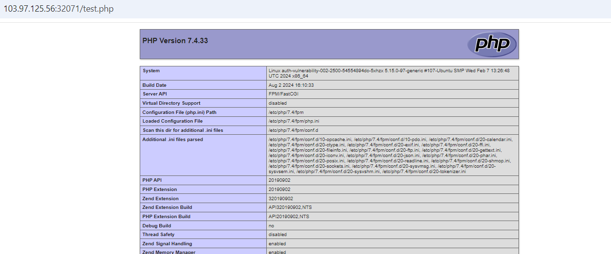

# Combination Skills

**Tên challenge:** Curriculum Vitae

**Link challenge:** [Here](https://battle.cookiearena.org/challenges/web/curriculum-vitae)

**Tác giả challenge:** MEME

**Mục tiêu challenge:** Flag: /flagXXXX.txt. Flag Format: CHH{XXX}

**Tác giả Writeup:** Shino

---

# Bài giải
**B1:** Đầu tiên, giao diện Website khá đơn giản, chỉ có 1 bản CV và 1 chức năng Login:


Khi nhấn chuyển sang trang Login thì ta thấy có trường input User và Password đã được điền sẵn



Nhưng khi nhấn Login thì ta không thể đăng nhập được. Ngoài ra, khi ta đọc bản rõ của password thì ta thấy được password có giá trị là `Can you guess my password?`

=> Có vẻ như là username là `john`, còn password thì ta phải tìm.

Nhưng ta phải tìm ở đâu ? 

* **Trả lời:** Khi đọc kỹ phần Source code ở trang chủ thì ta thấy có 1 đoạn Comment do Developer đã quên xoá như sau:
```
    <!-- <a href="/myfile.php" class="btn btn-primary">Listing File</a>-->
    <!-- <a href="https://github.com/Mebus/cupp" class="btn btn-primary">Common User Passwords Profiler (CUPP)</a>-->
    <!-- <pre> -->
    <!-- git clone https://github.com/Mebus/cupp.git -->
    <!-- cd cupp; -->
    <!-- python3 cupp.py -i  -->
    <!-- </pre> -->
```
Có vẻ như, đoạn Comment trên đang hướng dẫn ta sử dụng chương trình Python `cupp.py` và khi đọc kỹ file `README.md` trong link Github ở trên thì ta biết được câu lệnh `python3 cupp.py -i` sẽ giúp ta generate ra 1 file `.txt` với nội dung là những password được tạo ra từ việc kết hợp những thông tin mà ta cung cấp về đối tượng nào đó.

**B2:** Thực hiện clone link Github về và sử dụng file cupp.py thông qua lệnh `python3 cupp.py -i`

Khi sử dụng chương trình ta sẽ được hỏi những thông tin của đối tượng như là: `First name, Surname ( Họ của đối tượng ), Nickname, Date Of Birth, ...` như sau:

```
┌──(root㉿kali)-[~/Desktop/cupp]
└─# python3 cupp.py -i
 ___________ 
   cupp.py!                 # Common
      \                     # User
       \   ,__,             # Passwords
        \  (oo)____         # Profiler
           (__)    )\   
              ||--|| *      [ Muris Kurgas | j0rgan@remote-exploit.org ]
                            [ Mebus | https://github.com/Mebus/]


[+] Insert the information about the victim to make a dictionary
[+] If you don't know all the info, just hit enter when asked! ;)

> First Name: John
> Surname: Doe
...
```

* Để trả lời được những thông tin trên thì ta phải đi do thám đối tượng. Trong trường hợp của challenge này thì ta sẽ lấy những thông tin đó thông qua CV của đối tượng `john` ở `index.php`.

<b><u>Thông tin thêm:</u></b> Trong quá trình sử dụng `cupp.py`, ta sẽ được hỏi những câu hỏi mà ta chưa có câu trả lời, ta chỉ cần nhấn `Enter` để bỏ qua câu trả lời đó.

Sau khi đã trả lời xong tất cả câu hỏi thì chương trình sẽ giúp ta generate ra 1 file với tên được đặt theo định dạng `firstname + .txt`.

**VD:** john.txt

**B3:** Ta bắt đầu Brute-force password với file `john.txt` vừa có được.

Sau đó, ta sẽ có được password của `john` là `Doejohn9007`.

**B4:** Ta login với password vừa brute được thì Website chuyển hướng ta sang 1 trang mới.



Khi ta mài mò các tính năng, ta phát hiện trang web này có 2 tính năng:

1. Update nội dung file
2. Fetch ( Đọc ) nội dung file

Câu hỏi được đặt ra ở đây là: Dựa vào hai tính năng này thì ta làm sao có thể tìm được flag ?

* **Trả lời:** Chờ 1 chút, nếu nhìn kỹ lại 1 chút thì ở đoạn Comment do anh Developer bất cẩn để lại đã cung cấp cho ta 1 endpoint khác ngoài `login.php` và `index.php` là `/myfile.php`.

**B5:** Thử truy cập vào endpoint `/myfile.php`

Ta thu được kết quả là danh sách các file được list ở thư mục `/www` như sau:



**B6:** Thử truy cập vào endpoint `/robots.txt` thì Website trả về kết quả:

```
User-agent: *
Disallow: /test.php
```

**B7:** Tiếp tục truy cập vào `/test.php` nhưng chẳng thu được gì có ít ngoài dòng text sau:
```
Hello, world!www /www
```

Ngoài ra, các endpoint khác trong danh sách trên cũng chẳng thu được gì có ích.

Quay lại với Website có 2 chức năng Fetch và Update để tìm manh mối khác thì ta phát hiện url `/update_cv.php?file=cv1.json&action=fetch` có parameter `file` rất có khả năng để ta khai thác. Vì thông thường các parameter liên quan đến gọi file, nếu không được xử lý đúng cách thì rất dễ xuất hiện lỗ hổng.

**B8:** Thử đổi giá trị của parameter `file` thành `../../../../../../../etc/passwd` ( Path Traversal Payload )



=> Website này bị lỗi Path Travesal, dẫn đến ta có thể truy cập đến bất kỳ file nào trong hệ thống. Ngoài ra, ta cũng có thể sửa đổi nội dung của chúng và nhấn nút `Update` sau khi sửa đổi.

Đến đây, ta nghĩ ta có thể tìm Flag bằng cách đổi giá trị của parameter `file` thành `../../../../../../../../flag.txt` nhưng kết quả trả về lại là không có gì cả.

Khi đọc kỹ lại đề bài thì ta sẽ thấy, tên flag có format là `flagXXX.txt` nên ta sẽ không thể tìm được Flag nếu không biết được tên chính xác của file `.txt` chứa Flag. Lại là 1 đường cùng khác.

Nhưng khoan đã, kết hợp những điều ta đã có:

1. Ta có thể truy cập đến 1 file bất kỳ 
2. Ta có thể chỉnh sửa nội dung của 1 file bất kỳ

Và cả 2 điều trên đều có cùng điều kiện là `phải biết được chính xác tên file và vị trí của nó`.

Vậy thì sẽ ra sao nếu ta có được vị trí và tên chính xác của 1 file PHP và sửa nội dung của nó thành code ta muốn và gọi nó thông qua endpoint của Website, thì liệu nó có thực thi mã code đó không ?

Để trả lời cho câu hỏi trên, trước tiên ta phải tìm được 1 file PHP thoả lấp 2 điều kiện sau:

1. Ta phải biết được tên chính xác và vị trí của nó
2. Nó phải được gọi thông qua endpoint của Website ( **VD:** `/index.php` )

Đến đây thì ta đã biết file nào đủ điều kiện rồi đúng không ?

=> Đúng vậy, chẳng ai khác ngoài file `test.php`, được lưu trữ ở thư mục `www` mà ta đã từng truy cập trước đó.

**B9**: Sửa giá trị của parameter `file` thành `../../../../../../../www/test.php`

**B10**: Tiến hành sửa nội dung file `test.php` thành `<php phpinfo(); ?> `

**B11:** Truy cập vào endpoint `/test.php`



=> Vậy là ta đã thực thi thành công code PHP theo ý muốn của mình.

=> Từ đây, ta chỉ việc sửa code PHP của file `/test.php` để đọc file Flag từ hệ thống thôi.

<u><b>Thông tin thêm:</b></u> File Flag được lưu ở `/`
