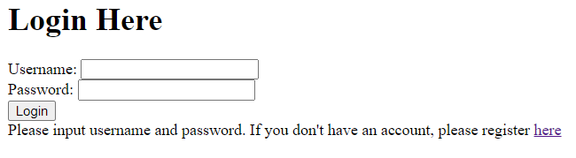
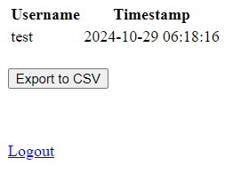
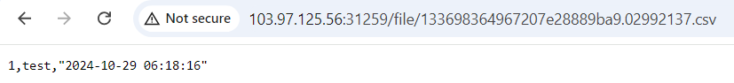
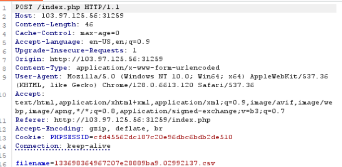
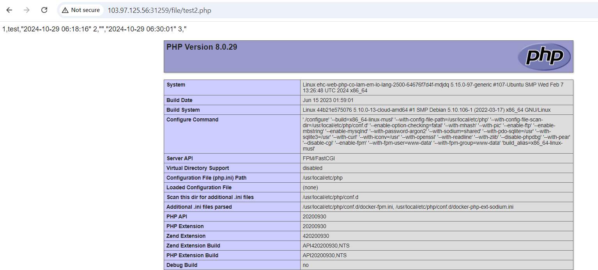

# Combination Skills

**Tên challenge:** PHP có làm em lo lắng

**Link challenge:** [Here](https://battle.cookiearena.org/challenges/web/php-co-lam-em-lo-lang)

**Tác giả challenge:** SHINE102

**Mục tiêu challenge:** FLAG Format: `EHC{XXX}`

**Tác giả Writeup:** Shino

---

# Bài giải

**B1:** Đầu tiên, giao diện Website chỉ có 2 chức năng Login và Register:

**B2:** Ta thử đăng ký với `username` và `password` là `test`

**B3:** Đăng nhập với tài khoản vừa tạo

Sau đó, trang Web sẽ chuyển hướng ta đến với 1 trang hiển thị như hình dưới:

Xem ra, trang Web này cũng khá đơn giản. Mài mò 1 lúc thì ta tổng kết được:
* Button `Export to CSV` khi ta click vào nó sẽ xuất ra 1 file `.csv` với tên file được random ngẫu nhiên và lưu vào thư mục `/file/ten_file_random.csv`.

Khi ta truy cập vào đường dẫn của file vừa export ra thì ta biết được nội dung của file đó sẽ là thông tin `username` và `timestamp` ở trang chủ.

Ngoài ra, khi ta quan sát gói tin khi ta nhấn nút `Export to CSV` thì gói tin POST sẽ được gửi đi và trong gói tin POST đó có 1 tham số là `filename`

**Giả thuyết:** Vậy thì sẽ ra sao nếu ta đăng ký `username` với nội dung là `<?php phpinfo(); ?>`, sau đó ta sẽ xuất file và đổi `filename` thành `test.php`, vậy khi ta truy cập vào đường dẫn `file/test.php` thì trang Web có thực thi code không ?

**B4:** Ta thử với giả thuyết trên

Kết quả là trang Web không thực thi code, lý do là vì trang Web đã tự động Filter khi gặp cú pháp `<?php` và đổi nó thành:

Ký tự `#` đã làm cho toàn bộ code sau nó thành comment, vì vậy trang Web đã không thực thi code của ta.

<u>**Thông tin thêm:**</u> PHP không chỉ có cách mở tag `<?php ?>` mà nó còn có thể tag như sau `<?= ?>`.

**B5:** Ta thử đăng ký với `username` là `<?= phpinfo(); ?>` và thử lại với giả thuyết trên.

=> Trang Web đã thực thi code PHP của ta, tiếp theo là lấy `Flag` thôi.

<u>**Lưu ý:**</u> Short tag `<?= ?>` được coi như là `echo`, nghĩa là nếu bạn dùng `<?= echo "hello"; ?>` thì nó sẽ gặp lỗi cú pháp `echo`. Vì vậy, bạn chỉ cần dùng lệnh đơn giản là `<?= exec('cd /; cat *'); ?>` là nó đã có thể in ra kết quả Flag rồi, không cần phải thêm lệnh `echo`.