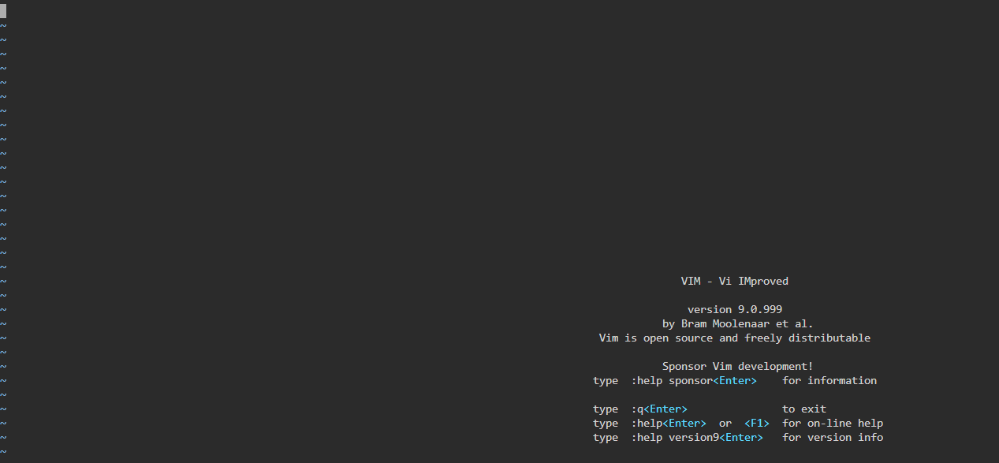
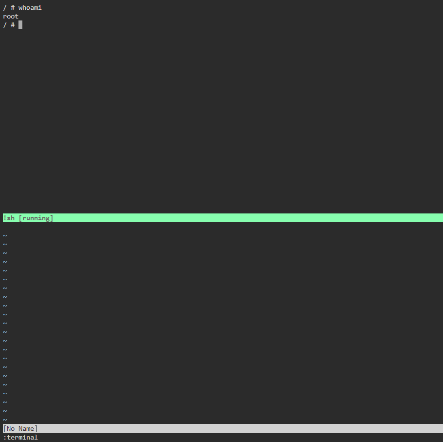

# Command Injection

**Tên challenge:** Break The Editor Jail

**Link challenge:** [Here](https://battle.cookiearena.org/challenges/miscellaneous/break-the-editor-jail)

**Tác giả challenge:** Phong Vũ Quốc

**Mục tiêu challenge:** Cassie, một nữ Hacker đã tiếp cận vào hệ thống. Vô tình sử dụng vim trên Terminal nhưng cô loay hoay không biết cách nào để thoát ra. Thời gian trôi qua càng lúc một nhanh, một chương trình giám sát đang chạy ngầm bên dưới. Nếu không thoát khỏi hệ thống này, cô sẽ bị bắt và phải ngồi tù.

**Tác giả Writeup:** Shino

---

# Bài giải

**B1:** Đầu tiên, giao diện Website chỉ có 1 màn hình giao diện của `vim` như sau:

Như ta đã biết, ta có thể thực thi code trong `vim` thông qua nhiều cách khác nhau, nhưng tôi sẽ thử cách mở terminal

**B2:** Ta thử nhập `:terminal` để mở terminal shell:

Tiếp theo, ta chỉ đọc `Flag` thôi.
