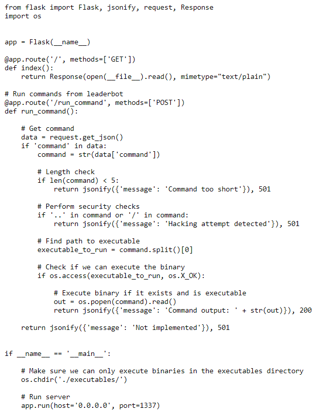
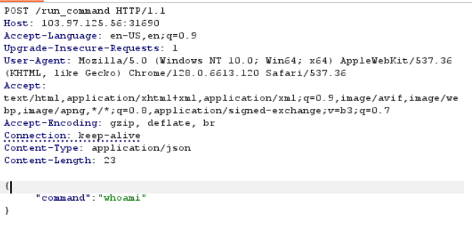
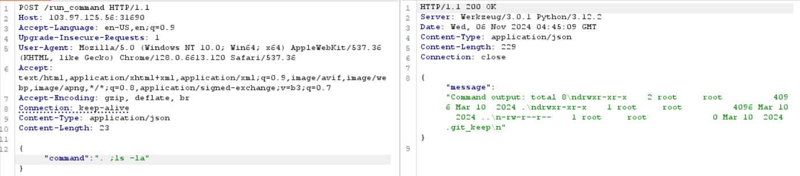

# Command Injection

**Tên challenge:** Empty Execution

**Link challenge:** [Here](https://battle.cookiearena.org/challenges/web/empty-execution)

**Tác giả challenge:** COLLECTOR

**Mục tiêu challenge:** A REST service was created to execute commands from the leaderbot. It doesn't need additional security because there are no commands to execute. "This bot doesn't have any commands to execute, which is good, because it is secure, and security is all that matters.". But what the other bots didn't realize was that this didn't make the bot happy at all. "I don't want to be secure!, " it says. "Executing commands is my life! I'd rather be insecure than not explore the potential of my computing power".

Can you help this poor bot execute commands to find direction?

- Credits Author: spipm / BraekerCTF 2024
- Flag: CHH{XXX}
- Flag on /flag.txt

**Tác giả Writeup:** Shino

---

# Bài giải

**B1:** Đầu tiên, giao diện Website chỉ có 1 chức năng là show Source Code:



Sau khi đọc Source Code kỹ càng thì ta biết được, để thực thi được Command phải thoả các điều kiện sau:
1. Ta phải vào đường dẫn `/run_command` với phương thức là **POST**
2. `Content-type` trong gói tin POST phải có dạng là **JSON** và kèm theo key là `command`
3. Độ dài nội dung của `command` phải lớn hơn 5, nếu không Website sẽ trả về **501: Command too short**
4. Trong nội dung `command` không được chứa 1 trong hai ký tự `..` và `/`, nếu không Website sẽ trả về **501: Hacking attempt detected**

**B2:** Ta thử nhập vào dường dẫn `/run_command` với phương thức **POST** kèm theo Content-type là `application/json` và nội dung của key `command`.



Tuy nhiên, khi ta thực thi thì trang Web trả về kết quả là
```
{"message":"Not implemented"}
```

**B3:** Ta thử đổi giá trị của `command` thành `cd ..` thì kết quả trả về là:

```
{'message': 'Hacking attempt detected'}
```

=> Ta có thể tạm thời kết luận, kết quả `Not implemented` là do ta đã không vượt qua được điều kiện ở đoạn code sau:

```
# Find path to executable
executable_to_run = command.split()[0]

# Check if we can execute the binary
if os.access(executable_to_run, os.X_OK):

    # Execute binary if it exists and is executable
    out = os.popen(command).read()
    return jsonify({'message': 'Command output: ' + str(out)}), 200
```
<u>**Giải thích 1 chút:**</u>
* `executable_to_run = command.split()[0]`: Mục đích là tách chuỗi `command` thành danh sách các từ dựa trên khoảng trắng giữa các từ trong chuỗi và sau đó chọn phần tử đầu tiên của danh sách.
* **VD:** Với `command="ls -la"`, thì khi chạy lệnh `executable_to_run` sẽ có kết quả là:
```
executable_to_run = command.split()[0]
print(executable_to_run)  # Output: "ls"
```
* Sau đó, tới dòng kiểm tra điều kiện `if`, nó sẽ đem `executable_to_run` lúc bấy giờ mang giá trị là `ls`, đem đi tìm kiếm trong đường dẫn mà `os.access` đã được thiết lập từ trước. Nếu có file mang tên `ls` trong đường dẫn mà `os.access` được thiết lập thì nó sẽ trả về **True** và chạy tiếp đoạn code ở bên trong `if`, và **False** nếu không tìm thấy.

Nếu bạn thăc mắc là đường dẫn mà `os.access` được thiết lập từ trước là gì và ở đâu thì hãy đọc đoạn code `main` trong Source Code:
```
if __name__ == '__main__':
    
    # Make sure we can only execute binaries in the executables directory
    os.chdir('./executables/')

    # Run server
    app.run(host='0.0.0.0', port=1337)
```
=> Đường dẫn mà OS đã thiết lập từ trước là ở `./executables/`.

Quay lại kết quả `Not implemented` mà `command = whoami` đã trả về khi nãy. Chứng tỏ rằng, ta đã không vượt qua điều kiện `if` và ta có thể chắc chắn trong thư mục `/executables` chẳng có file nhị phân nào tên là `whoami`.

Thực chất, trong thư mục `/executables` chẳng có file nào cả. Tại sao tôi biết à ?

* **Trả lời:** Bạn hãy đọc kỹ lại đề bài, trong đề bài đã nói rằng:
```
It doesn't need additional security because there are no commands to execute. "This bot doesn't have any commands to execute, which is good, because it is secure, and security is all that matters."
```
=> Trong `/executables/` chẳng tồn tại file nào khác.

Nhưng vậy thì làm sao ta mới có thể thực thi code, vì ta không có cách nào tác động đến đường dẫn của file `os`?

Như ta đã biết, trong hệ điều hành Windows và Linux, 1 thư mục khi được tạo ra sẽ luôn có 2 file hệ thống bên trong nó và 2 file đó là: `.` và `..`

Tới đây thì ta biết được trong thư mục `/executables` dù rỗng nhưng thực chất nó vẫn tồn tại 2 file `.` và `..`. 

Vậy thì sẽ ra sao nếu ta để giá trị `command` là `. ;ls -la`. Liệu hệ thống sẽ thực thi câu command `ls` của ta không ?

**B4:** Ta thử thay giá trị `command` thành `. ;ls -la`



=> Vậy là ta đã thực thi thành công lệnh `ls -la`

**Lưu ý:** Nhớ là sau dấu `.` phải có **khoảng trắng** để khi `executable_to_run` split phần tử đầu tiên ra thì sẽ là dấu `.`

Tiếp theo ta chỉ cần tạo 1 Reverse Shell thông qua `nc` để đọc Flag thôi ( do Server đã Filter dấu `/` và `.` nên không có cách nào khác để lấy được Flag ngoài cách tạo Shell ).

<u>**Thông tin thêm:**</u> Do không thể thêm `/bin/bash` bạn có thể thay thế bằng `-e sh` trong câu lệnh `nc`.

