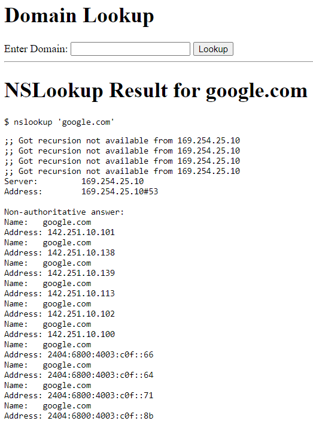

# Command Injection

**Tên challenge:** NSLookup

**Link challenge:** [Here](https://battle.cookiearena.org/challenges/web/nslookup)

**Tác giả challenge:** MEME

**Mục tiêu challenge:** Flag: `/flagXXXX.txt`. FLAG Format: `CHH{XXX}`

**Tác giả Writeup:** Shino

---

# Bài giải

**B1:** Đầu tiên, giao diện Website chỉ có 1 chức năng NSLookup:


**B2:** Ta thử nhập input `google.com`



=> Trang Web đang thực hiện cú pháp `nslookup` đến địa chỉ input của người dùng.

**B3:** Ta thử chèn thêm `;` vào input thì kết quả


Sau đó, ta đọc View Page Code thì biết được Website đã dùng Filter 1 số ký tự liên quan đến Command Injection:
```
const domainPattern = /^(?!:\/\/)([a-zA-Z0-9-_]+\.)+[a-zA-Z]{2,}$/;
```
Như ta đã biết thì ngoài các dấu `;`, `|`, `&` thì còn có ký tự xuống dòng `%0a` giúp ta kéo dài input và chèn thêm câu Command vào sau.

Nhưng ta để ý kết quả trả về google.com ở trên thì ta thấy đoạn `nslookup 'google.com'` được đặt nằm ở trong 2 dấu `'`.

**B4:** Ta thử `google.com'` để xem sao


=> `nslookup 'google.com'` bị dư 1 dấu `'` và không trả về kết quả.

Vậy thì sẽ ra sao nếu ta thêm dấu `#` để biến dấu `'` bị dư thành Comment trong linux thì liệu trang Web có thực thi lệnh bình thường không ?

<u>**Lưu ý:**</u> Mọi payload thử nghiệm nên được làm trên gói tin BurpSuite để tránh bị lỗi.

**B5:** Thử nghiệm với giả thuyết trên với payload `google.com' #`


=> Vậy là giả thuyết trên đã cho kết quả đúng, vậy giờ ta sẽ chèn thêm `%0a whoami` để xem trang Web có thực thi Command `whoami` không.

**B6:** Thử tiếp payload `google.com'%0awhoami #`


=> Dựa vào text `www` ở cuối cùng, ta có thể kết luận là trang Web đã thực thi Command `whoami` của ta.

Việc tiếp theo là ta sẽ `cd / %0a cat *` thôi.

Nhưng khi thực thi lệnh thì Website trả về kết quả:
```
Hack Detected!
```
=> Xem ra trang Web đã filter vài Command, sau khi thử nghiệm vài payload thì ta biết được Website đã Filter: `cat`, `ls`, `curl`, `wget`, `*`, ...

Sau khi đi đọc thêm tài liệu và thử nghiệm với các Command thay thế thì ta kết luận được.
1. Ta có thể thay thế lệnh `ls` bằng lệnh `find . -type f`
2. Ta có thể thay thế lệnh `cat` bằng lệnh `tac`.

Vậy thì bước kế tiếp ta sẽ dùng lệnh `find` để tìm ra các file có trong thư mục `/` để tìm được tên file chính xác của `flagXXXX.txt`, sau đó ta sẽ dùng lệnh `tac` để đọc nội dung file.

**B7:** Ta thử payload `google.com'%0a cd / %0a find . -type f #`


**B8:** Ta tiến hành đọc flag bằng lệnh `google.com'%0a cd / %0a tac flagmOZfQ.txt #`


=> Vậy là ta đã thành công lấy được `Flag`.
