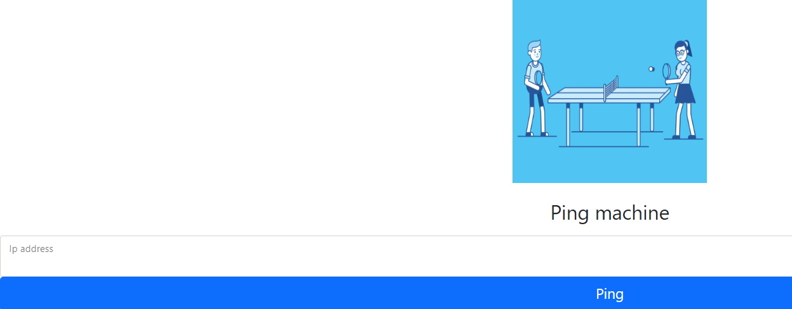
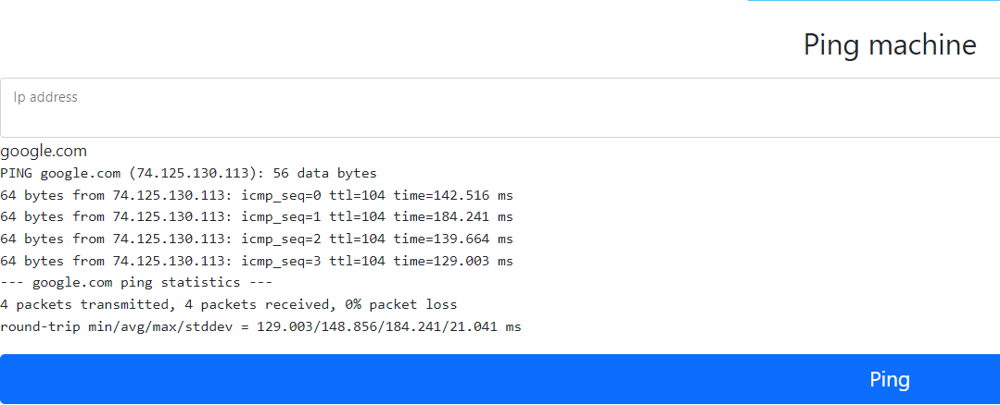
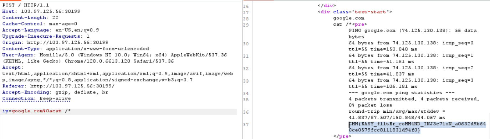

# Command Injection

**Tên challenge:** Ping 0x01

**Link challenge:** [Here](https://battle.cookiearena.org/challenges/web/ping-0x01)

**Tác giả challenge:** MEME

**Mục tiêu challenge:** Please just input your IP and get the result. However, we removed some special characters to fix the command injection. Could you bypass it?

Flag Location: `/flag.txt`

Flag Format: `CHH{XXX}`

**Tác giả Writeup:** Shino

---

# Bài giải

**B1:** Đầu tiên, giao diện Website chỉ có 1 chức năng ping như sau:



**B2:** Ta thử nhập input `google.com`



=> Trang Web đang thực hiện cú pháp `ping` đến địa chỉ input của người dùng.

**B3:** Ta đọc Source Code mà Challenge cung cấp, ta biết được Challenge đã filter vài ký tự trong Command và lệnh input của người dùng được truyền thẳng vào lệnh `ping` sau khi đã filter:
```
$substitutions = array(
    '&'  => '',
    ';'  => '',
    '|' => '',
    '-'  => '',
    '$'  => '',
    '('  => '',
    ')'  => '',
    '`'  => '',
    '||' => '',
);
$target = str_replace( array_keys( $substitutions ), $substitutions, $target );
$cmd = shell_exec( 'ping -c 4 ' . $target );
```

Tuy Challenge đã Filter gần hết các ký tự dùng để nối dài câu Command nhưng đã quên filter nốt `%0a` ( `\n` ) và nhờ đó ta có thể lợi dụng nó để nối dài câu Command.

**B4:** Ta thử nhập payload sau để lấy `Flag`:
```
google.com%0acat /*
```



=> Ta đã thành công đọc được `Flag`.