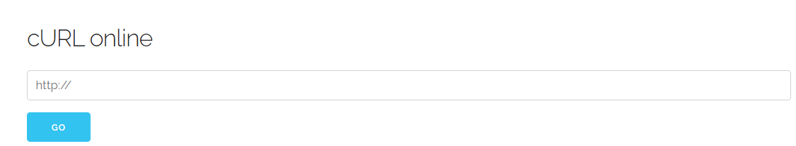
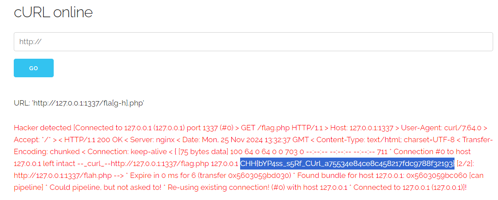

# Command Injection

**Tên challenge:** SVATTT 2016 Quals Curl

**Link challenge:** [Here](https://battle.cookiearena.org/challenges/web/svattt-2016-quals-curl)

**Tác giả challenge:** COLLECTOR

**Mục tiêu challenge:** Flag stored in `flag.php`. You can not visit this file directly because it is restricted only from localhost. the web service is running on the 1337 port.

* Author: `l4w`
* Format Flag: `CHH{XXX}`

**Tác giả Writeup:** Shino

---

# Bài giải

**B1:** Đầu tiên, giao diện Website chỉ có 1 chức năng `CURL` như sau:



Sau khi phân tích kỹ Source Code thì ta biết được:

1. Challenge đã filter từ khoá `flag`, `localhost` trên URL
2. Challenge cũng filter nếu như kết quả trả về có dòng `Connected to 127...`
3. Nếu muốn lấy được `Flag` thì ta phải dùng lệnh Curl của Web để chạm đến endpoint `/flag.php`, vì file `flag.php` chỉ trả về `Flag` nếu IP của gói tin request là `127.0.0.1`.

Sau khi mài mò thì ta tìm được payload sau để Bypass:
```
http://127.0.0.1:1337/fla[g-h].php
```

**B2:** Ta thử payload trên:


=> Ta đã thành công đọc được `Flag`.