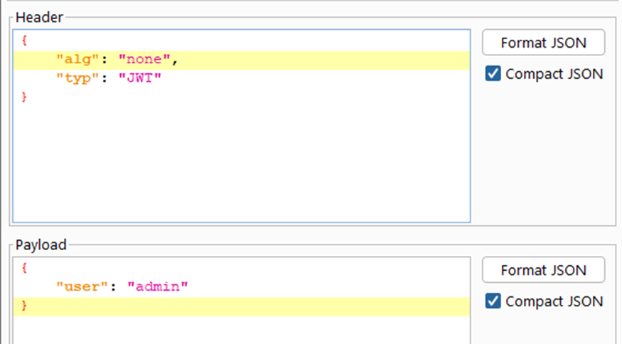

# JWT

**Tên challenge:** The JWT Algorithm

**Link challenge:** [Here](https://battle.cookiearena.org/challenges/web/the-jwt-algorithm)

**Tác giả challenge:** MEME

**Mục tiêu challenge:** The application is using JWT based authentication. You can not brute the secret! Flag is located on admin account. Format FLAG: `CHH{XXX}`

**Tác giả Writeup:** Shino

---

# Bài giải

**B1:** Đầu tiên, Website cung cấp cho ta tính năng Login như sau:


**B2:** Ta thử đăng nhập với tài khoản và password là `admin:admin`


=> Xem ra `admin` đã không đặt `password default` như thường lệ.

Ngoài ra, Source Code của Website cũng không có gì đặc biệt.

Quanh đi quẩn lại, manh mối duy nhất của ta là `JWT Token`. Tuy nhiên, ta sẽ không được cấp `JWT Token` nếu không vượt qua được chức năng Login.

Ta thử truy cập vào file `robots.txt` để xem có manh mối gì không ? Vì file `robots.txt` rất hay để lộ sơ hở trong các bài `CTF`

**B3:** Ta thử truy cập `robots.txt`


=> Ta đã tìm ra được 1 đường dẫn mới `/secret`

**B4:** Ta thử truy cập `/secret` nhưng Website trả về dòng text:

```
You are not google bot
```

Nhìn lại kết quả của file `robots.txt` thì ta biết `User-agent : Googlebot` mới được truy cập endpoint `/secret`

**B5:** Ta chỉnh `User-agent` thành `Googlebot`:


=> Ta thu được 1 Login credential: `guest:ilovcookie`

**B6:** Đăng nhập với tài khoản và password vừa tìm được


Lúc bấy giờ, khi nhìn lại gói tin thì ta đã được cấp 2 JWT Token.


**B7:** Đem lần lượt 2 `JWT Token` vừa được cấp lên trang Web `JWT.io` để giải mã


=> Từ 2 ảnh trên, ta biết được, `JWT Token` thứ 2 có một số vấn đề ở phần Payload. Ngoài ra, ở phần Header của nó đang chứa `JWT Token` thứ 1 được lưu ở biến `token` cho nên có vẻ như ta không thể đụng tới nó, vì cho dù có đụng thì Website cũng trả về kết quả:
```
Invalid Token
```

Ngoài ra, ta không chắc được liệu Website có xử lý đúng cách với phần Signature của `JWT Token` đầu tiên hay không nên ta sẽ thứ đổi phần `guest` trong Payload thành `admin` và đổi luôn `alg` trong Header thành `none` để xem Server sẽ xử lý ra sao.

<u>**Lưu ý:**</u> Nên dùng Extension **JWT Editor** của BurpSuite để chỉnh sửa `JWT Token`.

**B8:** Dùng **JWT Editor** của BurpSuite để chỉnh sửa `JWT Token` đầu tiên



Sau đó gửi gói tin đi:


=> Từ ảnh trên, ta đã thành công thay đổi `JWT Token` và lấy được `Flag`.