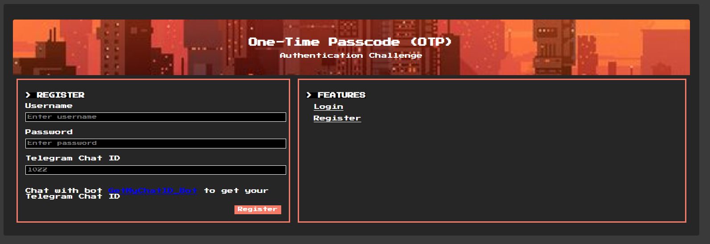
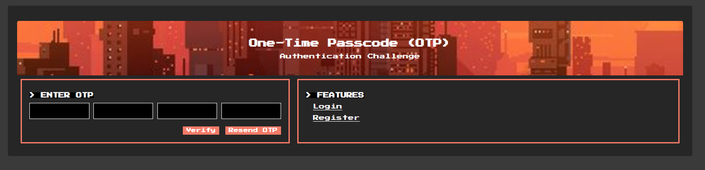
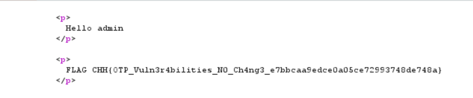

# OTP

**Tên challenge:** Refreshed OTP is same as old one

**Link challenge:** [Here](https://battle.cookiearena.org/challenges/web/refreshed-otp-is-same-as-old-one)

**Tác giả challenge:** MEME

**Mục tiêu challenge:** Try to login account `admin` and get the `FLAG`. OTP is refreshed but it's same as old one. It is a vulnerability of logic flow

**Tác giả Writeup:** Shino

---

# Bài giải

**B1:** Đầu tiên, Challenge cung cấp cho ta 2 Files:
1. File username.txt
2. File password.txt

**B2:** Website cung cấp cho ta 2 tính năng:
1. Login


2. Regiser



Nhưng đề bài yêu cầu ta đăng nhập với tên `admin` để lấy Flag. Cho nên ta sẽ thử Brute-force `password` của `admin` với file `password.txt` mà Challenge đã cung cấp cho ta.

**B3:** Ta thử Brute-force `password` của `admin` từ file `password.txt` thì ta được `password` là `Aa123456`

Sau khi Login thành công thì nó yêu cầu ta xác thực bằng mã `OTP` để tiếp tục



Sau khi thử vài lần, ta phát hiện hệ thống không giới hạn số lần thử `OTP`.

Ngoài ra, khi ta đọc Source code của trang này thì biết được thêm 2 thông tin quan trọng:

1. `OTP` được giới hạn trong khoảng từ `[0000 -> 9999]` 
```
<div class="form-group otp-inputs">
    <input type="text" inputmode="numeric" pattern="[0-9]*" maxlength="1" id="otp1" name="otp1" required>
    <input type="text" inputmode="numeric" pattern="[0-9]*" maxlength="1" id="otp2" name="otp2" required>
    <input type="text" inputmode="numeric" pattern="[0-9]*" maxlength="1" id="otp3" name="otp3" required>
    <input type="text" inputmode="numeric" pattern="[0-9]*" maxlength="1" id="otp4" name="otp4" required>
</div>
```
2. Chức năng `Resend OTP` thực chất chẳng ảnh hưởng gì đến mã `OTP`, nói cách khác nó chẳng làm mới mã `OTP`, đơn giản nó chỉ hiện ra thông báo là nó đã gửi lại mã `OTP` thành công.
```
<script>
    $(document).ready(function() {
        $('#resendOtpButton').click(function() {
        $.ajax({
            url: "/resend_otp",
            type: "GET",
            success: function(response) {
            // Show success message or handle response
            alert("A new OTP has been sent.");
            },
            error: function(error) {
            // Handle error
            alert("Error resending OTP.");
            }
        });
        });
    });
</script>
```

**B4:** Ta tiếp tục Brute-force mã `OTP` trong khoảng `[0000 -> 9999]`

Cuối cùng, ta đăng nhập thành công với tư cách `admin` và thu được Flag.


