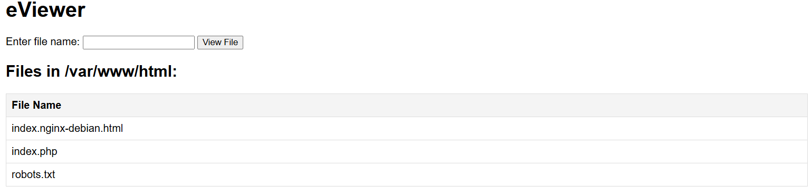
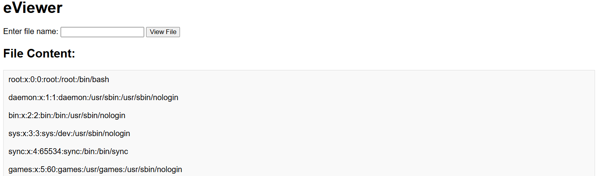

# Path Traversal

**Tên challenge:** eViewer

**Link challenge:** [Here](https://battle.cookiearena.org/challenges/web/eviewer)

**Tác giả challenge:** MEME

**Mục tiêu challenge:** Flag Location: /flag.txt. Flag Format: CHH{XXX}

**Tác giả Writeup:** Shino

---

# Bài giải

**B1:** Đầu tiên, giao diện Website khá đơn giản, chỉ có 1 chức năng input và list các file ở trong thư mục `/var/www/html`:

**B2:** Ta thử input `../../../../../etc/passwd` thì kết quả là.

=> Trang Web này bị lỗ hổng Path Traversal.

Tiếp theo, ta chỉ cần input `../../../../../flag.txt` để lấy `Flag`.