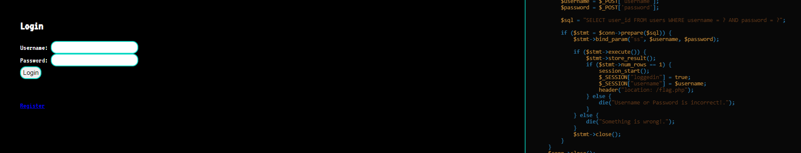
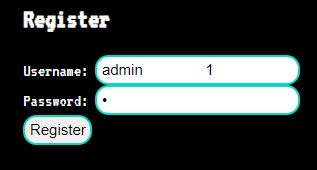
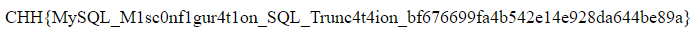

# SQL Injection

**Tên challenge:** SQL Truncation Attack

**Link challenge:** [Here](https://battle.cookiearena.org/challenges/web/sql-truncation-attack)

**Tác giả challenge:** MEME

**Mục tiêu challenge:** How to login to "admin" account?. Flag Format: `CHH{XXX}`

**Tác giả Writeup:** Shino

---

# Bài giải

**B1:** Đầu tiên, giao diện Website khá đơn giản, chỉ có 1 chức năng Login, 1 chức năng Register và Source code của page Login và Register được show ra bên phải:



**B2:** Ta thử đăng nhập với username là `admin` và password là `admin`

![alt text]./images/(image-2.png)

=> Xem ra manh mối duy nhất của ta là Source code được in ở trang Login và trang Register

Về cơ bản, khi ta đọc code xử lý chức năng Login của Website thì ta thấy nó hoàn toàn bình thường, không có lổ hổng. Và kết quả Flag sẽ được trả về khi ta đăng nhập với thành công với `username=admin`.

Còn về phía code ở trang Register thì ta rút ra được vài manh mối sau:
1. `username` có độ dài chuỗi giới hạn là 20.
2. `password` có độ dài chuỗi giới hạn là 40.
2. Câu truy vấn `Insert` trong Source code cũng không có lổ hổng để ta khai thác SQL Injection vì code đã dùng `bind_param` trong PHP để ngăn chặn SQL Injection từ input của người dùng.

**Câu hỏi được đặt ra là:** Nếu ở cả 2 câu truy vấn trong Source Code đều không có lỗ hổng, vậy thì ta phải làm sao để có thể đăng nhập được với tư cách là `admin` ?
* **Trả lời:** Nếu ta để ý kỹ thì Source Code ở trang Register không có 1 đoạn code nào dùng để xử lý input từ người dùng, họ chỉ so sánh liệu input `username` của người dùng có tồn tại trong Database từ trước không ? Nếu không thì tạo tài khoản thành công, nếu có thì ngược lại.

Khi ta tìm hiểu về SQL thì ta biết được:
```
Khi thực thi lệnh SELECT hoặc INSERT, cơ sở dữ liệu sẽ kiểm tra và cắt bớt phần dữ liệu dư thừa. Việc này để đảm bảo dữ liệu nhập vào sẽ phù hợp hợp với giới hạn lưu trữ dữ liệu được thiết lập khi tạo bảng. 
```
=> Như VD từ đoạn code khai báo `table` ở trang Register, trường input `username` chỉ cho phép lưu trữ 20 ký tự. Hệ thống sẽ tự thu gọn vùng nhớ để tiết kiệm không gian lưu trữ nếu dữ liệu của người dùng nhập vào ít hơn.

**Nghĩa là:**
1. Nếu ta nhập vào input `username` là `admin` thì 15 byte còn lại sẽ được tự động cắt bỏ để tiết kiệm.
2. Nếu người dùng nhập input `username` là `admin` kèm với 15 byte khoảng trắng `space` thì hệ thống cũng tự động loại bỏ chúng vì nó không quan trọng.

=> Nếu kẻ tấn công cố gắng nhập một chuỗi 21 ký tự, theo lý thuyết 1 ký tự cuối cùng ở phía sau cũng sẽ bị loại bỏ.

<u>**Lưu ý:**</u> Ở các bản cài đặt MySQL mới nhất đã thiết lập chức năng `Strict SQL Mode`. Nếu người dùng cố tình `INSERT` một bản ghi có độ dài lớn hơn chiều dài lưu trữ của một cột, nó sẽ báo lỗi và không thực hiện việc INSERT dữ liệu.
```
MariaDB [chh]> INSERT INTO `users` (username, password) VALUES ('admin               1', 'admin');
ERROR 1406 (22001): Data too long for column ‘username’ at row 1
```
Nhưng ở Challenge này thì chức năng `Strict SQL Mode` trong MySQL đã được tắt.

**B3:** Ta thử nghiệm đăng ký với input `username` theo lý thuyết trên:
1. Chuỗi `admin` 5 ký tự ghép với 15 ký tự khoảng trắng
2. Để tránh bị `MySQL` loại bỏ các khoảng trắng phía sau dữ liệu, ta thêm 1 ký tự bất kỳ ở sau 15 ký tự khoảng trắng.
3. `password` sẽ là tuỳ ý.



Website không báo lỗi => Ta đã đăng ký thành công, bây giờ thử đăng nhập với username `admin` và `password` của ta vừa tạo.

**B4:** Đăng nhập với username `admin` và `password` vừa tạo



=> Ta đã thành công đăng nhập được với tư cách là `admin`.

<u>**Thông tin thêm:**</u>

Lúc bây giờ, trong bằng users sẽ tồn tại 2 tài khoản `admin`
```
MariaDB [chh]> select * from users;
+---------+----------------------+-----------------+
| user_id | username             | password        |
+---------+----------------------+-----------------+
|       1 | admin                | Yulm5zpKGKdGqlr |
|       2 | admin                | 1               |
+---------+----------------------+-----------------+
2 rows in set (0.001 sec)
```

Nếu chỉ quan sát bằng mắt thường, ta sẽ thấy 2 tài khoản `admin` được lưu trữ trong table `users`.

Nhưng khi thực hiện đếm độ dài bằng hàm `length()`, ta sẽ thấy tài khoản `admin` đầu tiên chỉ có 5 ký tự, tài khoản còn lại có 20 ký tự (5 ký tự nhìn thấy `admin` + 15 ký tự khoảng trắng)

```
MariaDB [chh]> select length(username) from users where user_id=1;
+------------------+
| length(username) |
+------------------+
|                5 |
+------------------+
1 row in set (0.001 sec)

MariaDB [chh]> select length(username) from users where user_id=2;
+------------------+
| length(username) |
+------------------+
|               20 |
+------------------+
1 row in set (0.001 sec)
```
Với MySQL, toán tử `=` mặc định khi thực hiện phép so sánh sẽ rất lỏng lẻo (Loose comparison). Với Postgresql thì ngược lại, mặc định các so sánh đều chặt chẽ.

Bạn có thể tham khảo các kết quả so sánh dưới đây của MySQL, nó đều trả về kết quả `TRUE`:
```
SELECT '0' = 0; //True

SELECT '0.0' = 0; //True

SELECT '0      ' = '0'; //True
```

Trong MySQL, khi thực hiện truy vấn với các lệnh điều kiện, so sánh thì các khoảng trắng phía sau phần dữ liệu sẽ bị loại bỏ. Nên khi bạn thực hiện câu truy vấn dưới đây, nó sẽ trả về 2 kết quả `admin`:
```
MariaDB [chh]> SELECT * FROM users WHERE username = "admin"
+---------+----------------------+--------------------+
| user_id | username             | password           |
+---------+----------------------+--------------------+
|       1 | admin                | Yulm5zpKGKdGqlr    |
+---------+----------------------+--------------------+
|       2 | admin                | 1                  |
+---------+----------------------+--------------------+
```

Mà trên Website khi xử lý chức năng Login thì có thêm điều kiện `WHERE password = $password` nữa cho nên ta có thể dễ dàng đăng nhập vào với tư cách là `admin`.
```
MariaDB [chh]> SELECT * FROM users WHERE username = "admin" AND password = "1"
+---------+----------------------+--------------------+
| user_id | username             | password           |
+---------+----------------------+--------------------+
|       2 | admin                | 1                  |
+---------+----------------------+--------------------+
```