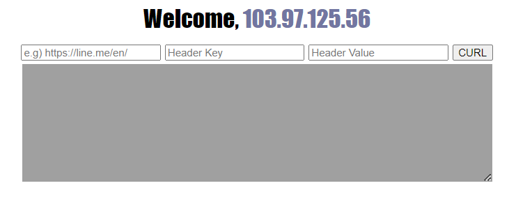
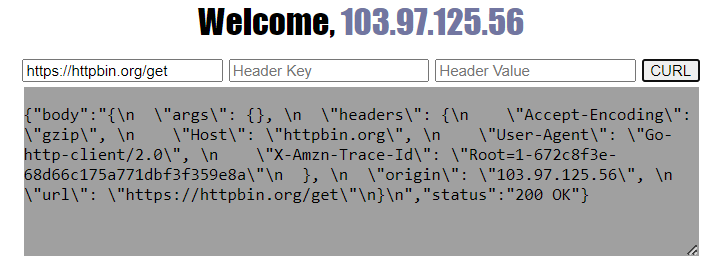
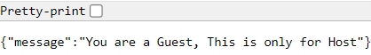
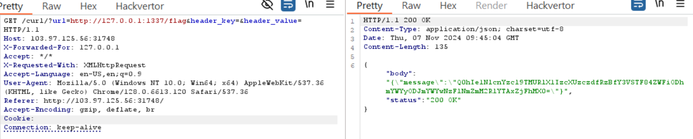

# SSRF

**Tên challenge:** Baby Simple Go CURL

**Link challenge:** [Here](https://battle.cookiearena.org/challenges/web/baby-simple-go-curl)

**Tác giả challenge:** COLLECTOR

**Mục tiêu challenge:** We were given a source code (You can download the file) also we need to access the URL `/flag` to get the flag. Credits: Line CTF 2023. Format Flag: `CHH{XXX}`

**Tác giả Writeup:** Shino

---

# Bài giải

**B1:** Đầu tiên, giao diện Website chỉ có 1 chức năng là CURL với 3 trường input như sau:



Ta còn được cung cấp thêm **Source Code** của trang Web nhưng ta sẽ đào sâu sau khi tìm hiểu xong chức năng cơ bản của Website.

**B2:** Ta thử nhập ở trường input đầu tiên là URL `https://httpbin.org/get` để xem liệu Website sẽ trả kết quả gì?


=> Xem ra trang Web này sẽ CURL đến 1 URL do ta cung cấp và 2 tham số input còn lại có thể để trống cũng được.

**B3:** Ta thử truy cập vào URL `/flag` của Website xem sao:



Xem ra, ta không thể lấy Flag thông qua cách truy cập thẳng vào URl của trang Web được, vì ta chỉ là khách.

**B4:** Ta bắt đầu đi nghiên cứu Source Code để xem trang Web này hoạt động thế nào và tìm ra cách để lấy Flag

Sau khi mở các file ra để xem thì ta biết được file `main.go` chính là thứ ta cần tìm:
```
r.GET("/curl/", func(c *gin.Context) {
		client := &http.Client{
			CheckRedirect: func(req *http.Request, via []*http.Request) error {
				return redirectChecker(req, via)
			},
		}

		reqUrl := strings.ToLower(c.Query("url"))
		reqHeaderKey := c.Query("header_key")
		reqHeaderValue := c.Query("header_value")
		reqIP := strings.Split(c.Request.RemoteAddr, ":")[0]
		fmt.Println("[+] " + reqUrl + ", " + reqIP + ", " + reqHeaderKey + ", " + reqHeaderValue)

		if c.ClientIP() != "127.0.0.1" && (strings.Contains(reqUrl, "flag") || strings.Contains(reqUrl, "curl") || strings.Contains(reqUrl, "%")) {
			c.JSON(http.StatusBadRequest, gin.H{"message": "Something wrong"})
			return
		}

		req, err := http.NewRequest("GET", reqUrl, nil)
		if err != nil {
			c.JSON(http.StatusBadRequest, gin.H{"message": "Something wrong"})
			return
		}

		if reqHeaderKey != "" || reqHeaderValue != "" {
			req.Header.Set(reqHeaderKey, reqHeaderValue)
		}

		resp, err := client.Do(req)
		if err != nil {
			c.JSON(http.StatusBadRequest, gin.H{"message": "Something wrong"})
			return
		}

		defer resp.Body.Close()

		bodyText, err := ioutil.ReadAll(resp.Body)
		if err != nil {
			c.JSON(http.StatusBadRequest, gin.H{"message": "Something wrong"})
			return
		}
		statusText := resp.Status

		c.JSON(http.StatusOK, gin.H{
			"body":   string(bodyText),
			"status": statusText,
		})
	})

	r.GET("/flag/", func(c *gin.Context) {
		reqIP := strings.Split(c.Request.RemoteAddr, ":")[0]

		log.Println("[+] IP : " + reqIP)
		if reqIP == "127.0.0.1" {
			c.JSON(http.StatusOK, gin.H{
				"message": flag,
			})
			return
		}

		c.JSON(http.StatusBadRequest, gin.H{
			"message": "You are a Guest, This is only for Host",
		})
	})

	r.Run("0.0.0.0:1337")
```

Sau khi đọc Source Code kỹ càng thì ta biết được, Website hoạt động như thế này:

Đầu tiên, chức năng `/curl/` mà ta vừa sử dụng, mỗi khi ta dùng thì nó sẽ lấy trường thông tin URL của ta đem đi kiểm tra thông qua đoạn code `if` sau đây để sàng lọc trước khi nó thực sự dùng lệnh `CURL`:
```
if c.ClientIP() != "127.0.0.1" && (strings.Contains(reqUrl, "flag") || strings.Contains(reqUrl, "curl") || strings.Contains(reqUrl, "%")) {
    c.JSON(http.StatusBadRequest, gin.H{"message": "Something wrong"})
    return
}
```
**Tóm tắt đoạn code trên:**
* Đầu tiên nó sẽ lấy IP từ gói tin request của ta thông qua hàm `ClientIP()` để check IP của ta có khác với  `127.0.0.1` không ?
* Nếu IP của ta khác với `127.0.0.1` thì nó sẽ xem xét tiếp URL ta nhập vào có chứa các từ khoá cấm như `flag`, `curl`, `%` không?
* Nếu có chứa thì nó sẽ không thực thi lệnh CURL và trả về `Something wrong` cho ta.

Bây giờ, ta hãy nhìn qua tiếp đoạn code xử lý `/flag` để xem làm sao ta có thể lấy `/flag`:
```
r.GET("/flag/", func(c *gin.Context) {
    reqIP := strings.Split(c.Request.RemoteAddr, ":")[0]

    log.Println("[+] IP : " + reqIP)
    if reqIP == "127.0.0.1" {
        c.JSON(http.StatusOK, gin.H{
            "message": flag,
        })
        return
    }

    c.JSON(http.StatusBadRequest, gin.H{
        "message": "You are a Guest, This is only for Host",
    })
})
```
**Tóm tắt về code trên:**
* Đầu tiên, đoạn code `reqIP := strings.Split(c.Request.RemoteAddr, ":")[0]` này, sẽ lấy IP thực sự của ta, khác với hàm `ClientIP()` chỉ lấy IP từ gói tin request của mình.
* Nếu IP thực sự của ta do `reqIP` lấy được, nếu nó bằng với `127.0.0.1` thì nó sẽ trả về `Flag` cho ta.

Khá đơn giản nhỉ, vậy thì bây giờ chúng ta sẽ thực thi lấy Flag bằng cách lợi dụng chức năng CURL của Website để lấy Flag cho ta.

**Cụ thể như sau:**
1. Ta sẽ input trường đầu tiên của chức năng CURL là `http://127.0.0.1:1337/flag`.

Chắc bạn sẽ thắc mắc là nếu URL chứa cụm từ `flag` thì nó sẽ bị `Something wrong` và không thực thi CURL thì sao ta có thể làm tiếp ?
* **Trả lời:** Bạn hãy nhìn lại đoạn kiểm tra `if` ở trên, đầu tiên là nó sẽ kiểm tra **IP** trước rồi mới tới kiểm tra `URL` mà **IP** mà câu điều kiện `if` dùng để kiểm tra là IP thông qua hàm `ClientIp()`, hàm này lấy IP thông qua gói tin request của mình và mình có thể lợi dụng điểm này để chèn HTTP-header `X-Forwarded-For: 127.0.0.1`, thì lúc này hàm `ClientIP()` sẽ trả về giá trị IP của mình là `127.0.0.1`. Từ đó, lần kiểm tra đầu tiên của `if` đã False, cho nên nó sẽ không thực thi tiếp lệnh bên trong `if` dù cho `URL` có chứa từ `flag` đi chăng nữa.
2. Khi ta CURL thì lúc này Website sẽ trả về `Flag`, lý do là vì Website đã thực hiện cú request đó từ bên trong Web nội bộ của nó, chứ không phải là do ta truy cập trực tiếp từ thanh URL của trình duyệt cho nên đoạn code lấy **IP** `reqIP := strings.Split(c.Request.RemoteAddr, ":")[0]` lúc bấy giờ sẽ có giá trị là `IP_internal_website = 127.0.0.1` và từ đó in ra `Flag` cho ta.

**B4:** Thực hành theo cách trên:

=> Ta đã lấy được `Flag`.