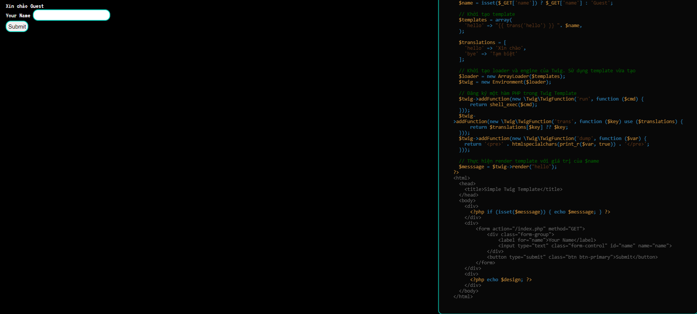
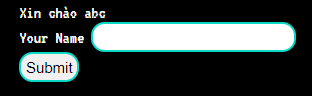
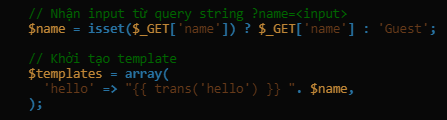
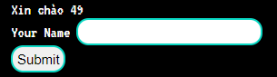
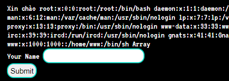

# SSTI

**Tên challenge:** Hello Twig

**Link challenge:** [Here](https://battle.cookiearena.org/challenges/web/hello-twig)

**Tác giả challenge:** MEME

**Mục tiêu challenge:** Can you get the flag ? Flag Format: CHH{XXX}

**Tác giả Writeup:** Shino

---

# Bài giải

**B1:** Đầu tiên, giao diện Website khá đơn giản, chỉ có 1 dòng input `name` và Source Code bên phải:

**B2:** Ta thử nhập `abc` vào trường input `name`:

Dựa vào đoạn code sau:

Ta có thể thấy là Website không sàng lọc kỹ input của người dùng `$name` mà cứ thế đưa vào Render Template.

=> Chức năng có thể bị SSTI

**B3:** Ta thử nhập input là `{{7*'7'}}` thì trang Web trả về kết quả như sau:

=> Ta có thể tạm thời kết luận là trang Web dùng Template `Twig` bị SSTI nhưng liệu ta có thể RCE thông qua loại lỗi này không thì vẫn chưa thể kết luận. Vì rất có thể Website chỉ cho phép những câu thử đơn giản và filter những payload liên quan đến RCE, và để củng cố thêm kết luận này ta sẽ thử đến payload có thể giúp ta thực thi Command.

**B4:** Thử payload RCE `{{['cat\x20/etc/passwd']|filter('system')}}`

=> Vậy là kết quả đã kết luận rằng ta có thể RCE hệ thống thông qua lổ hổng SSTI và kế tiếp ta chỉ việc lấy flag thôi.

<u><b>Thông tin thêm:</b></u> Flag nằm ở thư mục `/`