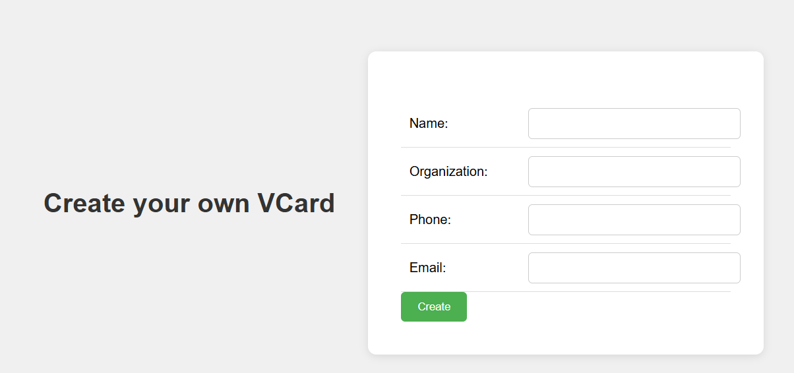
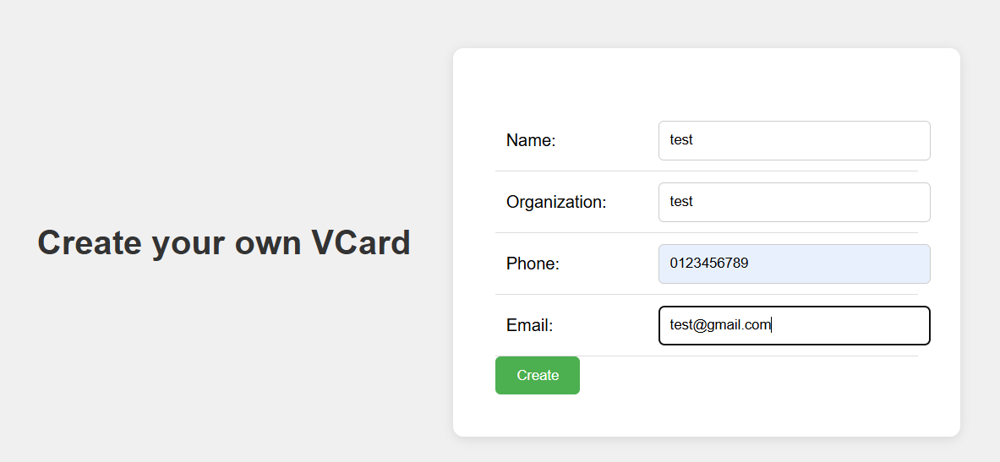
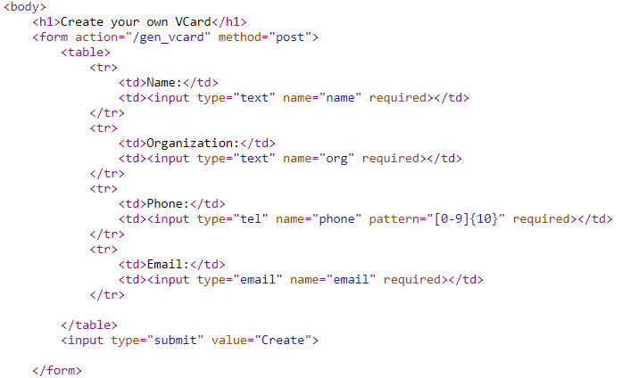
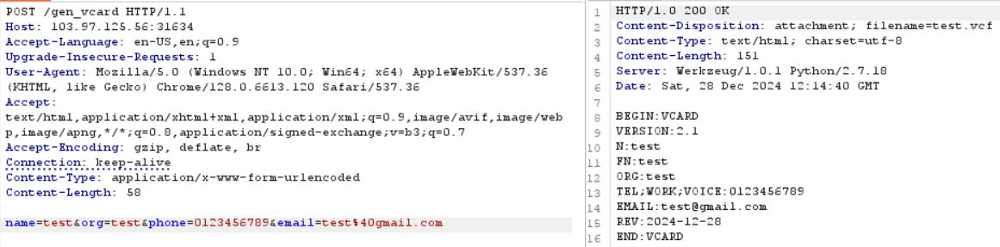
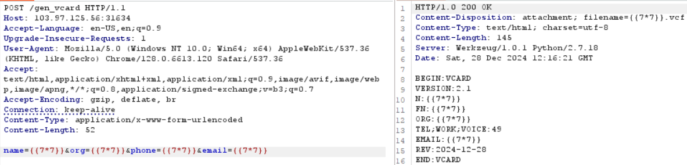
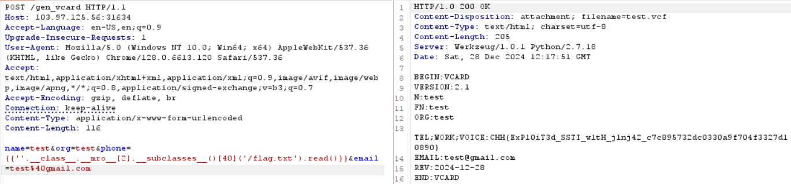

# SSTI

**Tên challenge:** Jinja2 VCard Generator

**Link challenge:** [Here](https://battle.cookiearena.org/challenges/web/jinja2-vcard-generator)

**Tác giả challenge:** COLLECTOR

**Mục tiêu challenge:** Trang web cho phép bạn tạo và tải về VCard miễn phí. Hãy khai thác lỗ hổng Server Side Template Injection để đọc nội dung file `/flag.txt`.

**Tác giả Writeup:** Shino

---

# Bài giải

**B1:** Đầu tiên, trang Web có tính năng tạo ra file `.vcf` như sau:



**B2:** Ta thử nhập thông tin và tạo ra 1 file `.vcf`:



Sau khi ta click `Create` thì 1 file `test.vcf` được tải xuống.

**B3:** Ta mở file `test.vcf` bằng notepad thì được nội dung như sau:

```
BEGIN:VCARD
    VERSION:2.1
    N:test
    FN:test
    ORG:test
    TEL;WORK;VOICE:0123456789
    EMAIL:test@gmail.com
    REV:2024-12-28
    END:VCARD
```

=> Xem ra phần 4 dòng thông tin ta điền sẽ được lưu vào đây.

Ta thử bắt lại gói tin POST trong `Burp-Suite` thì không thấy gói tin POST nào hết.

Khi đọc Source Code ta sẽ thấy khi ta nhấn nút `Create` thì ta sẽ gửi 1 gói tin POST đến endpoint `/gen_vcard` với 4 tham số lần lượt như các thông tin mà ta điền ở trên ( `name`, `org`, `phone` và `email` ):



=> Có thể do khi ta Click `Create` thì 1 file `.vcf` được tải xuống máy ta cho nên Burp-Suite không bắt lại gói tin đó.

**B4:** Ta thử tạo 1 gói tin POST đến `/gen_vcard` như sau:


=> Vậy là ta đã tạo được 1 gói tin POST thành công.

**B5:** Tiếp theo ta sẽ thử payload `SSTI` đối với Jinja2 là `{{7*7}}` ở 4 parameter trên:



=> Từ ảnh trên, ta có thể thấy parameter `phone` bị SSTI khi trả về giá trị `49`.

**B6:** Ta tiến hành đọc file `/flag.txt` thông qua payload `{{''.__class__.__mro__[2].__subclasses__()[40]('/flag.txt').read()}}`:



=> Vậy là ta đã thành công đọc được `Flag`.