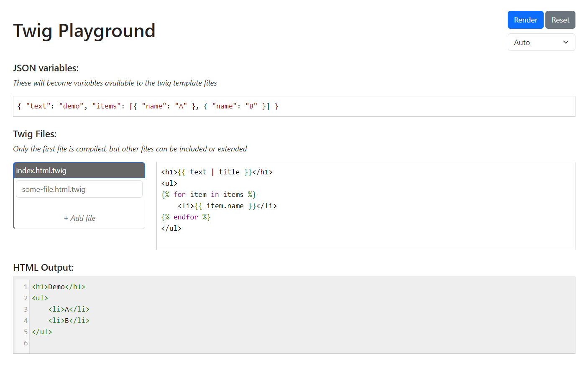
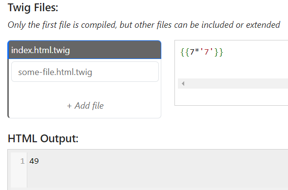
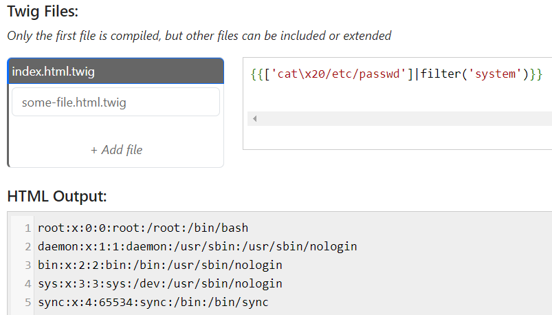

# SSTI

**Tên challenge:** Twig Playground

**Link challenge:** [Here](https://battle.cookiearena.org/challenges/web/twig-playground)

**Tác giả challenge:** COLLECTOR

**Mục tiêu challenge:** Play with your code, and dont forget to read the flag on /flag.txt Flag Format: CHH{XXX}

**Tác giả Writeup:** Shino

---

# Bài giải

**B1:** Đầu tiên, giao diện Website khá đơn giản:

Sau khi thử tính năng Website thì ta biết được, `HTML Output` sẽ in ra nội dung đã được Render của file `index.html.twig` khi ta click vào nút `Render` ở góc phải Website.

**B2:** Ta thử chỉnh sửa nội dung file `index.html.twig` thành payload SSTI `{{7*'7'}}` rồi `Render`:

=> Ta có thể tạm thời kết luận là trang Web dùng Template `Twig` bị SSTI nhưng liệu ta có thể RCE thông qua loại lỗi này không thì vẫn chưa thể kết luận. Vì rất có thể Website chỉ cho phép những câu thử đơn giản và filter những payload liên quan đến RCE, và để củng cố thêm kết luận này ta sẽ thử đến payload có thể giúp ta thực thi Command.

**B4:** Thử payload RCE `{{['cat\x20/etc/passwd']|filter('system')}}` rồi tiếp tục `Render`

=> Vậy là kết quả đã kết luận rằng ta có thể RCE hệ thống thông qua lổ hổng SSTI và kế tiếp ta chỉ việc lấy flag thôi.

<u><b>Thông tin thêm:</b></u> Flag nằm ở thư mục `/`