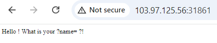
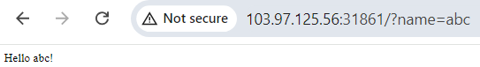
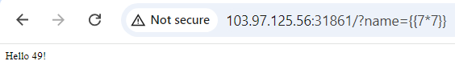
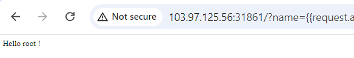

# SSTI

**Tên challenge:** What is your name ?

**Link challenge:** [Here](https://battle.cookiearena.org/challenges/web/what-is-your-name)

**Tác giả challenge:** MEME

**Mục tiêu challenge:** Can you get the flag ? Flag Format: CHH{XXX}

**Tác giả Writeup:** Shino

---

# Bài giải

**B1:** Đầu tiên, giao diện Website khá đơn giản, chỉ có 1 dòng text:

Ta để ý thấy phần `?name=` trong đoạn text khá giống với 1 parameter trên URL, nên ta thử thêm parameter `name` vào URL để xem sao.

**B2:** Ta thử thêm parameter `name` với giá trị là `abc` vào URL 2 thì Website trả về kết quả như sau:

Và ngoài parameter `name` ra thì ta chẳng còn manh mối nào khác, và thông thường thì các lỗi bảo mật liên quan đến parameter rất nhiều ( Chẳng hạn như: IDOR, XSS, SSTI, Path Traversal,... ), cho nên ta sẽ thử từng trường hợp.

**B3:** Thử từng payload và khi ta thử đến payload `{{7*7}}` thì trang Web trả về kết quả như sau:

=> Ta có thể tạm thời kết luận là trang Web bị SSTI nhưng liệu ta có thể RCE thông qua loại lỗi này không thì vẫn chưa thể kết luận. Vì rất có thể Website chỉ cho phép những câu thử đơn giản và filter những payload liên quan đến RCE, và để củng cố thêm kết luận này ta sẽ thử đến payload có thể giúp ta thực thi command.

**B4:** Thử payload RCE `{{request.application.__globals__.__builtins__.__import__('os').popen('whoami').read()}}`

=> Vậy là kết quả `Hello root !` đã kết luận rằng ta có thể RCE hệ thống thông qua lổ hổng SSTI và kế tiếp ta chỉ việc lấy flag thôi.

<u><b>Thông tin thêm:</b></u> Flag nằm ở thư mục `/`