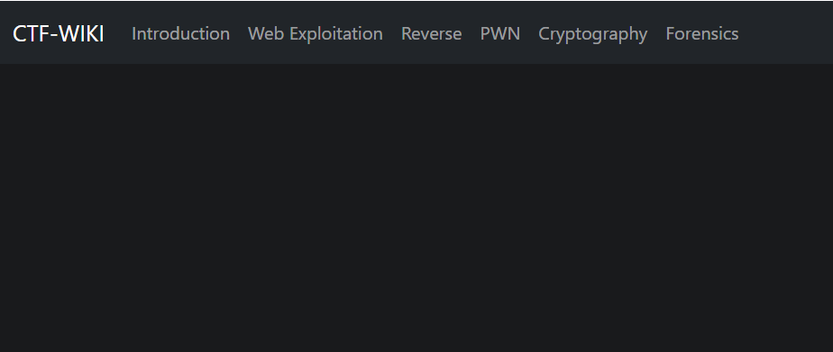
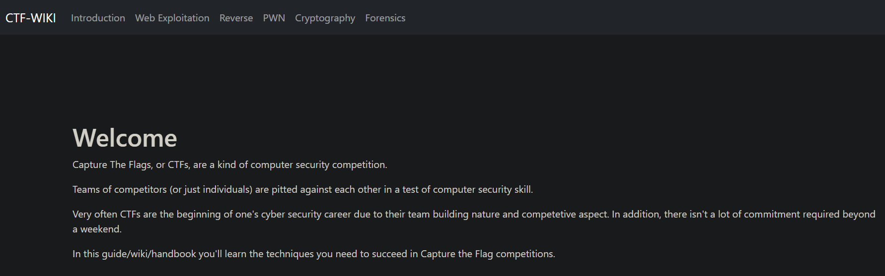
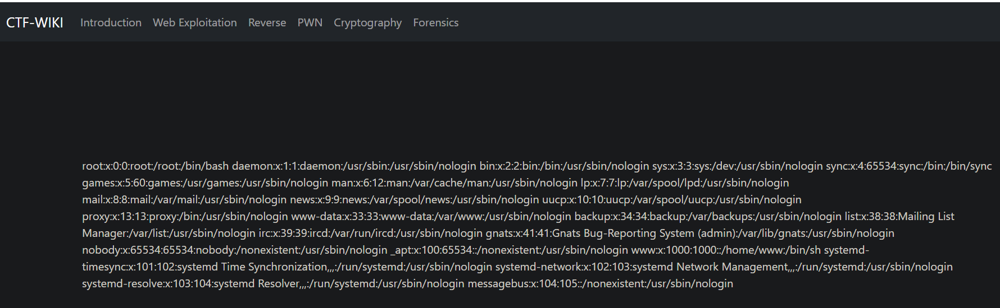
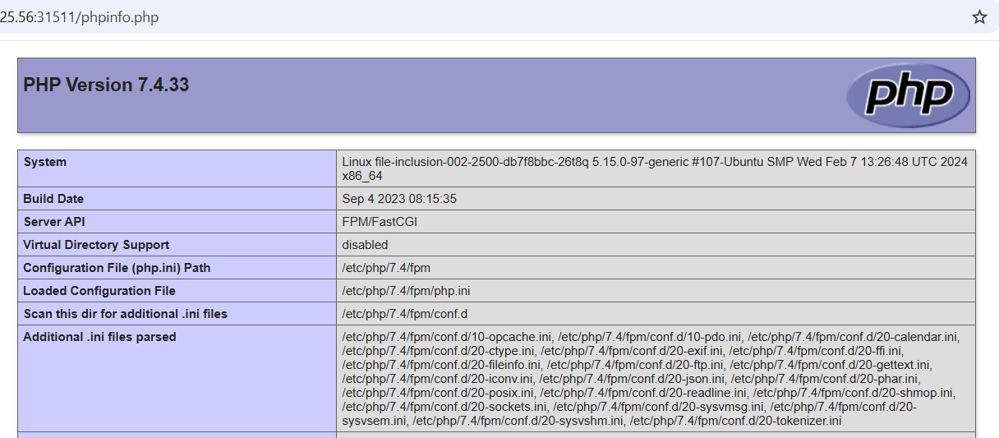
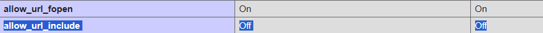
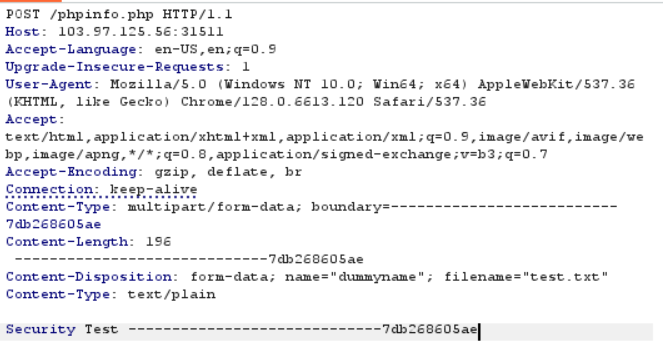
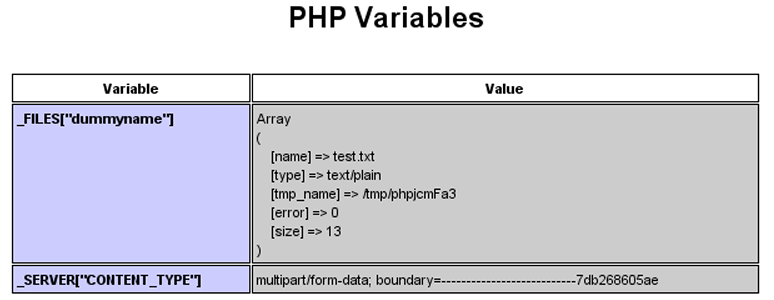

# Upload File

**Tên challenge:**  PHP Inclusion via phpinfo

**Link challenge:** [Here](https://battle.cookiearena.org/challenges/web/php-inclusion-via-phpinfo)

**Tác giả challenge:** COLLECTOR

**Mục tiêu challenge:**
phpinfo() Outputs information about PHP's configuration. Let's find phpinfo file, then create a Webshell for reading the flag file on the system. Some program execution functions are disabled!

Flag Location: /flagXXXX.txt

Flag Format: CHH{XXX}

Credits: MCTF

**Tác giả Writeup:** Shino

---

# Bài giải

**B1:** Đầu tiên, ta sẽ thấy Website có các mục như sau:
	


**B2:** Ta thử click vào 1 trong các mục trên thì Website trả về Output:



Ngoài ra, URL trên Website lúc này có xuất hiện thêm parameter `file=1`.

Như 1 lẽ thường tình, ta sẽ liên tưởng đến nhiều lỗ hổng bảo mật liên quan đến parameter trên URL như `LFI`, `RFI`,...

**B3:** Ta thử payload `?file=/etc/passwd` để xem sao:



=> Vậy là ta có thể tạm thời biết được parameter `file` này có thể làm ta đọc được file nội bộ.

Nhưng format của `Flag` là `flagXXXX.txt`, cho nên ta không thể đọc được nó thông qua lỗ hổng trên vì ta không biết được tên chính xác của file `flag`.

**B4:** Ta thử thay giá trị của parameter `file` thành URL Attacker có chứa `shell.php` của mình xem thử trang Web có thực thi không ?

=> Kết quả là chẳng có gì xảy ra.

=> Parameter `file` chỉ có lỗ hổng `LFI`.

Tới đây, ta thử truy cập endpoint `/robots.txt` để xem có manh mối không thì kết quả vẫn không có gì xảy ra.

Cuối cùng, ta sẽ thử đi tìm endpoint chứa file `phpinfo` để tìm thêm manh mối.

**B5:** Ta thử truy cập vào endpoint `/phpinfo.php` để xem sao:



Như ta biết, `phpinfo` có chức rất nhiều thông tin quan trọng về Application. Chúng ta thử kiểm tra xem tính năng `allow_url_include` đang ở trạng thái bật hay tắt ?



=> Đó là lý do ta không thể khai thác lỗ hổng `RFI` trên Website được.

**B6:** Ta tiếp tục check thử tính năng `file_uploads` có `ON` không, nếu nó `ON` thì ta có thể tiến hành `RCE`


Vậy là bước đầu có cơ hội RCE, tiếp đến ta phải thử bắt lại gói tin **GET** đến `/phpinfo.php` và đổi thành **POST** và thử upload 1 file xem liệu trang `phpinfo` có trả về giá trị của file đó không?



Sau khi gửi gói tin đi, ta kiểm tra lại nếu ở trang `phpinfo` có thể hiện thông tin sau thì nghĩa là ta có thể thực thi `RCE`:



=> Vậy là ta có thể tiến hành RCE thông qua trang `phpinfo` này

<u>**Giải thích 1 tí:**</u>

Để có thể RCE được thông qua `phpinfo` thì ta phải đủ các điều kiện sau:
1. Website phải **tồn tại** parameter bị `LFI`.
2. Ta có thể truy cập trang trả về kết quả `phpinfo()` như trên.
3. Tính năng `file_uploads` trong trang `phpinfo()` phải được `ON`.
4. `phpinfo()` sẽ trả về kết quả như ảnh trên nếu như ta thử Upload 1 file thông qua gói tin **POST** ở trang đó.

Như vậy là ta đã đủ các điều kiện trên để có thể **RCE** hệ thống nhưng cụ thể là làm thế nào ?

**Cung cấp thông tin 1 tí:**

* Khi ta Upload 1 file thông qua gói tin **POST** ở trang `phpinfo()`, trong trường hợp ở ảnh trên là file `test.txt` thì file `test.txt` sẽ được lưu tạm thời ở thư mục `/tmp` và file `test.txt` sẽ được đổi tên ngẫu nhiên có dạng như `phpXXXXXX`.
* Sau đó, nó sẽ đem thông tin đó in ra trong `phpinfo()` như bạn thấy ở ảnh trên và kết thúc quá trình xử lý. Và khi kết thúc quá trình xử lý, file `phpXXXXXX` trong mục `/tmp` sẽ bị xoá.

=> Mục tiêu của ta là mở được cái file `/tmp/phpXXXXXX` có chứa nội dung code `PHP` của ta Upload để nó thực thi code, trước khi nó bị xoá ở cuối quá trình xử lý.

Và để làm được điều đó thì ta phải dùng tới kỹ thuật `Race Condition` để làm cho việc xử lý của Website chậm lại và ta có thể có đủ thời gian để mở file `/tmp/phpXXXXXX` của ta để thực thi code trước khi nó bị xoá.

**Bạn có thể đọc kỹ hơn ở đây:** https://book.hacktricks.xyz/pentesting-web/file-inclusion/lfi2rce-via-phpinfo
* Web trên sẽ nói kỹ phương pháp và cách làm, kèm theo file hỗ trợ để bạn có thể thực thi được kỹ thuật `Race Condition` trong trường hợp này.

Ngoài ra, bạn có thể tham khảo file khai thác của tôi, vì ở Challenge này, ta không thể tạo kết nối **Reverse Shell**, có thể là do `Configuration` của Website.

Nhưng ta vẫn có thể tạo kết nối TCP giữa Website đến máy Attacker của ta, chỉ có điều là ta không thể thao tác lệnh trên đó nhung chỉ bấy nhiêu thôi là cũng đủ để ta đọc được `Flag` rồi.

**Cụ thể:**
1. Đầu tiên, bạn hãy thay đổi `$ip` và `$port` trong file `shell.py` thành `$ip` và `$port` public của bạn.
2. Bạn hãy listen ở máy của bạn thông qua payload `nc -lnvp port` với port là port mà bạn đã thay đổi trong file `shell.py`.
3. Bạn bắt đầu chạy file `shell.py` như sau:
```
python2 shell.py IP_challenge Port_challenge Thread // Mẫu

python2 shell.py 103.97.125.56 31511 100 // Ví dụ
```

Có thể phải cần chạy vài lần, cho đến khi Output của file `shell.py` là:
```
Done !!!
Woot!  \m/
Shuttin' down...
```

Lúc bấy giờ, khi ta quay lại máy listen của ta thì sẽ thấy `Flag`.

<u>**Giải thích file `shell.py` làm gì:**</u>
* File sẽ tạo ra các luồng Upload file chứa nội dung PHP được lưu ở biến `payload` lên Website.
* Sau đó, lấy tên file `phpXXXXXX` ở trang output của `phpinfo()` rồi lợi dụng lỗ hổng LFI ở paramter `file` để truy cập đến file `phpXXXXXX` được lưu ở thư mục `/tmp`.
* Nếu Website bị `Race Condition` làm chậm quá trình xử lý thì file `shell.py` có thể chạm đến file `phpXXXXXX` và thực thi code bên trong.
* Code bên trong file `phpXXXXXX` sẽ tạo kết nối Socket đến máy Listener của ta trước, sau đó nó sẽ thực thi lệnh `cd /; cat *` ở trên Website của nó rồi lấy kết quả đó in lên kết nối Socket giữa ta với nó.


