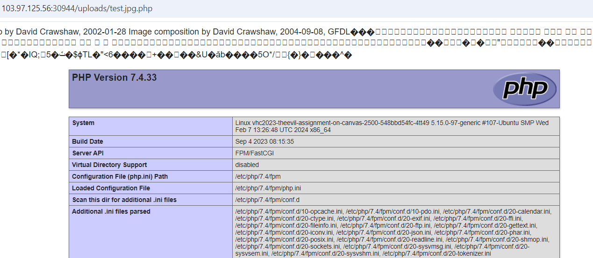

# Upload File

**Tên challenge:**  The Evil Assignment on Canvas

**Link challenge:** [Here](https://battle.cookiearena.org/challenges/web/the-evil-assignment-on-canvas)

**Tác giả challenge:** COLLECTOR

**Mục tiêu challenge:**
Oh noooo, when you're "chilling" with this CTF, your evil professor throws an impossible assignment on Canvas at you, and it's due TOMORROW! The only way to pass this course is to pwn him!! The show will never end!

**Tác giả Writeup:** Shino

---

# Bài giải

**B1:** Đầu tiên, ta sẽ thấy Website có chức năng Upload ảnh như sau:
	

**B2:** Sau khi, ta thử up 1 file ảnh mà chức năng cho phép thì nó sẽ đưa ta 1 đường dẫn đến thư mục chứa ảnh đó:

Lúc này, câu hỏi đặt ra là: `Chức năng chỉ cho phép up những file có định dạng ảnh dựa trên filter ở extension của file hay là filter ở Content-type,...`

Để tìm ra câu trả lời thì ta sẽ thử từng trường hợp và trường hợp đầu tiên là kiểm tra ở **Extension File** và ta sẽ thực hiện theo các bước sau:
1. Ta sẽ thử bắt lại gói tin `POST` trong Burpsuite
2. Sau đó đổi tên file thành `flower.php`
3. Ta xoá bớt vài nội dung gốc của file `flower.jpg` ban đầu, chỉ chừa lại những **MAGIC BYTES** trong file `jpg`
4. Ta chèn thêm nội dung: `<?php phpinfo(); ?>` vào
5. Giữ nguyên `content-type: image/jpeg` thay vì `plain/text` như các file text thông thường.

=> Kết quả là không được.

**B3:** Ta thử giữ nguyên nội dung như trên nhưng tên file thì ta thêm từ khoá `.jpg` vào như sau: `test.jpg.php`

Khi ta Upload lại lần nữa thì kết quả trả về là:

**B4:** Ta thử click vào đường dẫn trên:

=> Kết quả là trang web đã thực thi mã php từ file ta đã tải lên.

**B5:** Ta chỉ cần Up sửa lại nội dung file thực thi code để đọc `Flag` thôi.

