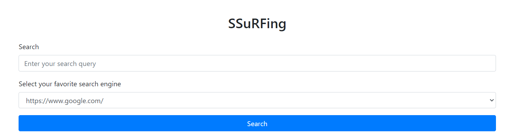
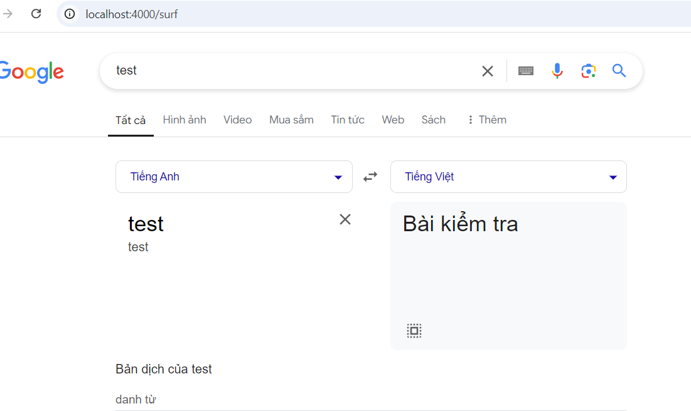
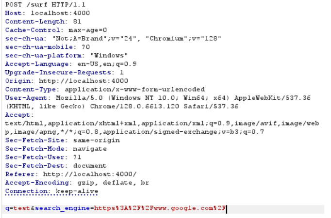
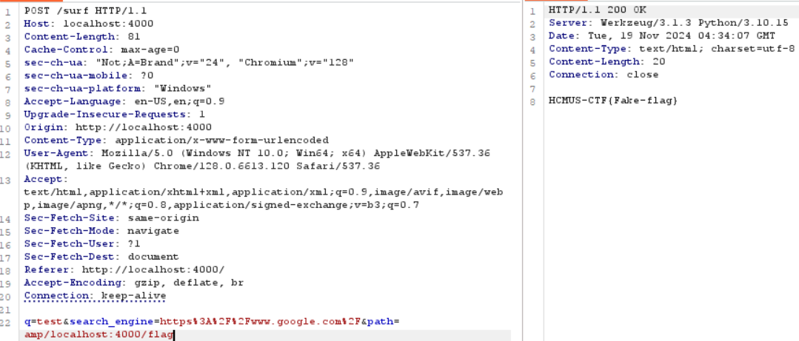

# SSRF Via Search Engine

**Tên challenge:**  SSuRFing

**Link challenge:** `SSuRFing.zip`

**Tác giả challenge:** Dat2Phit

**Mục tiêu challenge:**
Access endpoint `/flag` and read `Flag`

**Tác giả Writeup:** Shino

---

# Bài giải

**B1:** Đầu tiên, ta sẽ thấy trang Web có chức năng tìm kiếm thông qua các Search Engine như sau:



**B2:** Ta thử search với từ khoá bất kỳ và sau đó trang Web sẽ chuyển hướng ta sang trang tìm kiếm của Search Engine đó:



Sau khi bắt lại gói tin POST `/surf` thì ta sẽ thấy có 2 parameter `q` và `search_engine` ở phần body như sau:



Ta đọc qua Source Code mà Challenge cung cấp, thì ta biết được các thông tin đáng chú ý sau:

1. `Search_engine` bắt buộc phải là 1 trong 5 công cụ sau:
```
    "https://www.google.com/": "search",
    "https://www.bing.com/": "search",
    "https://html.duckduckgo.com/": "html",
    "https://search.yahoo.com/": "search",
    "https://search.brave.com/": "search"
```
2. Có 1 parameter nữa là `path` nhưng không được thể hiện trong phần `body` của gói tin POST `/surf` vì trên trang chủ của Website chỉ cho chọn `Search_engine` và nhập query `q` nhưng ta có thể thêm nó vào nếu cần thiết.
3. Nếu giá trị của `q` rỗng hoặc `search_engine` không phải là 1 trong 5 công cụ trên thì Web sẽ trả về `Invalid Data`
4. Cú pháp lệnh request mà Website sử dụng có dạng: `search_engine + path + '?q=' + query` ( VD ở trường hợp ta thử ở trên là: `https://google.com/?q=test` )
5. Nếu muốn lấy được `Flag` thì phải truy cập vào endpoint `/flag` nhưng với điều kiện là IP thực sự của ta phải có giá trị `127.0.0.1`

Vậy thì hướng đi của bài này phải làm sao, vì ta chẳng thể chèn được thêm cú pháp để thực thi Command Injection và cũng chẳng thể dùng `file:///etc/passwd` vì nó có `Search_engine` ở đầu query.
* **Trả lời:** Ta có thể lợi dụng chức năng `open-redirect` của `Search Engine` để giúp ta chuyển hướng đến mục tiêu ta cần khai thác, và `Search Engine` có thể giúp ta làm chuyện này chính là `Google`.

<u>**Có thể bạn chưa biết:**</u> AMP URL Google sẽ giúp ta chuyển hướng đến trang mục tiêu mà ta muốn thông qua cú pháp sau:
```
https://google.com/amp/<target_url>
```
**Đọc thêm về AMP URL:** https://developers.googleblog.com/en/whats-in-an-amp-url/

**B2:** Ta bắt lại gói tin POST `/surf` rồi chỉnh sửa body thành nội dung sau:



=> Vậy là ta đã lợi dụng được chức năng của Server và đọc thành công được file `Flag`