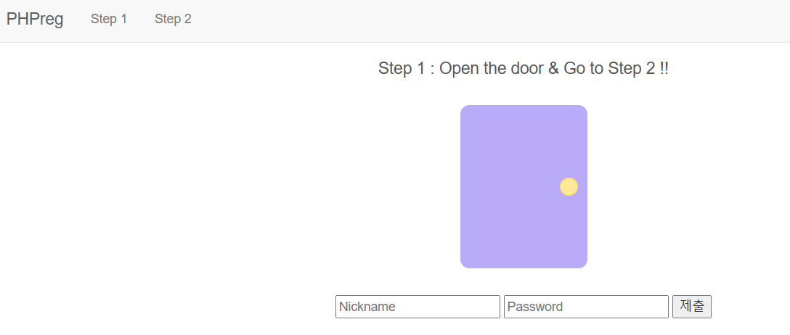
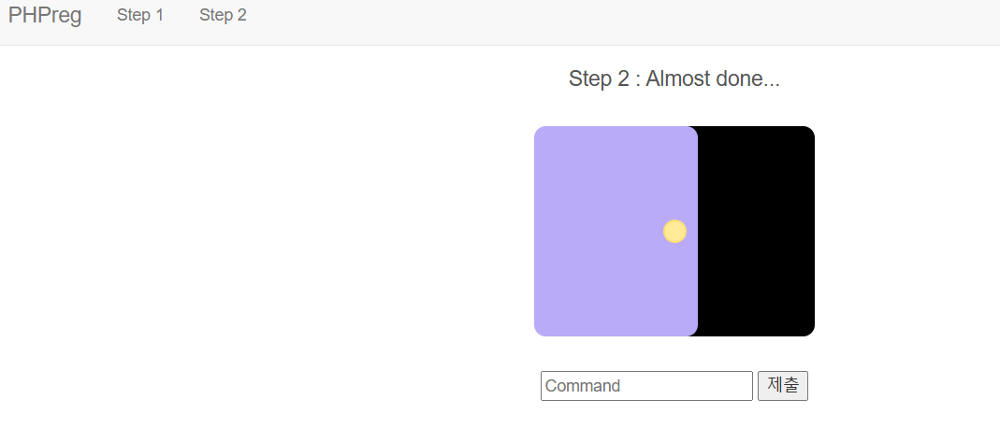
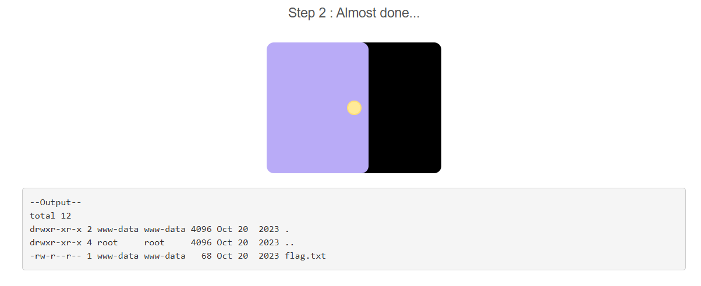
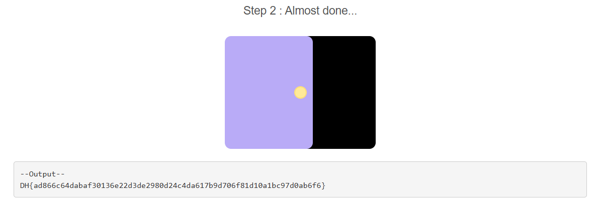

# Bypass Regex In PHP

**Tên challenge:**  PHPreg

**Link challenge:** [Here](https://dreamhack.io/wargame/challenges/873)

**Tác giả challenge:** Dreamhack

**Mục tiêu challenge:**
This page is written in php.

Enter the appropriate Nickname and Password and you can proceed to Step 2.

Use the `system()` function in Step 2 to obtain flags.

The flag is `../dream/flag.txt` located at.

The format of the flag is` DH {...}` That's it.

**Tác giả Writeup:** Shino

---

# Bài giải

**B1:** Đầu tiên, Challenge sẽ cung cấp cho ta 1 Source Code và Website có chức năng Login như sau:



Ta phải đăng nhập thành công thì mới có thể tiến hành thực thi chức năng Command bên trong `Step 2`

**B2:** Ta phân tích Source Code mà Challenge cung cấp thì rút ra được vài điểm chú ý sau:
1. Để đăng nhập thành công thì ta phải đăng nhập `nickname = dnyang0310` và `password = d4y0r50ng+1+13`
2. `Nickname` sẽ bị filter nếu trường input của người dùng có chứa chuỗi string `nyang`
```
$pw = preg_replace("/\d*\@\d{2,3}(31)+[^0-8\"]\!/", "d4y0r50ng", $input_pw);
```
3. `Password` sẽ bị filter nếu trường input `password` có chứa chữ cái trong đó.
```
 if (preg_match("/[a-zA-Z]/", $input_pw)) {
    echo "alphabet in the pw :(";
 }
```
Vậy thì làm sao để có thể đăng nhập thành công nếu không `nickname` thì không được nhập nyang và `password` thì không được nhập chữ cái ?

* Trả lời: Dựa vào 2 đoạn code dưới đây trong Source Code, ta có thể Bypass được:
```
$name = preg_replace("/nyang/i", "", $input_name);
$pw = preg_replace("/\d*\@\d{2,3}(31)+[^0-8\"]\!/", "d4y0r50ng", $input_pw);
```
Từ 2 dòng `preg_replace` trên, ta có thể Bypass bằng cách:
1. Ta sẽ nhập `nickname` là `dnyangnyannyangg0310`.
2. Ta sẽ nhập password là `1@1131319!` để thoả với biểu thức chính quy và nó sẽ bị thay thế thành `d4y0r50ng`, ngoài ra ta cũng thêm `+1+13` vào sau `password` để cho phù hợp với điều kiện `Login`.

**B3:** Đăng nhập với credential `dnyangnyannyangg0310` và `1@1131319!+1+13`



=> Vậy là ta đã Bypass thành công, tiếp đến là đọc `Flag` thôi.

Theo đề bài thì `flag.txt` nằm ở `../dream/flag.txt`

**B4:** Ta thử dùng lệnh `cd ../dream; ls -la`



Vậy là ta đã tìm được `flag.txt` nhưng Source Code đã filter từ `flag` trong Command.
```
else if (preg_match("/flag/i", $cmd))
{
    echo "<pre>Error!</pre>";
}
```


=> Do đó ta sẽ dùng lệnh sau để đọc `Flag`:
```
cd ../dream; cat *
```

