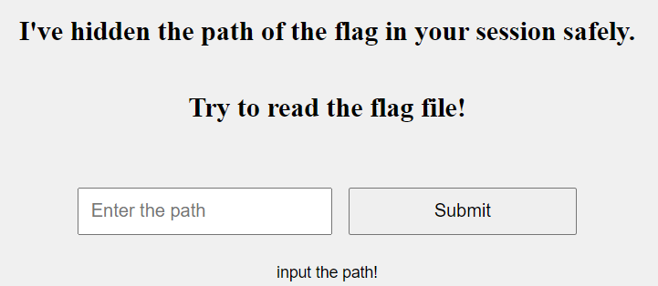
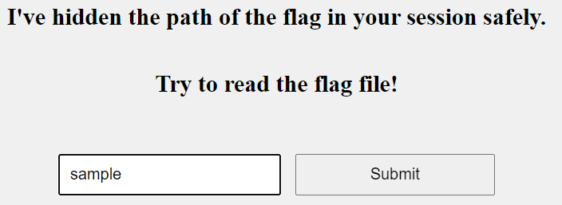
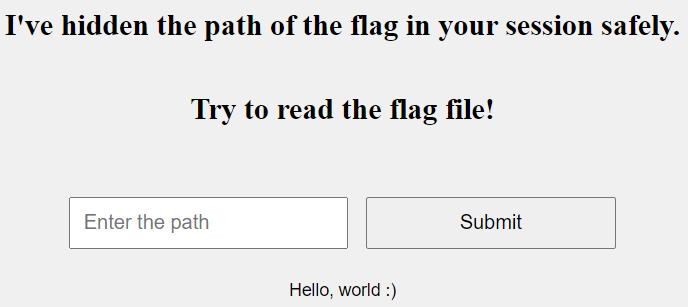

# Decode Cookie Session In Flask

**Tên challenge:**  Secure Secret

**Link challenge:** [Here](https://dreamhack.io/wargame/challenges/1570)

**Tác giả challenge:** Dreamhack

**Mục tiêu challenge:** The flag file is placed hidden in a random directory, and concealed its directory inside the session.

Find the vulnerability and get the flag!

The flag format for this challenge is `DH{...}`.

**Tác giả Writeup:** Shino

---

# Bài giải

**B1:** Đầu tiên, Challenge sẽ cung cấp cho ta 1 Source Code và Website có chức năng input như sau:



Ta nhập thử `test` thì nó trả về:
```
Invalid path!
```

**B2:** Ta đi sâu vào Source Code mà Challenge cung cấp:
```python
#!/usr/bin/env python3
import os
import string
from flask import Flask, request, abort, render_template, session

SECRETS_PATH = 'secrets/'
ALLOWED_CHARACTERS = string.ascii_letters + string.digits + '/'

app = Flask(__name__)
app.secret_key = os.urandom(32)

# create sample file
with open(f'{SECRETS_PATH}/sample', 'w') as f:
    f.write('Hello, world :)')

# create flag file
flag_dir = SECRETS_PATH + os.urandom(32).hex()
os.mkdir(flag_dir)
flag_path = flag_dir + '/flag'
with open('/flag', 'r') as f0, open(flag_path, 'w') as f1:
    f1.write(f0.read())


@app.route('/', methods=['GET'])
def get_index():
    # safely save the secret into session data
    session['secret'] = flag_path

    # provide file read functionality
    path = request.args.get('path')
    if not isinstance(path, str) or path == '':
        return render_template('index.html', msg='input the path!')

    if any(ch not in ALLOWED_CHARACTERS for ch in path):
        return render_template('index.html', msg='invalid path!')

    full_path = f'./{SECRETS_PATH}{path}'
    if not os.path.isfile(full_path):
        return render_template('index.html', msg='invalid path!')

    try:
        with open(full_path, 'r') as f:
            return render_template('index.html', msg=f.read())
    except:
        abort(500)
```
Từ trên, ta rút ra được vài điểm đáng chú ý sau:
1. Đường dẫn tới file chứa `Flag` là: `/secrets/random_32bytes/flag`.
2. Khi ta nhập input vào thì đường dẫn khi được xử lý sẽ là `/secrets/input_cuata`.

**VD:** Nếu ta nhập vào `sample` thì đường dẫn `/secrets` được cố định từ trước sẽ cộng với input của ta nghĩa là `/secrets/sample` và sẽ trả kết quả nội dung file `sample` trong thư mục `/secrets` là `Hello, world :)`





3. Toàn bộ đường dẫn đến `Flag` được lưu vào `session['secret']`.

Vậy thì từ đây, ta đã biết mục tiêu của ta là đi lấy secret trong session mà ứng dụng cung cấp cho ta.

**B3:** Ta quan sát session mà ứng dụng cung cấp cho ta có dạng sau:
```
.eJwtybERgDAIAMBdskAChiBuA4TYWBk7z921sPu7v9MMP-NK24-ZGVXAYSEpjcG1wGCPWjs7gXwANERlohXMXEYrzcOgf8taLY9D9_S8w5kaRw.Z1Uacg.J0f1b_gkX_qDI8ThkONnFMa6EmA
```
Dù tìm nhiều phương pháp để decode nhưng vẫn không thành, cho đến khi tôi tìm được 1 bài viết nói về [Flask Session Cookie Tampering](https://stackoverflow.com/questions/77340063/flask-session-cookie-tampering).

Cụ thể, ta sẽ dùng Tool `FLask-Unsign` được viết bằng Python để Decode ra Flask Session này: https://github.com/Paradoxis/Flask-Unsign.

**B4:** Ta tiến hành Decode Session bằng Tool trên:
```
$> flask-unsign --decode --cookie '.eJwtybERgDAIAMBdskAChiBuA4TYWBk7z921sPu7v9MMP-NK24-ZGVXAYSEpjcG1wGCPWjs7gXwANERlohXMXEYrzcOgf8taLY9D9_S8w5kaRw.Z1Uacg.J0f1b_gkX_qDI8ThkONnFMa6EmA'

'{"secret":"secrets/72a91c13590671ca01f7ce44d7c519e4412b22a75581bbc9f606ceb1d5197a4b/flag"}'
```

**B5:** Ta chỉ cần nhập đường dẫn trên là sẽ có được `Flag`

<u>**Lưu ý:**</u> Chỉ cần nhập vào `72a91c13590671ca01f7ce44d7c519e4412b22a75581bbc9f606ceb1d5197a4b/flag`, đừng nhập `/secrets` vì nếu không đường dẫn mà ứng dụng tìm sẽ là `/secrets/secrets/72a91c13590671ca01f7ce44d7c519e4412b22a75581bbc9f606ceb1d5197a4b/flag` và ứng dụng sẽ trả về kết quả `Invalid path!`.

<u>**Thông tin thêm:**</u> Trong Flask Session, ta có thể giải mã Session mà không cần đến `Secret Key` nhưng để thao túng và ký lại thì phải cần đến `Secret Key`. Để tìm được `Secret Key` thì cách khả thi là dùng Brute-force và tool [Flask-Unsign](https://github.com/Paradoxis/Flask-Unsign) cũng có hỗ trợ cho ta việc Brute-force `Secret Key` và ký lại.