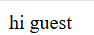
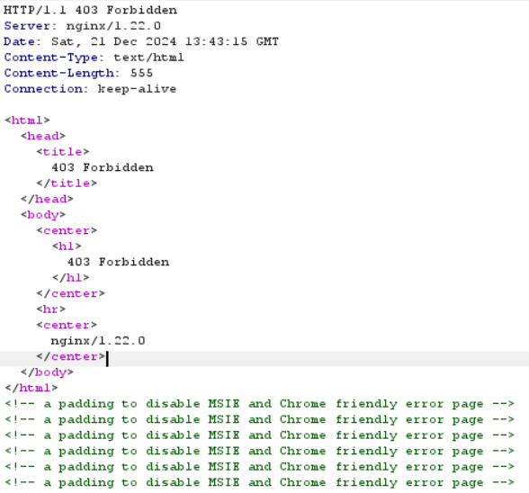
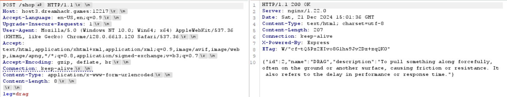
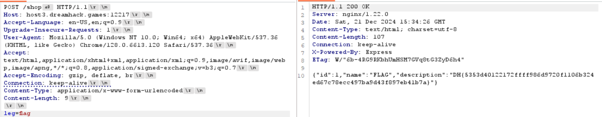

# Unicode Dotless

**Tên challenge:** Youth-Case

**Link challenge:** [Here](https://dreamhack.io/wargame/challenges/1402)

**Tác giả challenge:** Dreamhack

**Mục tiêu challenge:** Bypass filter

**Tác giả Writeup:** Shino

---

# Bài giải

**B1:** Đầu tiên, Challenge sẽ cung cấp cho ta 1 Source Code và Link Website, trước tiên ta truy cập vào Website thì trang Web chỉ trả về dòng text như sau:



Xem ra chẳng có manh mối gì nên ta sẽ bắt đầu nghiên cứu đến Source Code.

**B2:** Ta bắt đầu phân tích những file quan trọng trong Source Code:
1. `app.js`:
```javascript
const words = require("./ag")
const express = require("express")

const PORT = 3000
const app = express()
app.set('case sensitive routing', true)
app.use(express.urlencoded({ extended: true }))

function search(words, leg) {
    return words.find(word => word.name === leg.toUpperCase())
}

app.get("/",(req, res)=>{
    return res.send("hi guest")
})

app.post("/shop",(req, res)=>{
    const leg = req.body.leg.toLowerCase()

    if (leg == 'flag'){
        return res.status(403).send("Access Denied")
    }

    const obj = search(words,leg)

    if (obj){
        return res.send(JSON.stringify(obj))
    }

    return res.status(404).send("Nothing")
})

app.listen(PORT,()=>{
    console.log(`[+] Started on ${PORT}`)
})
```
**Giải thích:**
* File trên sẽ trả về dòng text `hi guest` khi có request đến `/`.
* Code sẽ thực hiện chức năng `Search` với từ khoá được lấy từ parameter `leg` trong phần body của request POST đến `/shop`.
* Code sẽ thực hiện tìm theo từ khoá của parameter `leg` trong file `ag.js`.
* Nếu từ khoá chứa từ `flag` thì sẽ trả về `403: Access Denied`

2. `ag.js`:
```javascript
module.exports = [
    {
        "id": 1,
        "name": "FLAG",
        "description": "DH{fake_flag}"
    },
    {
        "id": 2,
        "name": "DRAG",
        "description": "To pull something along forcefully, often on the ground or another surface, causing friction or resistance. It also refers to the delay in performance or response time."
    },
    {
        "id": 3,
        "name": "SLAG",
        "description": "The waste material produced by the smelting process, which involves separating metal from its ore. Slag is typically a mixture of metal oxides and silicon dioxide."
    },
    {
        "id": 4,
        "name": "SWAG",
        "description": "Refers to stylish confidence in one's appearance or demeanor. It can also mean promotional goods or items given away for free as a form of advertising."
    }
]
```
**Giải thích:** Đây là những nội dung mà file `app.js` sẽ truy vấn đến theo từ khoá của parameter `leg`.

**B3:** Ta thử gửi gói tin POST đến `/shop` và thử tìm từ khoá `drag` để test tính năng `search`.
```
POST /shop HTTP/1.1
Host: host3.dreamhack.games:23194
Accept-Language: en-US,en;q=0.9
Upgrade-Insecure-Requests: 1
User-Agent: Mozilla/5.0 (Windows NT 10.0; Win64; x64) AppleWebKit/537.36 (KHTML, like Gecko) Chrome/128.0.6613.120 Safari/537.36
Accept: text/html,application/xhtml+xml,application/xml;q=0.9,image/avif,image/webp,image/apng,*/*;q=0.8,application/signed-exchange;v=b3;q=0.7
Accept-Encoding: gzip, deflate, br
Connection: keep-alive
Content-Type: application/x-www-form-urlencoded
Content-Length: 8

leg=drag
```
Nhưng trang Web lại trả về lỗi `403 Forbidden`:



Ta không gửi từ khoá chứa `flag` và kết quả lại là `403: Forbidden` chứ không phải `403: Access Denied`, cho nên khả năng là trang Web đã chặn mọi gói tin đến với `/shop`, do đoạn code sau trong file `nginx.conf` xử lý:
```
events {
    worker_connections  1024;
}

http {
    server {
        listen 80;
        listen [::]:80;
        server_name  _;
        
        location = /shop {
            deny all;
        }

        location = /shop/ {
            deny all;
        }

        location / {
            proxy_pass http://app:3000/;
        }

    }

}
```

Vậy thì làm sao ta mới có thể Bypass và gửi gói tin POST đến `/shop` được đây ?
* **Trả lời:** Sau khi đi tìm hiểu thì ta biết được Website đang dùng `Nginx 1.22.0` và ta có thể dùng ký tự `\xA0` để bypass được filter này.

<u>**Đọc thêm:**</u> https://book.hacktricks.xyz/pentesting-web/proxy-waf-protections-bypass

**B4:** Ta thử gửi lại gói tin POST nhưng sẽ thêm ký tự `\xA0` vào sau `/shop` như sau:


=> Vậy là ta đã thành công Bypass được filter `/shop`

Bước tiếp theo, là ta cần phải tìm kiếm `Flag` nhưng không được nhập chữ `flag`, thế thì ta phải làm sao ?

* **Trả lời:** Sau khi tìm hiểu thì mình tìm được 1 case thú vị về [Hacking GitHub's Auth with Unicode's Turkish Dotless 'I'](https://dev.to/jagracey/hacking-github-s-auth-with-unicode-s-turkish-dotless-i-460n) có thể giúp ta lấy được `Flag`, tóm gọn lại thì bạn có thể xem ví dụ sau:
```javascript
'John@Gıthub.com'.toLowerCase() === 'John@Github.com'.toLowerCase()
```
Bạn có thể thấy ví dụ trên thì chữ `ı` trong `Gıthub.com` có cách viết khác với `i` trong `Github.com`, tuy nhiên khi so sánh hai ký tự với nhau thì lại cho kết quả giống nhau.

Do đó, ta có thể tận dụng điều này và làm tương tự với từ `flag`, ta có thể dùng từ `fl` trong `Turkish Unicode` để thay thế cho chữ `fl` mà bình thường ta hay viết.

**B5:** Ta gửi gói tin như sau sẽ lấy được `flag`:
