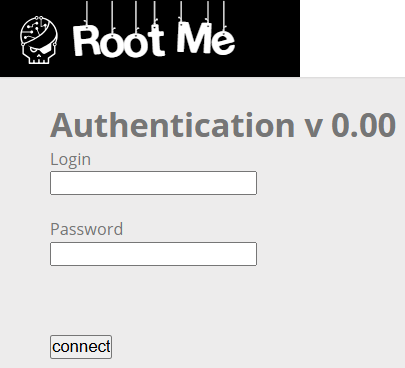
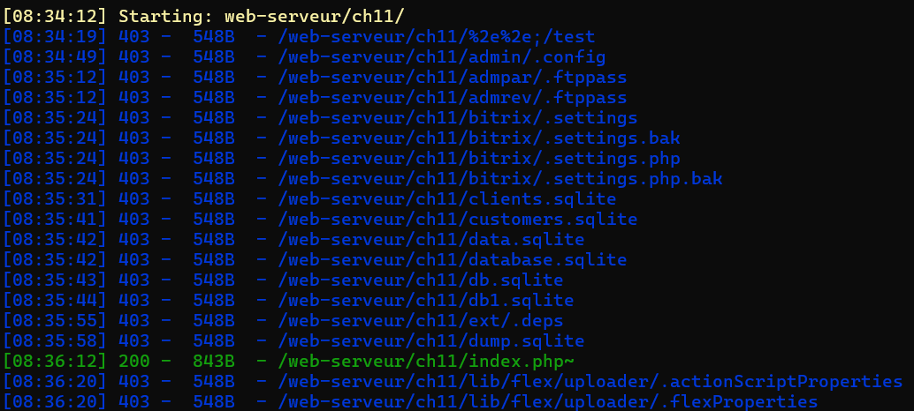
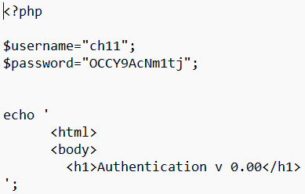

# Backup File

**Tên challenge:**  Backup File

**Link challenge:** [Here](https://www.root-me.org/en/Challenges/Web-Server/Backup-file)

**Tác giả challenge:** g0uZ

**Mục tiêu challenge:** No clue.

**Tác giả Writeup:** Shino

---

# Bài giải

**B1:** Đầu tiên, ta sẽ thấy trang Web có chức năng đăng nhập như sau:



Thông qua tên Challenge, ta biết mục tiêu của ta trong Challenge này đó chính là tìm được file backup.

**B2:** Ta tiến hành Brute-force các đường dẫn ẩn thông qua tool `dirsearch`:
```
$> dirsearch -u http://challenge01.root-me.org/web-serveur/ch11/
```


Ta thử truy cập vào endpoint `/index.php~` và 1 file `index.php~` được tải xuống.

**B3:** Đọc nội dung file `index.php~` vừa tải xuống và ta lấy được `username` và `password`.



=> Ta đã tìm được `Flag` là `password`.