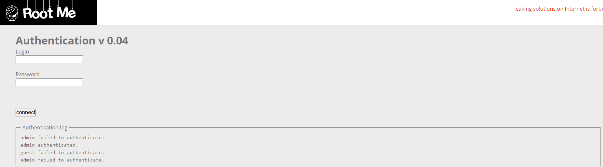

# CRLF

**Tên challenge:**  CRLF

**Link challenge:** [Here](https://www.root-me.org/en/Challenges/Web-Server/CRLF)

**Tác giả challenge:** g0uZ

**Mục tiêu challenge:** Inject false data in the journalisation log.

**Tác giả Writeup:** Shino

---

# Bài giải

**B1:** Đầu tiên, ta sẽ thấy trang Web có chức năng đăng nhập như sau:
	


Sau khi thử nhập `username` và `password` là `test` thì `Authentication log` thêm 1 dòng sau:
```
admin failed to authenticate.
admin authenticated.
guest failed to authenticate.
admin failed to authenticate.
test failed to authenticate.
```
=> Tới đây, ta biết được để lấy được `Flag` thì ta phải làm cho `Authentication Log` in ra dòng `admin authenticated`.

Do ta đã biết Challenge này liên quan đến `CRLF`, nên ta sẽ khai thác theo payload sau để lấy `Flag`:
```
http://challenge01.root-me.org/web-serveur/ch14/?username=admin%20authenticated.%0d%0atest&password=
```
<u>**Giải thích:**</u>
* `%0d%0a` chính là `\r\n` trong gói tin HTTP.
* Chúng được gọi chung là CRLF và là các chuỗi ký tự đặc biệt được sử dụng trong giao thức HTTP để biểu thị sự kết thúc của một dòng hoặc sự bắt đầu của một dòng mới.
* Máy chủ web và trình duyệt sử dụng CRLF để phân biệt giữa tiêu đề HTTP và nội dung phản hồi.

**Đọc thêm:** https://book.hacktricks.xyz/pentesting-web/crlf-0d-0a