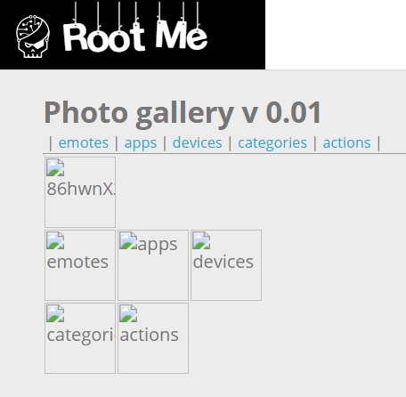

# File Upload - MIME type

**Tên challenge:**  Photo Gallery v0.01

**Link challenge:** [Here](https://www.root-me.org/en/Challenges/Web-Server/Directory-traversal)

**Tác giả challenge:** g0uZ

**Mục tiêu challenge:** Find the hidden section of the photo galery.

**Tác giả Writeup:** Shino

---

# Bài giải

**B1:** Đầu tiên, ta sẽ thấy có các Gallery khi truy cập vào trang web như sau:
	


Sau khi thử click từng Gallery thì ta thấy rằng, các mục Gallery chứa các hình ảnh trong các mục này nhưng không thể click trực tiếp vào các hình ảnh trong từng mục.

Tuy nhiên, ở URL của trang Web có 1 parameter `galerie`:

```
http://challenge01.root-me.org/web-serveur/ch15/ch15.php?galerie=actions
```

Nhìn vào parameter `galerie`, ta có thể liên tưởng đến các kịch bản lỗi bảo mật liên quan như Path Traversal,...

**B2:** Ta thử payload `../../../../../../../../../../../etc/passwd`, để xem Website có trả về nội dung file `passwd` không

Tuy nhiên, trang Web chỉ trả về dòng lỗi sau:
```
Warning: file_exists(): open_basedir restriction in effect. File(galerie/../../../../../../../../../../../etc/passwd) is not within the allowed path(s): (/challenge/web-serveur/ch15:/tmp) in /challenge/web-serveur/ch15/ch15.php on line 32
```
**Giải thích:**
1. `file_exists()`: Đây là một hàm PHP để kiểm tra xem một tệp có tồn tại hay không. Tuy nhiên, đường dẫn mà hàm này nhận được không nằm trong phạm vi cho phép của thiết lập `open_basedir`.

2. `open_basedir`: Đây là tùy chọn cấu hình trong PHP giới hạn quyền truy cập vào các tệp và thư mục chỉ nằm trong một phạm vi nhất định. Điều này ngăn chặn truy cập ngoài phạm vi đã cho, giúp tăng cường bảo mật cho hệ thống.

Tóm lại, cảnh báo này ngăn không cho phép truy cập tệp ngoài phạm vi đã cấu hình. `open_basedir` ở đây là một cơ chế bảo mật, giúp giới hạn truy cập tệp và thư mục, ngăn chặn các tấn công kiểu `Path Traversal`.

Tuy nhiên, khi ta nhìn thử vào đoạn lỗi thì ta phát hiện đường dẫn chính xác chứa file `ch15.php` ( File mà ta đang tương tác ) là `/challenge/web-serveur/ch15/ch15.php`.

**B3:** Tiếp tục đổi payload thành `../../../../../../../../../../../challenge/web-serveur/ch15/ch15.php` để xem Website có trả về nội dung file `ch15.php` không

Kết quả là trang Web lại in ra 2 dòng lỗi khác:
```
Warning: opendir(galerie/../../../../../../../../../../../challenge/web-serveur/ch15/ch15.php): failed to open dir: Not a directory in /challenge/web-serveur/ch15/ch15.php on line 34

Warning: readdir() expects parameter 1 to be resource, bool given in /challenge/web-serveur/ch15/ch15.php on line 36
```

Từ lỗi trên, ta biết được parameter `galerie` chỉ nhận đường dẫn đến thư mục, chứ không nhận đường dẫn đến file cụ thể.

**B4:** Ta thử đổi payload thành `../../../../../../../../../../../challenge/web-serveur/ch15/` để xem Website sẽ trả về điều gì ?


Ta thu được: 1 file `ch15.php` và 1 thư mục `galerie`

**B5:** Tiếp tục thêm thư mục `galerie` ở cuối payload `../../../../../../../../../../../challenge/web-serveur/ch15/galerie`



Từ ảnh trên, ta biết được:
* `emotes`, `apps`, `devices`, `categories`, `actions` là các thư mục gallery tương ứng của web
* `86hwnX2r`là thư mục ẩn mà ta đang tìm

**Thông tin thêm:** Vì trên trang Web không thể hiện đủ thông tin của thư mục. Bạn có thể vào Source Code ở trang hiện tại để xem tên đầy đủ của thư mục hoặc dùng Inspect của Google.

**B6:** Ta tiếp tục thêm thư mục ẩn `86hwnX2r` vào cuối payload `../../../../../../../../../../../challenge/web-serveur/ch15/galerie/86hwnX2r`


Ta thu được 3 file: `password.txt`, `hacked_web.jpg`, `secret.png`

Vậy là ta đã tìm được file `password.txt` nhưng câu hỏi tiếp theo là làm sao để đọc được nó. Vì parameter `galerie` chỉ nhận giá trị là đường dẫn đến thư mục thôi.

**Trả lời:** Quay lại trang chủ, khi ta đọc Source Code sẽ có những **ANCHOR** tương ứng với những bức ảnh trong các mục Gallery. Khi ta click vào các đường dẫn đó thì Website sẽ chuyển hướng ta sang URL chứa ảnh đó có dạng sau:
```
http://challenge01.root-me.org/web-serveur/ch15/galerie/apps/kexi.png
```

Ta so sánh với thư mục chứa `password.txt` sẽ phát hiện chúng ở cùng đường dẫn `web-serveur/ch15/galerie/`.

**B7:** Ta thử đổi URL thành đường dẫn chứa file `password.txt` như sau:
```
http://challenge01.root-me.org/web-serveur/ch15/galerie/86hwnX2r/password.txt
```

=> Kết quả trang Web đã trả về nội dung file password.txt cho ta: `kcb$!Bx@v4Gs9Ez `

