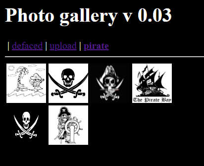
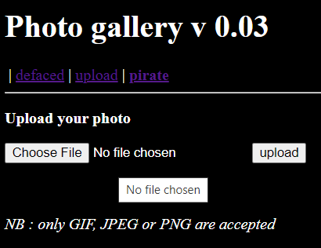
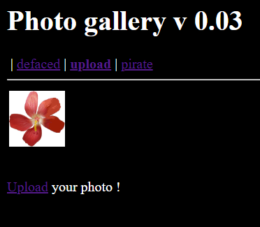
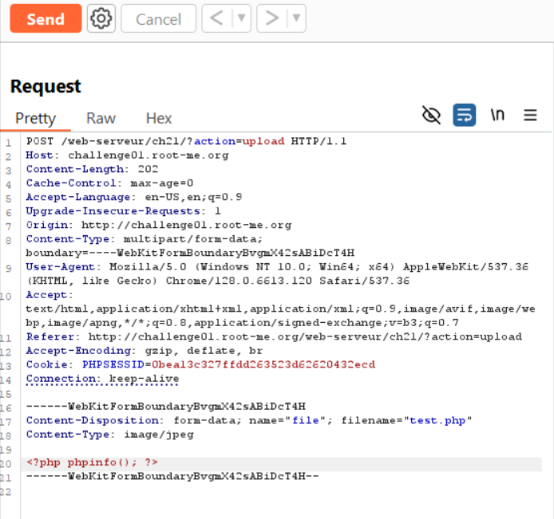
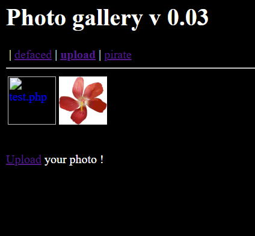
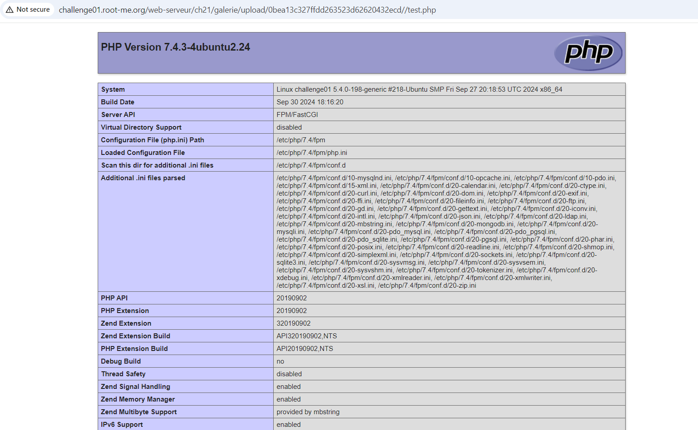

# File Upload - MIME type

**Tên challenge:**  Gallery v0.03

**Link challenge:** [Here](https://www.root-me.org/en/Challenges/Web-Server/File-upload-MIME-type)

**Tác giả challenge:** g0uZ

**Mục tiêu challenge:**
Your goal is to hack this photo galery by uploading PHP code. Retrieve the validation password in the file .passwd.

**Tác giả Writeup:** Shino

---

# Bài giải

**B1:** Đầu tiên, ta sẽ thấy có 3 Gallery khi truy cập vào trang web như sau:
	

Sau khi thử click từng Gallery thì ta sẽ thấy rằng, mục `defaced` và `pirate` có các hình ảnh trong các mục này nhưng mục Upload thì lại rỗng.

Tuy nhiên, ở mục Upload có cung cấp cho ta 1 chức năng Upload ảnh như sau:

**B2:** Sau khi, ta thử up 1 file ảnh mà chức năng cho phép thì khi Reload lại mục Upload, ta sẽ thấy được bức ảnh mà ta vừa up lên.

`Lúc này, câu hỏi đặt ra là: "Chức năng chỉ cho phép up những file có định dạng ảnh dựa trên filter ở extension của file hay là filter ở Content-type,..."`

Để tìm ra câu trả lời thì ta sẽ thử từng trường hợp và trường hợp đầu tiên ta sẽ thử là up 1 file có đuôi .php có nội dung là: `<?php phpinfo(); ?>` với `content-type: image/jpeg` thay vì `plain/text` như các file text thông thường.

**B3:** Ta Reload lại mục Upload và bùm

**B4:** Ta thử click vào file `test.php`

=> Kết quả là trang web đã thực thi mã php từ file ta đã tải lên.

=> Từ đây, ta có thể kết luận trang web đã filter dựa trên Content-type để lọc các file có định dạng khác.

<u><b><i>Thông tin thêm:</i></b></u> File `.passwd` nằm ở thư mục `/challenge/web-serveur/ch21`