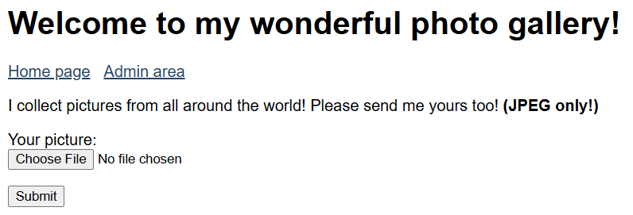
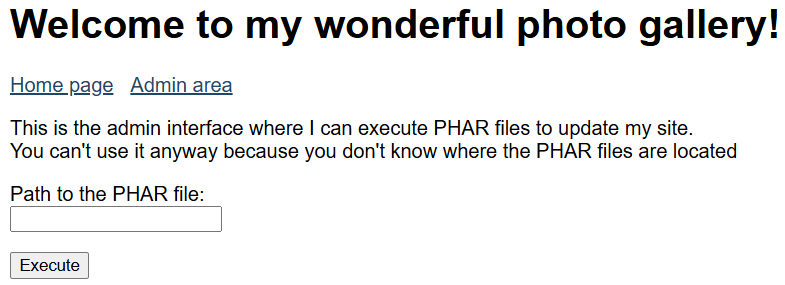
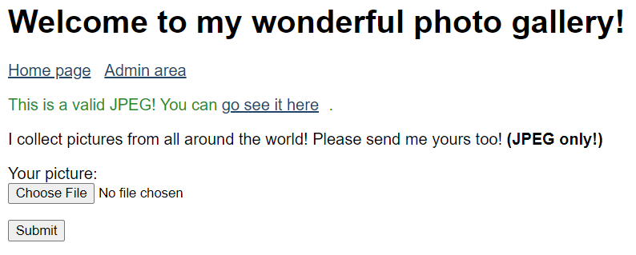
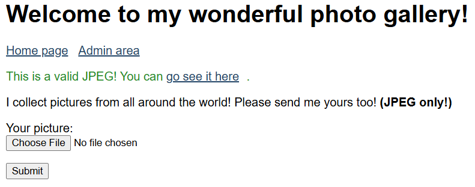
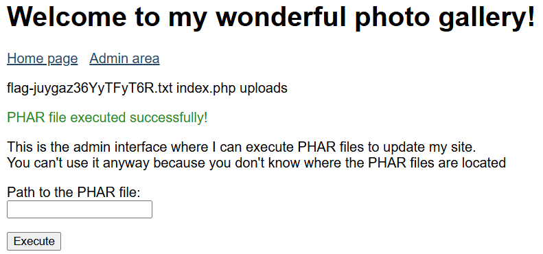

# File Upload - Polyglot

**Tên challenge:**  Are You Bilingual ?

**Link challenge:** [Here](https://www.root-me.org/en/Challenges/Web-Server/File-upload-Polyglot)

**Tác giả challenge:** Cyxo

**Mục tiêu challenge:**
Your friend who is a photography fan has created a site to allow people to share their beautiful photos. He assures you that his site is secure because he checks that the file sent is a JPEG, and that it is not a disguised PHP file. Prove him wrong!

**Tác giả Writeup:** Shino

---

# Bài giải

**B1:** Đầu tiên, ta sẽ thấy trang Web có 2 chức năng tương ứng với 2 mục, 1 là Upload ảnh, 2 là Admin Panel.
	




**B2:** Ta thử Upload 1 file ảnh có tên `meo.jpg` bình thường thì Website sẽ trả về dòng text nếu thành công như sau:



Ta thử click vào file ảnh đó thì nó mở ra 1 trang URL có đường dẫn là:
```
/uploads/phpZDJmGL.jpg
```
**B3:** Ta bắt lại gói tin POST trong Burpsuite rồi thử chèn nội dung `<?php phpinfo(); ?>` vào file ảnh vừa đăng , đồng thời đổi đuổi file thành `.php`.

Trang Web trả về dòng text:
```
This is a fake JPEG!
```

Sau khi thử vài lần với chức năng Upload ảnh của trang Web thì ta rút được vài thông tin sau để có thể Upload ảnh thành công:
1. Tên File nhất định phải có đuôi `.jpg`
2. Nội dung File nhất định phải bắt đầu bằng các byte: `\xff\xd8\xff\xff\xd9`

Ngoài ra, ta cũng không thể kiểm soát được tên File vì dù cho bạn đặt tên File là gì thì hệ thống cũng sẽ đổi tên random.

**B4:** Ta thử nghiên cứu trang Admin Panel để tìm thêm thông tin.

Sau khi mài mò thì ta biết được trang Admin Panel nhận input là 1 đường dẫn tới file `PHAR` rồi thực thi nó. 

Ngoài ra, khi ta nhập 1 đường dẫn không có file `PHAR` nó sẽ output 1 dòng lỗi:
```
Error when including PHAR file "": include(): Failed opening 'phar://' for inclusion (include_path='.:/usr/local/lib/php')
```
* <u>**Giải thích:**</u> Lỗi này xảy ra khi PHP cố gắng tải một tệp `PHAR` bằng phương thức `include` hoặc `require` nhưng không thành công. Thông báo lỗi chỉ ra rằng PHP không thể mở tệp `PHAR` qua giao thức `phar://`

**Câu hỏi ở đây là:** File PHAR ở đâu ? Liệu ta có thể lợi dụng chức năng này để thực thi code không ? Và làm sao nó có thể thực thi được File PHAR nếu những file ảnh ta đưa lên đều được đổi tên ngẫu nhiên và luôn phải có dạng `.jpg`

* **Trả lời:** Sau khi đi tìm hiểu về các tài liệu trên mạng thì ta biết được: Các tệp `PHAR` chứa dữ liệu meta ở định dạng được `Serialize`, do đó, khi được phân tích cú pháp bởi Webserver thì siêu dữ liệu này sẽ được `Deserialize` và bạn có thể thử lạm dụng lỗ hổng `Deserialize` này để chèn mã code PHP để trong quá trình `Deserialize` nó sẽ thực thi code đó.
* Điều hay nhất về đặc điểm này là quá trình khử phân tích này sẽ xảy ra ngay cả khi sử dụng các hàm PHP như `file_get_contents()`, `fopen()`, `file()` hoặc `file_exists()`,...

* Vì vậy, hãy tưởng tượng một tình huống trong đó bạn có thể làm cho một trang web PHP thực thi một file `PHAR` tùy ý do ta tải lên và thông qua giao thức 
`phar://` của Website đến đường dẫn file `PHAR` mà ta tải lên thì nó sẽ thực thi code bên trong file đó.

Tóm lại, kế hoạch của ta là bắt đầu thực hiện tạo 1 file `PHAR` có nội dung code PHP rồi đổi tên nó thành `.jpg` và đăng lên Website rồi dùng chức năng ở Admin Panel đưa ta đến đường dẫn file chứa nội dung `PHAR` của ta.

**B5:** Ta bắt đầu tạo file PHAR theo những gì tìm hiểu được trên mạng

Đầu tiên, ta tạo 1 file `test.php` có nội dung:
```
<?php
$phar = new Phar('test.phar');
$phar->startBuffering();
$phar->addFromString('test.txt', '<?php system("ls"); ?>');
$phar->setStub("\xff\xd8\xff\xff\xd9\n<?php __HALT_COMPILER(); ?>");
$phar->stopBuffering();
```
<u>**Giải thích code:**</u>
1. `$phar = new Phar('test.phar')`: Tạo một đối tượng `PHAR` mới đại diện cho tệp `test.phar`.
2. `$phar->startBuffering()`: để bắt đầu quá trình lưu trữ dữ liệu vào bộ nhớ đệm, thay vì ngay lập tức ghi vào tệp `PHAR`. Điều này giúp cho các thay đổi chỉ được áp dụng khi stopBuffering() được gọi.
3. `$phar->addFromString('test.txt', '<?php system("ls"); ?>')`: Thêm một tệp có tên `test.txt` vào bên trong `test.phar`. Nội dung của `test.txt` là đoạn mã PHP `<?php system("ls"); ?>`, mà nếu được thực thi, sẽ chạy lệnh hệ thống `ls` để hiển thị các file ở thư mục hiện tại.
4. `phar->setStub("\xff\xd8\xff\xff\xd9\n<?php __HALT_COMPILER(); ?>")`:
* `setStub()`: thiết lập đoạn mã stub cho tệp PHAR, tức là đoạn mã sẽ được chạy đầu tiên khi tệp PHAR này được thực thi.
* `\xff\xd8\xff\xff\xd9` là một đoạn magic byte nhằm làm cho tệp `PHAR` có vẻ giống tệp ảnh (JPG) để vượt qua cơ chế kiểm tra file ảnh của Website.
* `<?php __HALT_COMPILER(); ?>`: Kết thúc đoạn mã PHP, mục đích ngăn những đoạn `dữ liệu PHAR` sau đó được xử lý như mã PHP. Lệnh `__HALT_COMPILER()` chỉ ra cho PHP rằng sau đây là dữ liệu nhị phân, không phải mã PHP.

Tiếp theo, ta sẽ compile file `test.php` này thành file `test.phar`, sau đó đổi tên file từ `test.phar` -> `test.jpg`:
```
php --define phar.readonly=0 test.php && mv test.phar test.jpg
```
**Tham khảo thêm:** [Link 1](https://www.thehacker.recipes/web/inputs/file-inclusion/lfi-to-rce/php-wrappers-and-streams), [Link 2](https://book.hacktricks.xyz/pentesting-web/file-inclusion/phar-deserialization)

**B6:** Ta Upload file `test.jpg` lên trên Website



=> Vậy là ta đã thành công Upload 1 file `PHAR` dưới danh 1 file `.jpg`.

Ta lưu lại đường dẫn tới file `PHAR` của ta:
```
/uploads/phpqyfiQU.jpg
```
**B7:** Ta qua Admin Panel và bắt đầu đưa đường dẫn đến file của ta.

Nhưng kết quả vẫn in ra lỗi, vì ta vẫn chưa biết được đường dẫn chính xác của thư mục `uploads` đang ở đâu.

Vậy thì làm sao ta biết được thư mục uploads đang ở đầu

* **Trả lời:** Khi ta Click thử nút Submit ở chức năng Upload ảnh mà không chọn File ảnh nào trước đó, nó sẽ in ra dòng lỗi sau:
```
Fatal error: Uncaught ValueError: Path cannot be empty in /var/www/html/index.php:22 Stack trace: #0 /var/www/html/index.php(22): fopen('', 'rb') #1 {main} thrown in /var/www/html/index.php on line 22
```
=> Từ lỗi trên, ta biết được đường dẫn của Web của nó là `/var/www/htlm/`

**B8:** Ta thử input đường dẫn `/var/www/html/uploads/phpqyfiQU.jpg/test.txt` ở trang Admin Panel.



=> Vậy là ta đã làm cho hệ thống thực thi file `PHAR` của ta

**Lưu ý:** Input bắt buộc phải có thêm `/test.txt` vì file `/test.txt` mới là file chứa code PHP mà ta đã ẩn nó ở trong file `.jpg`.

**B9:** Tiếp theo, ta chỉ cần sửa code PHP thành `cat flag....` và lặp lại các bước trên là ta sẽ thành công lấy được Flag.
