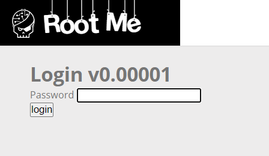
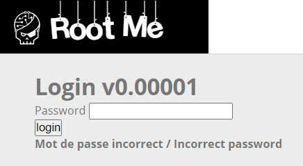
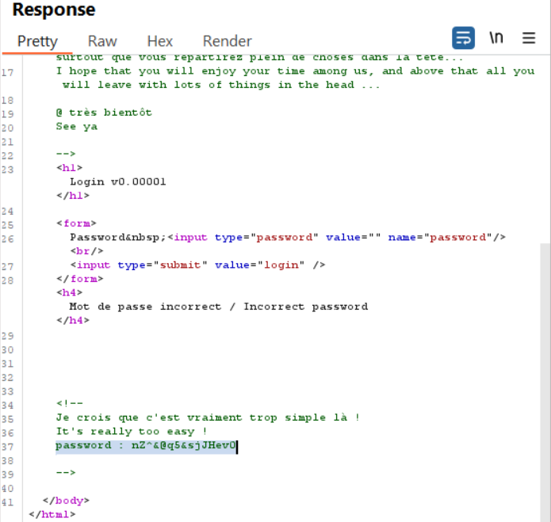

# HTML - Source Code
**Tác giả challenge:** g0uZ

**Link challenge:** [Here](https://www.root-me.org/en/Challenges/Web-Server/HTML-Source-code)

**Mục tiêu challenge:** Find a hidden password

**Tác giả Writeup:** Shino

---

# Bài giải

**B1:** Đầu tiên, giao diện Website chỉ có 1 chức năng Login password duy nhất:

**B2:** Ta thử điền password là `123456` vào thì Website trả về kết quả như sau:

Nhưng khi quan sát gói tin ở BurpSuite thì ta lại thấy trong đống code HTML lại hiện password như sau

=> Có vẻ như Developer đã bất cẩn quên xoá comment trước khi phát hành sản phẩm.

=> Từ đây, ta có thể kết luận trang web đã bị rò rỉ mật khẩu do sự bất cẩn từ phía Developer.
