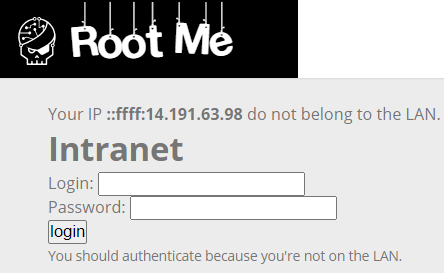
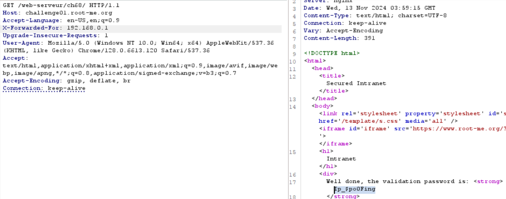

# HTTP - IP Restriction Bypass

**Tên challenge:** Only local users will be able to access the page

**Link challenge:** [Here](https://www.root-me.org/en/Challenges/Web-Server/HTTP-IP-restriction-bypass)

**Tác giả challenge:** Cyrhades

**Mục tiêu challenge:** Dear colleagues, We’re now managing connections to the intranet using private IP addresses, so it’s no longer necessary to login with a username / password when you are already connected to the internal company network.

**Tác giả Writeup:** Shino

---

# Bài giải

**B1:** Đầu tiên, giao diện Website chỉ có 1 chức năng Login như sau:



Với dòng thông báo:
```
Your IP ::ffff:14.191.63.98 do not belong to the LAN.
```

Chúng ta sẽ nghĩ ngay đến việc thay đổi IP thông qua gói tin bằng cách chèn thêm HTTP-header `X-Forwarded-For` với giá trị `192.168.0.1` ( dãy IP mạng nội bộ thông thường ) để ta có thể được `authenticate` mà không cần Login.

**B2:** Thực hành theo cách trên:



=> Ta đã thành công lấy được `Flag`