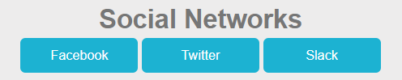
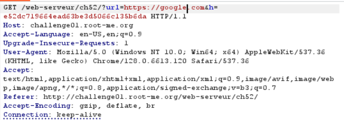
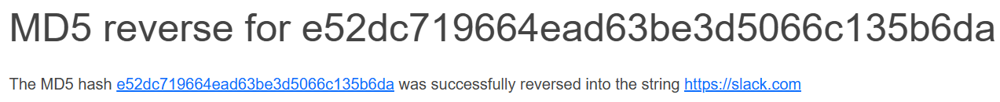
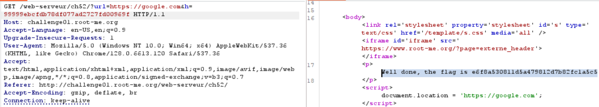

# HTTP - Open redirect

**Tên challenge:** Internet is so big

**Link challenge:** [Here](https://www.root-me.org/en/Challenges/Web-Server/HTTP-Open-redirect)

**Tác giả challenge:** Swissky

**Mục tiêu challenge:** Find a way to make a redirection to a domain other than those showed on the web page.

**Tác giả Writeup:** Shino

---

# Bài giải

**B1:** Đầu tiên, giao diện Website chỉ có 3 button như sau:



Khi ta click vào 1 trong 3 Button thì nó sẽ chuyển hướng ta sang trang mạng xã hội tương ứng.

Sau đó, khi xem lại gói tin thì ta thấy trước khi nó chuyển hướng thì sẽ có 1 gói tin `GET` như sau:
```
GET /web-serveur/ch52/?url=https://slack.com&h=e52dc719664ead63be3d5066c135b6da HTTP/1.1
```
**B2:** Ta thử giữ nguyên giá trị của parameter `h` và thay đổi giá trị parameter `url` thành `https://google.com`



Kết quả là ứng dụng trả về Output:
```
Incorrect hash!
```

Dù cho ta thử tương tự với 1 trong 2 Button còn lại hay là xoá luôn parameter `h` thì vẫn cùng kết quả trên.

**B3:** Ta thử copy mã Hash `h` của gói tin `GET` ở trên và thử đi dịch ngược nó bằng các thuật toán như MD5 hoặc SHA1,... để xem có được không.



=> Chuỗi Hash trên là thuộc về thuật toán MD5

Tiếp đến, ta thử dùng thuật toán để tạo ra mã băm của chuỗi `https://google.com`, rồi sau đó bắt lại gói tin `GET` và sửa nó thành:



=> Ta đã thành công lấy được `Flag`.