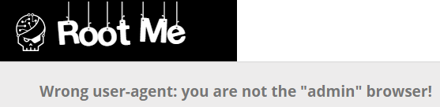
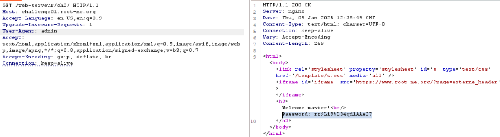

# HTTP - User-agent

**Tên challenge:**  Admin is really dumb...

**Link challenge:** [Here](https://www.root-me.org/en/Challenges/Web-Server/HTTP-User-agent)

**Tác giả challenge:** g0uZ

**Mục tiêu challenge:** Find the flag.

**Tác giả Writeup:** Shino

---

# Bài giải

**B1:** Đầu tiên, giao diện Website chỉ có 1 dòng text như sau:

**B2:** Ta thử bắt lại gói tin trong Burp-Suite rồi thay đổi `User-agent` thành `admin`:

=> Vậy là ta đã thành công lấy được Flag.
